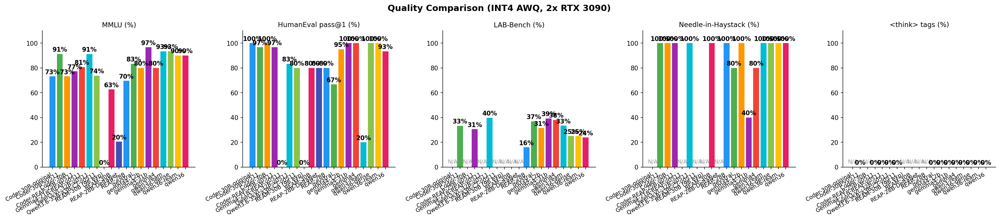

# NVIDIA Inference: SGLang on 2x RTX 3090

High-throughput LLM inference on 2x NVIDIA RTX 3090 (GA102-300-A1, Ampere) with CUDA 13.2 / PyTorch cu128.

## Current Focus

**Target: single-user 256K context performance.** Multi-user throughput is secondary. See [256K single-user optimization roadmap](#256k-single-user-optimization-roadmap) for active work. Aligned with the RDNA4 sister project's target — both teams share 256K progress bidirectionally.

## Cross-team Learnings from RDNA4 sister project (2026-04-18)

The [2x R9700 RDNA4 sister repo](https://github.com/mattbucci/2x-R9700-RDNA4-GFX1201-sglang-inference) shares the same SGLang v0.5.10 stack. Recent findings already incorporated here:

1. **Gemma4 reasoning parser** — cherry-picked as `patches/014-gemma4-reasoning-parser.patch` (upstream PR #21952, not in v0.5.10). Adds `Gemma4Detector` for `<|channel>thought` / `<channel|>` markers. Enabled on `gemma4` and `gemma4-31b` presets once Gemma 4 inference unblocks on sm_86.
2. **AWQ calibration silently breaks thinking AND vision.** Both teams shipped quants that regressed these capabilities (our Qwen3.5-28B REAP lost `<think>` structure; Devstral + Qwen3-VL-30B community AWQs broke vision). See [Known Issues](#known-issues) for the specific failures. **Rule:** every new quantized model must validate (a) an image+text roundtrip and (b) a thinking-tagged generation that cleanly terminates before launch.
3. **Chat template is a silent bug magnet.** Devstral BOS → `<unk>`, Qwen3.5 has thinking tags but calibration didn't include thinking, Gemma4 thinking requires a per-request flag. Always inspect the jinja template and verify `AutoTokenizer.from_pretrained(...).chat_template is not None` before launch.
4. **Recommended calibration datasets** (reasoning + vision preserving): `a-m-team/AM-Thinking-v1-Distilled` (thinking traces, Qwen3-verified), `glaiveai/reasoning-v1-20m` (native `<think>` tags), `LLaVA-Instruct-150K` (image+text pairs), `AI-MO/NuminaMath-CoT` (+9.81% GPTQ accuracy vs WikiText2). RDNA4 is assembling a mixed dataset and will share the script + ratios once tested.

## Known Issues

- **Gemma 4 (26B MoE, 31B Dense)** — Blocked by FlashInfer `BatchPrefillWithPagedKVCache` on sm_86. Gemma 4's full-attention layers use `global_head_dim=512` which FlashInfer doesn't support on Ampere (only 64/128/256). See [FlashInfer details](#flashinfer-head_dim-support). Unblock paths: `--attention-backend torch_native` (slower but working on R9700), FFPA kernels, or TRTLLM FMHA.
- **Vision handling breaks during calibration** — Community VL AWQ checkpoints (Qwen3-VL-30B from cyankiwi, Devstral vision) produce garbage or lose image alignment. Root cause: calibration data had no multimodal image+text examples, so vision-language alignment isn't preserved through quantization. Self-calibration must include multimodal samples. The R9700 team's Gemma 4 26B MoE vision is working after fixes — we need to port the same approach.
- **Thinking-mode breaks during calibration** — Our Qwen3.5-28B REAP lost structured `<think>` tagging after GPTQ + CT→AWQ conversion (emits free-form reasoning, blocks `--reasoning-parser qwen3`, causes runaway generation on hard prompts). Root cause: Open-Platypus calibration had no reasoning traces, so the model forgot how to emit `<think>`/`</think>` stop tokens. Fix path: re-calibrate with `glaiveai/reasoning-v1-20m` or `a-m-team/AM-Thinking-v1-Distilled`. Until then use `enable_thinking=False`.
- **Chat templates are load-bearing** — We've been bitten multiple times. Devstral community AWQ needs a custom template (BOS token stripped or it emits `<unk>`). Gemma 4 community weights ship without a template (must embed jinja into `tokenizer_config.json`). Qwen3.5 uses `enable_thinking` via `chat_template_kwargs`. Always verify the template with a short generation after loading, and keep project-specific templates under version control in `scripts/*_chat_template.jinja`.
- **Qwen3-VL-30B MoE AWQ** — Two issues. (1) `--quantization awq` (base AWQConfig) has [no FusedMoE handler](https://github.com/sgl-project/sglang/blob/v0.5.10/python/sglang/srt/layers/quantization/awq.py#L187-L191) — MoE expert layers fall back to unquantized fp16 weights (384 MB/layer × 48 layers → 23 GB/GPU OOM). Fix: use `--quantization awq_marlin`. (2) Even with `awq_marlin`, the [community vLLM checkpoint](https://huggingface.co/cyankiwi/Qwen3-VL-30B-A3B-Instruct-AWQ) produces garbage output — likely a weight-name mapping mismatch between vLLM and SGLang for `Qwen3VLMoeForConditionalGeneration`. Workaround: use `SGLANG_FORCE_MOE_WNA16=1` to skip Marlin MoE repack (saves ~7 GB peak VRAM), but needs a compressed-tensors checkpoint since AWQ packing ≠ WNA16 packing. Self-calibrating a CT checkpoint via llmcompressor would fix both issues.
- **Qwen3.5-27B DeltaNet context limited to 32K** — DeltaNet layers replicated across GPUs (19 GB/GPU), leaving only 2.2 GB for KV cache. REAM/REAP MoE variants would reduce weights and unlock longer context.
- **AWQ Marlin MoE peak VRAM** — `awq_marlin_moe_repack` doubles weight memory during repacking (old + new tensors coexist). For 128-expert MoE models this adds ~7 GB peak per GPU. Patch adds `SGLANG_FORCE_MOE_WNA16=1` env var to bypass Marlin repack and use [MoeWNA16 Triton kernels](https://github.com/sgl-project/sglang/blob/main/python/sglang/srt/layers/quantization/moe_wna16.py) instead (only works with compressed-tensors format, not native AWQ).
- **Triton attention BF16 precision** — RDNA4 team found that SGLang's Triton attention kernels do BF16 accumulation in online softmax, causing catastrophic precision loss on deep models (60+ layers). [Patch 011](https://github.com/mattbucci/2x-R9700-RDNA4-GFX1201-sglang-inference/blob/main/patches/011-rdna4-triton-attention-fp32.patch) fixes it with FP32 casts in QK dot product + value accumulation. We use FlashInfer (which does FP32 internally) for most models, but this affects any model forced to Triton attention (e.g. Gemma 4 if head_dim=512 workaround is found). The Qwen3-VL-32B Dense (64 layers) may also be affected.
- **Qwen3.5-28B MoE REAP** — **Working** (patch 009). Required extensive integration: CausalLM wrapper with lm_head/logits_processor/mrope, FusedMoE TP overflow guards, GPTQ calibration with in-memory expert fusion (BF16 source has per-expert weights but HF class expects fused FusedMoE format — calibrating without fusion silently produces garbage), config flattening (text_config fields to top level), FlashInfer architectures None guard. 33 tok/s decode, constant across context lengths.
- **Qwen3.5-28B REAP `<think>` tags broken** — The model has think tokens (248068/248069) and the chat template supports `enable_thinking`, but the GPTQ calibration + CT→AWQ conversion appears to have broken structured thinking. The model produces free-form reasoning ("The user is asking...") instead of `<think>...</think>` tagged output. This causes: (1) runaway generation on hard questions (no stop signal), (2) answer truncation when max_tokens is hit, (3) inability to use `--reasoning-parser qwen3`. Needs investigation — may require re-calibrating with thinking-mode prompts or fixing tokenizer special token handling in the conversion pipeline.
- **CUDA graphs** — Only bs=1 works. `--cuda-graph-max-bs 1 --disable-custom-all-reduce`.
- **60B+ models** — Coder-Next-REAM (35GB), GLM-4.5-Air-REAP (43GB) don't fit in 48GB.

## 256K Single-User Optimization Roadmap

Ordered by expected impact. Updated as work progresses.

### Active
1. **Push Devstral-24B to 256K context** — Currently 131K with room in VRAM (24B dense, ~7 GB/GPU, 80 KB/token KV). FP8 KV cache already applied. Needs `--context-length 262144` sweep and sliding window verification at long context. Likely quickest win.
2. **Fix Qwen3.5-28B REAP `<think>` regression** — Re-calibrate GPTQ with thinking-aware data (`glaiveai/reasoning-v1-20m` + Open-Platypus mix). Must preserve MMLU/HumanEval numbers while restoring `<think>` tagging. Multi-hour calibration job.
3. **Unblock Gemma 4 on 3090** — Try `--attention-backend torch_native` path (R9700 confirmed this works for head_dim=512). Measure tok/s at 4K then scale context. Patch 014 reasoning parser now in place.
4. **Qwen3-30B REAM 256K sweep** — Currently benchmarked to 16K (@71 tok/s). Extend sweep to 32K/64K/128K/256K to characterize the long-context decode cliff. Already the fastest long-context model; establish the ceiling.

### Queued
5. **Qwen3.5-28B MoE REAP 262K perf** — 33 tok/s is constant with context but low vs REAM's 197. Profile to see whether DeltaNet kernel launches or MoE expert routing dominate; consider piecewise CUDA graph fix (currently disabled due to `quant_type` NoneType bug).
6. **Qwen3-VL-30B AWQ Marlin** — Self-calibrate CT checkpoint with multimodal data to fix both the vLLM name-mapping garbage and the Marlin MoE peak-VRAM OOM. Vision probe mandatory post-calibration.
7. **Piecewise CUDA graph fix** — Unblocks decode latency improvements on all quantized MoE models (REAP/REAM).
8. **Coder-30B 262K context** — KV budget says it fits; need to verify sliding window + FP8 KV at long context.

### Discarded / blocked
- **TurboQuant 3-bit KV** — Would 3x effective context, but [SGLang PR #21618](https://github.com/sgl-project/sglang/issues/21618) is unmerged.
- **Coder-Next-REAM, GLM-4.5-Air REAP** — Don't fit in 48 GB even quantized.

## Next to Try

### Quality evaluation (REAP vs REAM vs original)



| Model | MMLU | HumanEval | Needle (65K) | Context | tok/s |
|-------|:----:|:---------:|:------------:|:-------:|:-----:|
| **Coder-30B** (128 exp) | **73%** | **100%** | 100% | 16K | 193 |
| **REAP-28B** (205 exp, DeltaNet) | 70% | 80% | **100%** | **262K** | 35 |
| **REAM-30B** (96 exp) | 63% | 80% | 100% | **262K** | **197** |

**Methodology:** `scripts/eval/eval_and_chart.py` — MMLU (200 samples), HumanEval pass@1 (30 samples), [LAB-Bench](https://github.com/Future-House/LAB-Bench) (7 science benchmarks, 50 samples each), needle-in-a-haystack (1K→65K). Full model context as reasoning budget. Single-user, temperature=0.

**Key findings:**
- **REAM lost the most quality** — 10pp below Coder on MMLU. Expert merging (128→96) hurt reasoning more than REAP's pruning.
- **REAP held up better** on MMLU (70% vs 73%) despite pruning 256→205 experts, but 20pp gap on HumanEval.
- **All models pass needle** through 65K context — context utilization is solid across architectures.
- The original eval bug gave REAP 20% MMLU because `max_tokens=20` truncated the model's verbose reasoning before it could answer.

Run evals:
```bash
# Start model server, then:
python scripts/eval/eval_and_chart.py --run --port 23334 --tag "Model-Name" --workers 1
python scripts/eval/eval_and_chart.py --chart  # generate PNG
```

**Still TODO:** [RULER](https://github.com/NVIDIA/RULER) (synthetic long-context 4K→256K), [LongBench Pro](https://arxiv.org/html/2601.02872v1) (real-world bilingual 8K→256K), [LiveCodeBench](https://livecodebench.github.io/) (fresh coding problems).

REAP research shows quality within 1-4pp of baseline; REAM retains ≥94% ([REAP paper](https://arxiv.org/html/2510.13999), [REAM blog](https://bknyaz.github.io/blog/2026/moe/)).

### Performance optimization

- **Piecewise CUDA graphs** — Disabled on REAP/REAM due to `quant_type` NoneType bug in piecewise graph capture. Fixing would improve decode latency for all quantized models.
- **DeltaNet kernel fusion** — 13.5/35 tok/s bottleneck is 312 kernel launches per token at ~316µs each. Raw compute is 44ms but actual is 74ms (pre-patches). Kernel fusion or CUDA graphs would close the gap toward theoretical 22 tok/s.
- **Qwen3-VL-30B** — AWQ checkpoint available, garbage output from vLLM weight mapping issue. Apply same VL prefix fix used for Devstral (`model.language_model.` → `language_model.model.`).
- **Gemma 4 REAP** — BF16 source ready (40GB, 103 experts) but blocked by FlashInfer `head_dim=512` on Ampere.

### Findings from RDNA4 R9700 system

The sister [2x R9700 repo](https://github.com/mattbucci/2x-R9700-RDNA4-GFX1201-sglang-inference) found:

- **ROOT CAUSE: Triton attention BF16 precision bug** — Online softmax accumulates `e_max`/`e_sum`/`re_scale` in BF16 and `tl.dot()` lacks `out_dtype=tl.float32`. Causes 15% mean error vs FP32 after 128 KV tokens. Compounds catastrophically over 60 layers (Gemma 31B). `--attention-backend torch_native` produces perfect output. [Patch 011](https://github.com/mattbucci/2x-R9700-RDNA4-GFX1201-sglang-inference/blob/main/patches/011-rdna4-triton-attention-fp32.patch) adds FP32 casts throughout decode + extend kernels.
- **Gemma 31B Dense quality FIXED** — Near-perfect output with FP32 triton attention + Intel AutoRound GPTQ + FP8 KV cache. Currently ~2 tok/s via GPTQ torch fallback; need AWQ conversion or native GPTQ HIP kernels for speed.
- **AutoRound > GPTQ > AWQ for INT4 quality** — Intel AutoRound uses SignSGD (200 iterations) to jointly optimize rounding + clipping, directly minimizing `||WX - W_qX||`. Can export to both GPTQ and AWQ formats. [RedHatAI reports 99.4%+ quality](https://huggingface.co/RedHatAI/gemma-3-27b-it-quantized.w4a16) with uniform GPTQ INT4 on CUDA.
- **BF16 precision affects all new architectures** — Both RDNA4 and [Blackwell SM12.x](https://forums.developer.nvidia.com/t/qwen3-5-27b-optimisation-thread-starting-at-30-t-s-tp-1/366009) hit attention precision issues that Ampere/Hopper tolerate. Fix: FP32 accumulation in online softmax.
- **Qwen3.5-27B at 26 tok/s** on RDNA4 (vs our 13.5 tok/s). Same replication strategy.
- **Community AWQ fails for DeltaNet** — both teams confirmed. GPTQ calibration + CT→AWQ conversion required.
- **DeltaNet layers must stay BF16** — INT4 destroys recurrent state quality. Architectural limit.
- **Coder-Next 80B fits on R9700 (32GB/GPU)** — but not on 3090 (24GB/GPU).

## Quick Start

```bash
# 1. Setup: clone SGLang v0.5.10, apply patches, create conda env
./scripts/setup.sh

# 2. Run any model:
./scripts/launch.sh devstral            # Devstral-24B AWQ — best all-round
./scripts/launch.sh coder-30b           # Coder-30B MoE AWQ — best throughput
./scripts/launch.sh coder-reap          # Coder-REAP-25B — fastest single-user
./scripts/launch.sh qwen35              # Qwen3.5-27B DeltaNet AWQ

# 3. Test quality (MMLU, HumanEval, LAB-Bench, Needle)
python scripts/eval/eval_and_chart.py --run --port 23334 --tag "Model-Name"

# 4. Benchmark
python scripts/bench/bench_all_unified.py --name "Model Name" --port 23334
```

## Prerequisites

- 2x NVIDIA RTX 3090 (24GB GDDR6X each, 48GB total) with NVLink bridge
- NVIDIA drivers (595+) + CUDA 13.x
- Miniforge3/Conda
- ~150GB disk for models

## Model Support (SGLang)

### Agent / coding workloads (single-user, max context)

| Model | Type | Max context | 1-user tok/s | TPOT | Launch | Status |
|-------|------|:----------:|:------------:|:----:|:------:|:------:|
| **Qwen3-30B REAM AWQ** | **MoE (96 experts)** | **262K** | **197** | **5ms** | `launch.sh qwen3-ream` | **Working** |
| Coder-REAP-25B W4A16 | MoE (103 experts) | 131K | 134 | 7ms | `launch.sh coder-reap` | Working |
| **Devstral-24B AWQ Marlin** | **Dense** | **131K** | **87** | **12ms** | `launch.sh devstral` | **Working** |
| **Coder-30B AWQ Marlin** | **MoE (128 experts)** | **16K** | **193** | **5ms** | `launch.sh coder-30b` | **Working** |
| **Qwen3.5-28B MoE REAP** | **DeltaNet+MoE (205 exp)** | **262K** | **35** | **29ms** | `launch.sh qwen35-moe` | **Working** |
| Qwen3.5-27B AWQ | DeltaNet hybrid | 32K | 13.5 | 74ms | `launch.sh qwen35` | Working |
| Qwen3-VL-32B Dense AWQ | Dense (vision+text) | 8K | 24 | 45ms | `launch.sh qwen3-vl-32b` | Working |
| Gemma 4 26B REAP | MoE (103 experts) | — | — | — | — | Blocked (FlashInfer) |

### VRAM context length limits (FP8 KV cache, TP=2, 48GB total)

KV cache is the dominant VRAM constraint. REAM/REAP MoE models have smaller weights, leaving more room for context.

| Model | Wt/GPU | KV/token | Free VRAM | **Max context** |
|-------|:------:|:--------:|:---------:|:---------------:|
| **Qwen3-30B REAM AWQ** | **6.2 GB** | **36 KB** | **16.3 GB** | **262K** |
| Devstral-24B AWQ | 7.0 GB | 80 KB | 15.5 GB | **131K** |
| Coder-REAP-25B W4A16 | 6.5 GB | 72 KB | 16.0 GB | **131K** |
| Coder-30B AWQ | 8.0 GB | 36 KB | 14.5 GB | **262K** |
| Qwen3.5-28B MoE REAP CT | 8.1 GB | 5 KB | 15.2 GB | **262K** |
| **Qwen3.5-27B AWQ** | **19.0 GB** | 24 KB | **2.2 GB** | **32K** |

Future: [TurboQuant](https://github.com/sgl-project/sglang/issues/21618) (3-bit KV, ICLR 2026) would give ~3x more context, but SGLang integration is WIP/unmerged.

### Batch throughput (multi-user)

| Model | Peak total tok/s | Best conc | Context |
|-------|:----------------:|:--------:|:-------:|
| **Qwen3-30B REAM AWQ** | **1,832** | **@16** | **16K** |
| Devstral-24B AWQ | 1,647 | @32 | 32K |
| Coder-30B AWQ | 1,201 | @32 | 16K |

**Weights:** Community AWQ works for standard architectures (Devstral, Coder-30B) but fails for:
- **Qwen3.5** — community AWQ produces garbage on DeltaNet layers; we calibrate with GPTQ, keep DeltaNet/SSM in BF16
- **Gemma 4** — standard GPTQ only calibrates 1/128 experts; needs forced-routing calibration
- **Devstral** — community AWQ works but needs custom chat template (BOS token fix)

Self-calibrated models use the pipeline in `scripts/quantize/` (GPTQ calibration → CT→AWQ conversion).

## Performance (2x RTX 3090, TP=2, SGLang v0.5.10 + patches)

**Methodology:** `bench_all_unified.py` uses `sglang.bench_serving` for proper TPOT/TTFT measurement.

### Devstral-24B AWQ (up to 131K context)

24B dense transformer. ~7 GB/GPU. FP8 KV cache enables long context.

| Context Length | tok/s |
|:--------------:|:-----:|
| 128 | 63.4 |
| 1K | 62.4 |
| 4K | 51.9 |
| 8K | 44.0 |
| 16K | 32.8 |
| **32K** | **21.1** |

| Concurrency | tok/s |
|:-----------:|:-----:|
| 1 | 64 |
| 4 | 241 |
| 8 | 476 |
| 16 | 955 |
| **32** | **1,647** |

### Coder-REAP-25B W4A16 (131K context, 103 experts)

25B / 3B active MoE. REAP-pruned (128→103 experts). ~6.5 GB/GPU. Uses `auto-round` quantization.

| Context Length | tok/s |
|:--------------:|:-----:|
| 128 | 134 |
| 1K | 126 |
| 4K | 98 |
| 8K | 63 |
| 16K | 57 |
| **32K** | **46** |

### Coder-30B MoE AWQ (16K context, 128 experts)

30B / 3B active MoE. ~8 GB/GPU. Best throughput scaling.

| Context Length | tok/s |
|:--------------:|:-----:|
| 128 | 42.9 |
| 1K | 41.0 |
| 4K | 37.7 |
| 8K | 33.8 |
| **16K** | **27.4** |

| Concurrency | tok/s |
|:-----------:|:-----:|
| 1 | 42 |
| 4 | 146 |
| 8 | 308 |
| 16 | 607 |
| **32** | **1,201** |

### Qwen3.5-27B AWQ DeltaNet (32K context)

27B DeltaNet hybrid. ~19 GB/GPU (replicated). Decode speed is constant regardless of context length (no KV attention scaling).

| Context Length | tok/s | TTFT | TPOT |
|:--------------:|:-----:|:----:|:----:|
| 128 | 13.3 | 175ms | 75ms |
| 512 | 13.5 | 511ms | 74ms |
| 1K | 13.5 | 986ms | 74ms |
| 4K | 13.6 | 3.9s | 74ms |
| 16K | 12.9 | 5.0s | 78ms |

Previously 7 tok/s — patches 005-007 (FP8 KV, BF16 AWQ, DeltaNet kernel tuning) improved to 13.5 tok/s.

### Qwen3.5-28B MoE REAP (4K context, 205 experts)

28B / 3B active DeltaNet+MoE hybrid. REAP-pruned (256→205 experts). ~8 GB/GPU. Constant decode speed (DeltaNet advantage: no KV attention scaling).

| Context Length | tok/s | TTFT | TPOT |
|:--------------:|:-----:|:----:|:----:|
| 128 | 33 | 85ms | 31ms |
| 512 | 33 | 82ms | 30ms |
| 1K | 33 | 80ms | 31ms |
| **4K** | **33** | **147ms** | **31ms** |

| Concurrency | tok/s |
|:-----------:|:-----:|
| 1 | 33 |
| 4 | 65 |
| 8 | 60 |

First working INT4 quantization of Qwen3.5 DeltaNet+MoE. Required: GPTQ calibration with in-memory expert fusion (BF16 source has per-expert weights, HF model class expects fused FusedMoE format), DeltaNet/gate/vision layers excluded from INT4, custom CausalLM wrapper with logits processor + mrope handling (patch 009).

### Qwen3-30B-Instruct REAM AWQ Marlin (262K context, 96 experts)

30B / 3B active MoE. REAM-merged (128→96 experts). ~6.2 GB/GPU. **Fastest model on the rig.**

| Context Length | tok/s | TTFT |
|:--------------:|:-----:|:----:|
| 128 | **179** | 0.3s |
| 512 | 168 | 0.6s |
| 1K | 176 | 0.6s |
| 4K | 140 | 0.9s |
| 8K | 116 | 1.1s |
| **16K** | **71** | **1.8s** |

| Concurrency | tok/s |
|:-----------:|:-----:|
| 1 | 191 |
| 4 | 600 |
| 8 | 1,074 |
| **16** | **1,832** |
| 32 | 1,301 |

197 tok/s single-user decode (5ms TPOT). 1,832 tok/s peak batch throughput at 16 concurrent — fastest on the rig, beating Devstral-24B (1,647). Self-calibrated GPTQ with all-expert routing + CT→AWQ conversion for Marlin kernels. Required patching llmcompressor for fused `Qwen3MoeExperts` (transformers 5.x) by creating per-expert `nn.Linear` wrappers during calibration.

## Setup

```bash
./scripts/setup.sh
```

Or manually:
```bash
cd components/sglang && git checkout v0.5.10
for p in ../../patches/*.patch; do git apply "$p"; done
cd python && pip install -e ".[srt]"
```

| Component | Version | Notes |
|-----------|---------|-------|
| SGLang | v0.5.10 + 12 patches | editable install from source |
| PyTorch | 2.9.1+cu128 | CUDA toolkit 12.8 |
| CUDA | 13.2 | driver 595.58 |
| NCCL | 2.27.5 | P2P over NVLink |
| FlashInfer | 0.6.7.post3 | JIT cubins for sm_86 |
| transformers | 5.5.3 | Gemma4/Qwen3.5 support |

## Patches

11 patches on top of SGLang v0.5.10. Apply in order:

1. **001-upstream-sync** (3,000 LOC) — Upstream cherry-picks: Gemma 4, Qwen3.5/3-Next, Triton attention, pool_configurator
2. **002-nvidia-model-fixes** (923 LOC) — Marlin shape fallback, DeltaNet TP replication, Gemma4 config fixes
3. **003-deltanet-triton-dtype-fix** (51 LOC) — DeltaNet conv_state bf16/fp16 cast fix
4. **004-gemma4-causal-lm-fix** (19 LOC) — CausalLM multimodal detection bypass
5. **005-ampere-fp8-triton-fallback** (59 LOC) — FP8 KV cache on sm_86 (PyTorch fallback for `fp8e4nv`)
6. **006-awq-bf16-activation-support** (15 LOC) — BF16 activations with AWQ dequant
7. **007-ampere-deltanet-kernel-tuning** (48 LOC) — DeltaNet BV=64 tuning for sm_86 (1.57x kernel speedup)
8. **008-awq-moe-wna16-fallback** (64 LOC) — `SGLANG_FORCE_MOE_WNA16=1` env var to bypass Marlin MoE repack (saves ~7 GB peak VRAM for 128-expert models)
9. **009-qwen35-moe-causalLM** — Qwen3.5 MoE text-only CausalLM wrapper (logits processor + mrope + setup.sh auto-patching)
10. **011-triton-attention-fp32** — FP32 accumulation in Triton attention online softmax (backport from R9700 — affects deep models like Gemma 31B)
11. **012-sliding-window-decode-fix** — Sliding window decode metadata: capture `window_kv_offsets` instead of discarding (backport from R9700)
12. **014-gemma4-reasoning-parser** (40 LOC) — `Gemma4Detector` from unreleased upstream SGLang PR #21952. Enables `--reasoning-parser gemma4` (`<|channel>`/`<channel|>` thinking delimiters). Backport from R9700.

## Key Findings

1. **AWQ Marlin is the fast path on Ampere** — compressed-tensors auto-promotes to Marlin on sm_80+. FP32 accumulation avoids FP16 overflow.
2. **DeltaNet replication mandatory for TP=2** — FP16 rounding accumulation through recurrent state destroys quality. Full model per GPU.
3. **FP8 KV cache works on Ampere via fallback** — patch 005 routes `fp8e4nv` to PyTorch. FlashInfer handles FP8 KV for head_dim ≤ 256.
4. **DeltaNet decode is framework-overhead-bound** — 312 kernel launches/token at ~316us each. Raw compute 44ms, actual 143ms (pre-patches). Kernel fusion or CUDA graphs would close the gap.
5. **REAM/REAP MoE unlocks longer context** — smaller weights = more VRAM for KV cache. Critical for 48GB.

## MoE Quantization Lessons

Standard GPTQ/AWQ **fails** for MoE models (MoEQuant, ICML 2025):

1. **Inter-expert imbalance**: Router unevenly distributes calibration data — rare experts get zero/garbage calibration.
2. **DeltaNet/SSM sensitivity**: Recurrent state `S(t) = g*S(t-1) + delta` accumulates INT4 noise. DeltaNet layers MUST stay BF16.

**Solutions**: Expert-balanced sampling (MoEQuant EBSS, GPTQModel FailSafe), skip recurrent layers. See `scripts/quantize/`.

## Quantization

Self-calibrated AWQ models use a separate conda env (`quant`):

```bash
conda activate quant
CUDA_VISIBLE_DEVICES="" python scripts/quantize/quantize_qwen35_llmcompressor.py
python scripts/quantize/convert_qwen35_ct_to_awq.py
```

See [rules-for-agents.md](rules-for-agents.md) for full pipeline and [REAM.md](scripts/quantize/REAM.md) for MoE expert pruning.

## Qwen3.5-27B Technical Details

Hybrid DeltaNet (linear attention) + full attention. TP=2 requires replicating all layers to avoid FP16 precision errors accumulating through DeltaNet recurrence.

**Root cause:** TP RowParallelLinear splits matmul: `W_0@x_0 + W_1@x_1` differs from `W@x` by ~1 ULP in FP16. DeltaNet's `S(t) = g*S(t-1) + delta` compounds this across 48 layers x N tokens.

**Fix:** Replicate all DeltaNet + MLP layers (`tp_size=1`), SSM state `tp_world_size=1`.

VRAM per GPU: ~19 GB model (replicated) + 1.27 GB DeltaNet state + 0.92 GB KV cache (FP8) = ~21 GB. Only 32K context fits.

### Triton kernel tuning (patch 007)

DeltaNet decode kernel defaults (`BV=32`, `num_warps=1`) under-utilize RTX 3090. Our sweep found BV=64 gives 1.57x:

| Config | BV | ms/layer | Speedup |
|--------|:--:|:--------:|:-------:|
| baseline | 32 | 0.018 | 1.00x |
| **BV64-w1** | **64** | **0.011** | **1.57x** |

### Pipeline bottleneck analysis

| Operation | ms/model | % |
|-----------|:--------:|:-:|
| MLP forward | 19.9 | 45% |
| Recurrent update | 8.3 | 19% |
| QKV projection | 7.9 | 18% |
| Output projection | 2.9 | 7% |
| RMSNorm + gating | 2.1 | 5% |
| Conv1d | 1.3 | 3% |
| **Theoretical** | **44.1** | **22.7 tok/s** |
| **Actual** | **74** | **13.5 tok/s** |

MoE kernel configs generated for RTX 3090 (Triton 3.5.1): `E=128,N=768` (Coder-30B, Qwen3-VL-30B), `E=128,N=704` (Gemma 4), `E=103,N=768` (Coder-REAP). Auto-loaded by `device_name=NVIDIA_GeForce_RTX_3090`.

## Gemma 4 Notes

Blocked on SGLang. RDNA4 team working on mixed precision + softmax patch for accuracy. Cross-team findings:

1. **FP16 overflow at layer 2** (hidden_size=5376). Fix: `--dtype bfloat16` + patch 006.
2. **CT→AWQ conversion quality poor** — cosine similarity 0.845 on q_proj. Models generate garbage.
3. **Missing chat template** — embed jinja into `tokenizer_config.json`.
4. **`num_experts` is None for Dense** — fix: `getattr(config, "num_experts", 0) or 0`.

## FlashInfer head_dim support

| head_dim | FlashInfer (sm_86) | Models |
|:--------:|:------------------:|--------|
| 64-256 | Supported | Qwen, Devstral |
| **512** | **Not supported** | **Gemma 4** (blocked) |

Possible fixes: SDPA fallback, TRTLLM FMHA path, [FFPA kernels](https://github.com/DefTruth/ffpa-attn-mma), or llama.cpp (80-110 tok/s for Gemma 4).

## Test System

```
OS:     EndeavourOS (Arch Linux)
Kernel: 6.19.11-arch1-1
RAM:    96 GB (92 GB usable, ~4 GB reserved by iGPU)
GPU:    2x NVIDIA RTX 3090 (GA102-300-A1, 24GB GDDR6X each)
GPU interconnect: NVLink (NV4, 4 lanes x 14 GB/s = 56 GB/s bidirectional)
Driver: 595.58.03
CUDA:   13.2 (PyTorch uses cu128 toolkit)
Python: 3.12
```

## Structure

```
patches/                           # SGLang v0.5.10 patches (7 total)
benchmarks/
  quality/                         #   Quality eval results (MMLU, HumanEval, LAB-Bench, Needle)
  <model>/                         #   Per-model throughput benchmark results
scripts/
  launch.sh                       #   Unified model launcher (launch.sh <model>)
  common.sh                       #   Shared NVIDIA environment setup
  setup.sh                        #   Full setup (conda, SGLang install)
  bench/                          #   Throughput benchmark scripts
  eval/                           #   Quality evaluation (eval_and_chart.py)
  quantize/                       #   Quantization pipeline (GPTQ -> CT -> AWQ)
  test/                           #   Kernel microbenchmarks + profiling
components/sglang/                 # SGLang v0.5.10 + patches (cloned by setup.sh)
```
