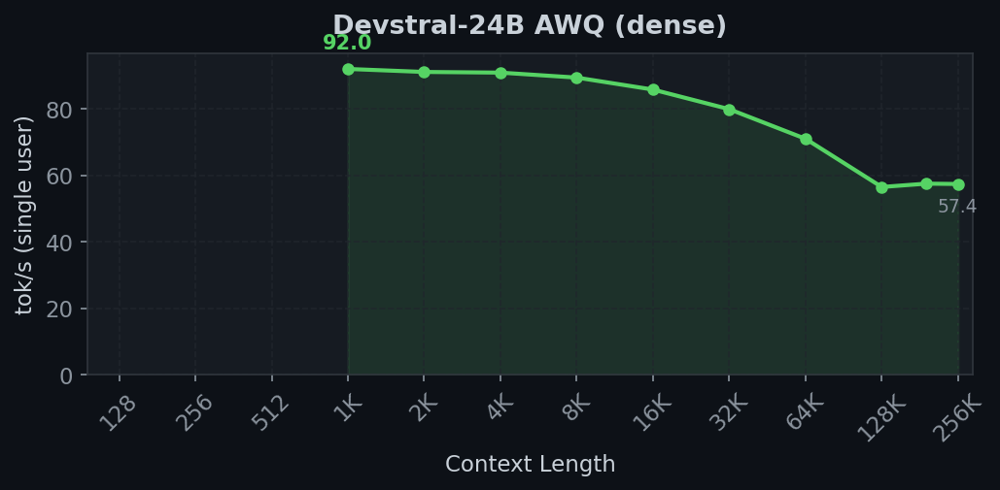
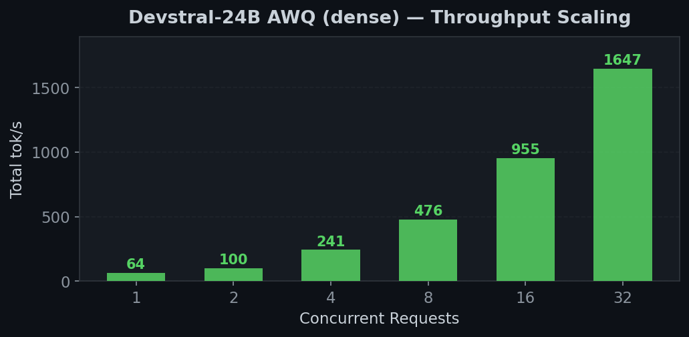
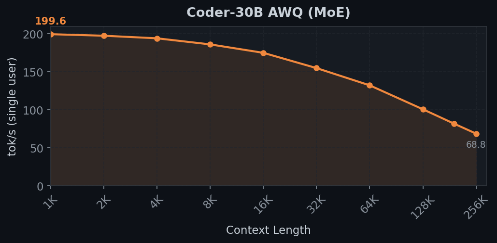
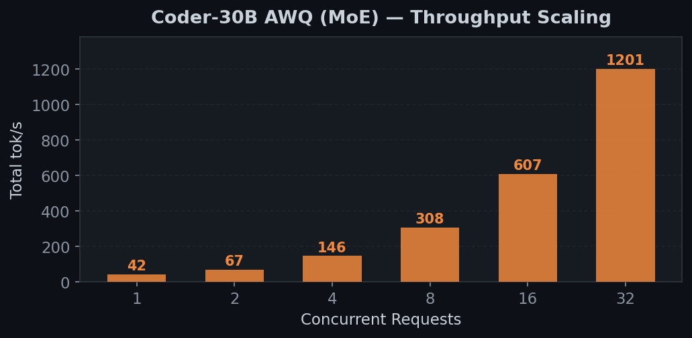

# SGLang Inference: 2x RTX 3090

High-throughput LLM inference on 2x NVIDIA RTX 3090 (GA102-300-A1, Ampere) with CUDA 13.2 / PyTorch cu128.

## Known Issues

- **All Gemma 4 models (26B MoE, 31B Dense)** — **Blocked by FlashInfer `BatchPrefillWithPagedKVCache` on sm_86 (Ampere)**. Gemma 4's full-attention layers use `global_head_dim=512` which this kernel doesn't support (only 64/128/256). See [FlashInfer execution path details](#flashinfer-execution-path) below. Calibrated checkpoints ready. Gemma 4 runs fine on 3090 via llama.cpp (80-110 tok/s).
- **Gemma 4 CT→AWQ conversion quality bug** — The unpack→transpose→repack pipeline produces poor cosine similarity for large output dimensions. See [Gemma 4 quantization notes](#gemma-4-quantization-notes).
- **Gemma 4 31B Dense FP16 overflow** — MLP values exceed FP16 max by layer 2. Marlin (FP32 accumulation) is unaffected. Verify with `--enable-nan-detection`.
- **Qwen3.5-27B DeltaNet is slow** — 7 tok/s, well below the 3090's 936 GB/s bandwidth limit (~67 tok/s theoretical). Likely caused by unoptimized Triton DeltaNet kernel on Ampere (sm_86) and/or our dtype cast patch overhead. RDNA4 gets 26 tok/s, M4 (MLX) also outperforms. Needs profiling to identify the actual bottleneck.
- **CUDA graphs** — Only bs=1 works. `--cuda-graph-max-bs 1 --disable-custom-all-reduce`.
- **60B+ models** — Coder-Next-REAM (35GB), GLM-4.5-Air-REAP (43GB) don't fit in 48GB VRAM.

### Gemma 4 quantization notes

Findings from cross-testing on a sister RDNA4 project (2x R9700):

1. **FP16 overflow on Gemma 31B Dense (hidden_size=5376)**. The MLP layers produce values exceeding FP16 max (65504) by layer 2, causing NaN → GPU crash. This affects ANY non-Marlin AWQ path (PyTorch dequant+matmul, Triton GEMM) because they accumulate in FP16. Marlin kernels accumulate in FP32 internally so NVIDIA is likely unaffected, but **verify with `--enable-nan-detection` if Gemma 31B produces garbage output.** Fix: use `--dtype bfloat16` (requires AWQ BF16 activation support patch).

2. **CT→AWQ conversion quality is poor for Gemma 4**. Cosine similarity between AWQ-dequantized and BF16 reference weights:
   - `q_proj` (out=8192): **0.845** — unacceptable
   - `gate_proj` (out=21504): **0.920** — poor
   - `v_proj` (out=4096): **0.993** — OK
   - `o_proj` (out=5376): **0.991** — OK

   Projections with larger output dimensions degrade more, suggesting a bug in the unpack→transpose→repack pipeline when `group_size` interacts with certain dimension ratios. The conversion scripts in both this repo and the RDNA4 repo produce the same issue. **Models load and run but generate garbage text** (repetitive tokens like "que que que").

3. **Missing chat template**. The Gemma 4 `tokenizer_config.json` from HuggingFace does NOT include the `chat_template` field — it's in a separate `chat_template.jinja` file. SGLang reads from the tokenizer, not the jinja file, so it falls back to a generic template. **Fix: embed the jinja file contents into `tokenizer_config.json`** as the `chat_template` field. Always verify: `AutoTokenizer.from_pretrained(...).chat_template is not None`.

4. **`num_experts` is None for Dense variant**. The Gemma 4 31B Dense config has `num_experts: null`. SGLang's `load_weights` does `if num_experts > 0` which throws `TypeError: '>' not supported between instances of 'NoneType' and 'int'`. **Fix: `num_experts = getattr(config, "num_experts", 0) or 0`**.

## Quick Start

```bash
# 1. Setup: clone SGLang v0.5.10, apply patches, create conda env
./scripts/setup.sh

# 2. Run any model:
./scripts/launch.sh devstral            # Devstral-24B AWQ — best all-round
./scripts/launch.sh coder-30b           # Coder-30B MoE AWQ — best throughput

# 3. Test quality
python scripts/eval/eval_comprehensive.py --port 23334 --parallel 4

# 4. Benchmark
python scripts/bench/bench_all_unified.py --name "Model Name" --port 23334
```

## Prerequisites

- 2x NVIDIA RTX 3090 (24GB GDDR6X each, 48GB total) with NVLink bridge
- NVIDIA drivers (595+) + CUDA 13.x
- Miniforge3/Conda
- ~150GB disk for models

## Model Support (SGLang)

### Agent / coding workloads (single-user, max context)

| Model | Type | Max context | 1-user tok/s | TPOT | Launch | Status |
|-------|------|:----------:|:------------:|:----:|:------:|:------:|
| Devstral-24B AWQ | Dense | 131K | 79 | 13ms | `launch.sh devstral` | Working |
| Coder-30B REAP W4A16 | MoE (103 experts) | 131K | 134 | 7ms | `launch.sh coder-reap` | Working |
| Coder-30B AWQ | MoE (128 experts) | 16K | 43 | 23ms | `launch.sh coder-30b` | Working |
| Qwen3.5-27B AWQ | DeltaNet hybrid | 16K | 7 | 143ms | `launch.sh qwen35` | Working (slow — DeltaNet) |
| Gemma 4 26B REAP | MoE (103 experts) | — | — | — | — | Blocked (see below) |

All numbers measured with `bench_all_unified.py` (tok/s = completion tokens / elapsed time, single user).

### Batch throughput (multi-user)

| Model | Peak total tok/s | Best conc | Context | Status |
|-------|:----------------:|:--------:|:-------:|:------:|
| Devstral-24B AWQ | 1,647 | @32 | 32K | Working |
| Coder-REAP-25B W4A16 | — | — | 131K | Working (single-user only so far) |
| Coder-30B AWQ | 1,201 | @32 | 16K | Working |

### Models that don't fit (48GB limit)

| Model | Params | Weight size | Why |
|-------|--------|:-----------:|-----|
| Coder-Next-REAM-60B | 60B MoE (384 experts) | 35 GB | ~17.5GB/GPU, OOM on init overhead |
| GLM-4.5-Air-REAP-82B | 82B MoE (96 experts) | 43 GB | ~21.5GB/GPU, no room for KV cache |
| Qwen3-Coder-Next-80B | 80B MoE (512 experts) | ~44 GB | Exceeds 48GB total |

## Performance (2x RTX 3090, TP=2, SGLang v0.5.10 + patches)

**Methodology:** All numbers use `bench_all_unified.py` which runs single-user context sweeps and concurrent throughput sweeps. See [benchmarks/README.md](benchmarks/README.md) for full methodology.

### Devstral-24B AWQ (up to 131K context)

24B dense transformer. ~14 GB/GPU. FP8 KV cache enables long context.
- **131K context, batch=1**: 183K token KV cache at 0.90 mem fraction
- **32K context, batch=64**: `launch.sh devstral-32k` for max throughput



| Context Length | tok/s |
|:--------------:|:-----:|
| 128 | 63.4 |
| 1K | 62.4 |
| 4K | 51.9 |
| 8K | 44.0 |
| 16K | 32.8 |
| **32K** | **21.1** |



| Concurrency | tok/s |
|:-----------:|:-----:|
| 1 | 64 |
| 4 | 241 |
| 8 | 476 |
| 16 | 955 |
| **32** | **1,647** |

### Coder-REAP-25B W4A16 (131K context, 103 experts)

25B total / 3B active MoE. REAP-pruned from Coder-30B (128→103 experts). ~6.5 GB/GPU.
571K token FP8 KV cache — enough for 131K+ context single-user. CUDA graphs at bs=1.

Uses `auto-round` quantization (not AWQ/Marlin). Converting to AWQ/Marlin could further improve speed.

| Context Length | tok/s |
|:--------------:|:-----:|
| 128 | 134 |
| 1K | 126 |
| 4K | 98 |
| 8K | 63 |
| 16K | 57 |
| **32K** | **46** |

### Coder-30B MoE AWQ (16K context, 128 experts)

30B total / 3B active MoE. ~16 GB/GPU. Best throughput scaling.



| Context Length | tok/s |
|:--------------:|:-----:|
| 128 | 42.9 |
| 1K | 41.0 |
| 4K | 37.7 |
| 8K | 33.8 |
| **16K** | **27.4** |



| Concurrency | tok/s |
|:-----------:|:-----:|
| 1 | 42 |
| 4 | 146 |
| 8 | 308 |
| 16 | 607 |
| **32** | **1,201** |

## Patches

4 patches on top of SGLang v0.5.10. Apply in order:

### 001-upstream-sync (3,000 LOC)
Cherry-picks from upstream main for model support. No NVIDIA-specific changes.
- Gemma 4 model + fused ops + config transformer
- Qwen3.5/Qwen3-Next model updates
- Triton attention backend + prefill improvements
- pool_configurator.py (MemoryPoolConfig refactor)

### 002-nvidia-model-fixes (923 LOC)
NVIDIA-specific fixes and model compatibility.
- MemoryPoolConfig: runtime import (not TYPE_CHECKING only)
- Marlin shape fallback: torch dequant for layers where dim not divisible by 64
- sharded_weight_loader: override_tp_rank for replicated DeltaNet layers
- pool_configurator: is_dflash guard
- Gemma4: text_config unwrap, top_k_experts config lookup
- Qwen3.5: mamba cache params, DeltaNet TP replication
- Devstral/LLaVA: chat template BOS fix, text-only VLM warmup

### 003-deltanet-triton-dtype-fix (51 LOC)
Fix DeltaNet Triton kernel bf16/fp16 dtype mismatch in causal_conv1d.
- conv_state loads cast to input dtype via `.to(x_ptr.dtype.element_ty)`
- Unblocks Qwen3.5-27B and any DeltaNet model on Ampere (sm_86)

### 004-gemma4-causal-lm-fix (19 LOC)
Fix Gemma4ForCausalLM being incorrectly detected as multimodal.
- CausalLM architectures skip multimodal processor registration
- Gemma4Config always has vision/audio attrs as class defaults — now ignored for text-only

## Setup

```bash
./scripts/setup.sh
```

Or manually:
```bash
cd components/sglang && git checkout v0.5.10
git apply ../../patches/001-upstream-sync.patch
git apply ../../patches/002-nvidia-model-fixes.patch
cd python && pip install -e ".[srt]"
```

| Component | Version | Notes |
|-----------|---------|-------|
| SGLang | v0.5.10 + 2 patches | editable install from source |
| PyTorch | 2.9.1+cu128 | CUDA toolkit 12.8 |
| CUDA | 13.2 | driver 595.58 |
| NCCL | 2.27.5 | P2P over PCIe |
| transformers | 5.5.3 | Gemma4 support |

## Quantization

Self-calibrated AWQ models use a separate conda env (`quant`):

```bash
conda activate quant
CUDA_VISIBLE_DEVICES="" python scripts/quantize/quantize_qwen35_llmcompressor.py
python scripts/quantize/convert_qwen35_ct_to_awq.py
```

See [rules-for-agents.md](rules-for-agents.md) for full quantization pipeline and rules.

## Test System

```
OS:     EndeavourOS (Arch Linux)
Kernel: 6.19.11-arch1-1
RAM:    96 GB (92 GB usable, ~4 GB reserved by iGPU)
GPU:    2x NVIDIA RTX 3090 (GA102-300-A1, 24GB GDDR6X each)
GPU interconnect: NVLink (NV4, 4 lanes × 14 GB/s = 56 GB/s bidirectional)
Driver: 595.58.03
CUDA:   13.2 (PyTorch uses cu128 toolkit)
Python: 3.12
```

## Roadmap

### In progress
- [ ] Gemma 4 26B REAP — GPTQ calibration running (layer 22/31, ~4h remaining)

### Next up
- [ ] Benchmark Gemma 4 26B REAP on SGLang (compressed-tensors, 131K context)
- [ ] REAM Qwen3-Coder-30B (128→96 experts) for Marlin-optimized coding model at 128K
- [ ] Profile Qwen3.5-27B DeltaNet slowness (7 tok/s vs 67 tok/s theoretical)
- [ ] Benchmark Coder-30B REAP at higher concurrency (only tested single-user)
- [ ] Try CUDA graphs bs=1 on Coder-30B (same trick that boosted Devstral 25%)
- [ ] Push self-calibrated checkpoints to HuggingFace for RDNA4 system to use

### Future
- [ ] REAM Qwen3.5-35B-A3B (256→192 experts) — DeltaNet hybrid MoE
- [ ] Add Gemma 4 to REAM (port from REAP's MODEL_ATTRS)
- [ ] Full multimodal Gemma 4 (needs gemma4_mm processor + vision/audio models from upstream)
- [ ] Re-enable CUDA graphs at higher batch sizes (needs custom all-reduce fix or smaller KV cache)
- [ ] Investigate CT→AWQ conversion quality bug for Gemma 4 (cosine sim drops on large dims)
- [ ] Convert Coder-30B REAP from auto-round to AWQ/Marlin for faster kernels

## FlashInfer execution path

SGLang uses FlashInfer's **`BatchPrefillWithPagedKVCache`** and **`BatchDecodeWithPagedKVCache`** kernels for attention. These are FlashInfer's native JIT-compiled kernels, distinct from the TRTLLM FMHA kernels also available in the FlashInfer library.

### head_dim support on sm_86 (RTX 3090, Ampere)

| head_dim | `BatchPrefill` (SGLang uses this) | TRTLLM FMHA (SGLang does NOT use) |
|:--------:|:---------------------------------:|:----------------------------------:|
| 64 | Supported | Supported |
| 128 | Supported | Supported |
| 192 | Supported | Supported |
| 256 | Supported | Supported |
| **512** | **NOT supported** | Being added ([PR #2959](https://github.com/flashinfer-ai/flashinfer/pull/2959)) |

**Impact on models:**
- Qwen family (head_dim=128): Works fine
- Devstral (head_dim=128): Works fine
- **Gemma 4 (global_head_dim=512)**: Blocked — full-attention layers crash FlashInfer

### Fallback attention backends

| Backend | FP8 KV cache on sm_86 | head_dim=512 | Status |
|---------|:---------------------:|:------------:|--------|
| FlashInfer | Yes | No | Default, fastest for supported configs |
| Triton | No (`fp8e4nv` not supported) | Yes | Works but VRAM-prohibitive without FP8 KV |
| SDPA (torch) | No | Yes | Not integrated as SGLang backend |

### Possible fixes

1. **Patch SGLang to use SDPA fallback** for head_dim > 256 layers — works but slow and no FP8 KV
2. **Integrate TRTLLM FMHA path** into SGLang for head_dim=512 — requires verifying sm_86 cubin support
3. **Integrate [FFPA kernels](https://github.com/DefTruth/ffpa-attn-mma)** — supports head_dim up to 1024, tested on RTX 3080 (sm_86)
4. **Wait for FlashInfer** to add head_dim=512 to `BatchPrefill` on sm_86
5. **Use llama.cpp** for Gemma 4 instead of SGLang (80-110 tok/s proven, see [gemma4-turboquant-bench](https://github.com/conorseabrook/gemma4-turboquant-bench))

## Structure

```
patches/                           # SGLang v0.5.10 patches
  001-upstream-sync.patch         #   Upstream cherry-picks (Gemma4, Qwen3.5, etc.)
  002-nvidia-model-fixes.patch    #   NVIDIA-specific fixes
benchmarks/                        # Benchmark results (per-model directories)
  {model}/results.json            #   Structured data from bench_all_unified.py
  baselines.json                  #   Regression test baselines
scripts/
  launch.sh                       #   Unified model launcher (launch.sh <model>)
  common.sh                       #   Shared NVIDIA environment setup
  setup.sh                        #   Full setup (conda, SGLang install)
  bench/                          #   Benchmark scripts
  eval/                           #   Quality evaluation + warmup
  quantize/                       #   Quantization pipeline (GPTQ → CT → AWQ)
components/sglang/                 # SGLang v0.5.10 + patches (cloned by setup.sh)
```
