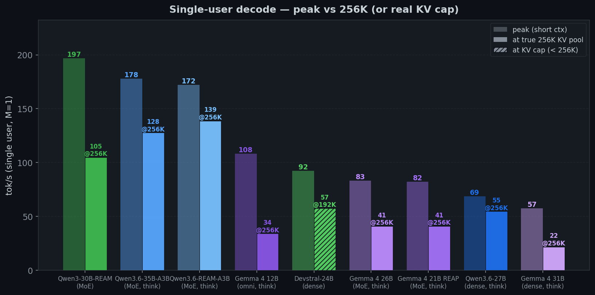
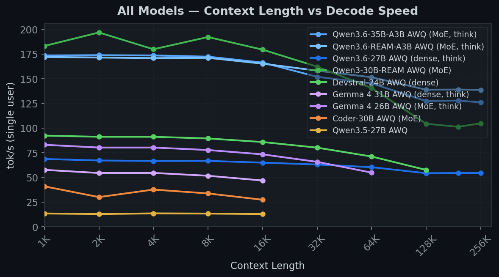

# NVIDIA Inference: SGLang on 2x RTX 3090

High-throughput LLM inference on 2× NVIDIA RTX 3090 (GA102-300-A1, Ampere). SGLang **v0.5.12** + 25 local patches, CUDA 13.2 / PyTorch cu130. This rig owns **all evals + AWQ/INT4 calibrations**; FP8 work lives with the [R9700 RDNA4 stack](https://github.com/mattbucci/2x-R9700-RDNA4-GFX1201-sglang-inference).

## Direction

**We optimize for 256K-context single-user agentic workloads on AWQ-int4 ships.** SWE-bench Lite is the canonical eval — every preset listed below serves at full 256K (or model-card max) so agentic harnesses with multi-turn tool-call context (median ~41K, p90 ~82K, max 230K per our 2026-05-31 measurement) actually fit.

This rules out three alternative optimization axes other 3090 stacks chase:

| Their focus | Why not ours |
|---|---|
| Short-ctx multi-stream throughput (vLLM-style 80-140 TPS @ <32K) | We need the full prompt of an agentic instance in context; truncating mid-conversation loses correctness. |
| FP8 quantization | R9700's gfx1201 has native FP8 WMMA acceleration; Ampere sm_86 doesn't. FP8 is half the weight bytes of INT4 → less of our 48 GB total VRAM is left for KV at 256K. |
| Spec-decode (EAGLE3 / DFlash / MTP) | At 256K + AWQ-int4 + draft + cuda graphs we OOM on 24 GB cards. R9700's 32 GB cards have the headroom we don't. Closed as "not viable on 24 GB"; see [Speculative decoding](#speculative-decoding). |

**Active work** (full task queue in `git log` + the task tracker):

1. **MoE coverage matrix gaps** — every MoE base should ship in native + REAP + REAM AWQ flavors. Audit + 6 missing-variant ships are tracked in the [MoE coverage matrix](#moe-coverage-matrix--calibration-backlog) below.
2. **Nemotron-3-Nano-Omni AWQ build** — first Mamba2-hybrid + AVLM (audio+video+vision+language) in our catalog. Calibration is **prepped** (62 GB BF16 base + 267-LOC script on disk, pre-flight done) but **queued behind the running sweep** — Rule 1 bars a concurrent calibration. R9700 already has the FP8 variant at 256K.
3. **Coding-eval bake-off** — opencode-baseline sweep across the fleet to confirm every preset produces non-empty diffs. Live receipts under `benchmarks/quality/`.

What we **don't** ship: random community quants. Every `mattbucci/*-AWQ` is calibrated end-to-end from the upstream BF16 base via our own GPTQ → CT → AWQ-Marlin pipeline. When a model needs MoE expert pruning, we run REAP/REAM ourselves (`scripts/quantize/run_reap.py`, `scripts/quantize/run_ream_qwen3moe.sh`) on the upstream weights — no atbender / Cerebras / unsloth ships used as bases. Pre-quantized 3rd-party AWQ uploads are reference points only.

## Performance — single-user decode at 256K





Single-user decode (M=1), honestly capped at each model's real KV pool (`max_total_num_tokens`). **True-256K decoders** (solid right bars): qwen36-ream **139**, qwen36 **126**, qwen3-30b-ream **103**, qwen3.6-27b **54** — the DeltaNet+MoE thinking models (`qwen36`/`qwen36-ream`/`qwen35-moe`) run CUDA graphs, so decode is attention-bound (qwen36 174→126 tok/s @ 1K→262K) rather than launch-bound. **KV-capped models** (hatched, shown at their deepest reliable length in the FP16-default config): devstral **56 @128K**, gemma4-31b **34 @16K**, gemma4-26b **33 @64K** — per-model KV ceilings are in [VRAM context limits](#vram-context-limits-kv-dtype-varies-tp2-48-gb-total). Charts drop over-KV-cap points (a prompt that can't fit the pool never decodes there, so its logged tok/s is an artifact).

## Roadmap

What's queued, grouped by theme. Calibration work is gated on the bake-off sweep finishing + Rule 1 (no concurrent calibration + serving). The bake-off methodology + resume mechanics live in [`CLAUDE.md`](CLAUDE.md) and [`evals/swebench/`](evals/swebench/).

### Experimentation sprint (active 2026-06-10 — bake-off paused, GPUs reserved, TP=2)

Hypotheses mined from the patch-set patterns; lab notebook with methods + decision rules: [`benchmarks/sprint-2026-06-kv-decode/LOG.md`](benchmarks/sprint-2026-06-kv-decode/LOG.md). One variable at a time; instruments identical to the fleet eval so results compare to existing baselines.

1. **Track A — SWA sub-pool right-sizing** (from patches 043/047): SGLang defaults `--swa-full-tokens-ratio 0.8`, but sliding layers (40/48 on the 12B, 25/30 on the 26B, window 1024) can't attend past 1024 tokens — the dominant KV consumer is mostly dead weight at MAX_RUNNING=1. **TRACK A CONCLUDED — both Gemma hybrids now true-256K: 12B 102K→565K and 26B 118K→652K full-pool tokens at ratio 0.0625; tool-use 1.0/1.0 to 258,085 true tokens on both; caps 5/5 (12B video fixed by patch 050 en route); decode within ~3%/1% of control at shared ctx + new 128K–256K decode band (~31 tok/s each).**
2. **Track B — Gemma decode** (from 011/017/021 + the flat-TPOT graph tell, which Track C confirmed fires on ALL three Gemma presets): A/B torch_native+cuda-graph vs triton+no-graph, and awq_marlin vs moe_wna16 MoE runner at M=1. Target ≥1.3× at 131K+ with capabilities held.
3. **Track C — fleet TPOT-vs-ctx audit: DONE** (LOG.md): flat-TPOT tell on gemma4-12b/26B/31B (1.07/1.01/0.99 = launch-bound); qwen3-ream −26% decode cliff at 64K→128K queued as B3.
4. **Track D — fail-open kernel-gate audit** (from R9700's dense-GEMV find: an FP16-scales-vs-BF16 dispatch gate silently dropped every dense ship to a 5× slower dequant fallback, 4.6→24.7 tok/s when fixed): first pass greps fleet boot logs for the per-layer chosen quant method per preset; any preset whose hot path differs from intent gets a tok/s A/B. Quality evals cannot catch this class — only tok/s can.

### New-arch bringup — 256K candidate

The arch has an **upstream SGLang loader grafted onto our v0.5.12 tree** — no from-scratch port; it passed GPU-free validation (import + AST constructor-drift check, zero kwarg drift on core primitives).

1. **`CohereLabs/BLS-Mini-Code-1.0`** (`Cohere2MoeForCausalLM`, patch 042) — 128-expert fine-grained MoE thinking+agentic coder, 500K native, ~26 KB/token (7 GB KV @256K). Loader grafts clean and validates GPU-free, but ~30B BF16 (61 GB) exceeds 48 GB, so it needs an **AWQ int4 build first** (calib device; preserve thinking+tool+vision, eos 255001, Cohere Command chat template) before it can boot.

### Nemotron-3-Nano-Omni AWQ build chain

NVIDIA Mamba2-Transformer hybrid MoE + AVLM (audio+video+vision+language) + thinking. Plan: [`scripts/quantize/nemotron3_nano_omni_plan.md`](scripts/quantize/nemotron3_nano_omni_plan.md). BF16 base + calibration script already on disk (62 GB + 267 LOC); pre-flight done.

1. **Smoke** BF16 base on SGLang TP=2 — context sweep `8K → 32K → 64K → 128K → 256K` to verify Triton-NVIDIA doesn't hit the AMD-only `TritonAMDGPUCanonicalizePointers` compiler bug R9700 hit at ~13K. Single text + image + audio probe at each ctx.
2. **Calibrate** GPTQ W4A16 via `scripts/quantize/quantize_nemotron3_nano_omni.py` (~12-20 h CPU, detached). Pre-flight ignore list already derived from `hybrid_override_pattern` (56% of layers stay BF16: 23 Mamba + 6 Attention; the other 23 MLP/MoE go INT4).
3. **Convert** CT → AWQ-Marlin + `check_awq_scales.py` audit (non-zero exit = do NOT ship).
4. **Validate** 6-modality probe (basic + thinking + image + video + audio + tool) via `validate_capabilities.py` (audio probe added in commit `ab7ab2c`).
5. **Ship** to `mattbucci/Nemotron-3-Nano-Omni-30B-A3B-Reasoning-AWQ` + wire `nemotron3-omni` preset in `launch.sh` (`--reasoning-parser nemotron_3 --tool-call-parser qwen3_coder --trust-remote-code`).
6. **NGRAM** spec-decode trial — CUDA-only, no training needed; if it clears 1.3× decode speedup on a coding probe, ship and skip EAGLE3 training. Plan: [`scripts/quantize/nemotron3_nano_omni_plan.md`](scripts/quantize/nemotron3_nano_omni_plan.md) Phase 1.
7. **EAGLE3 draft training** — only if NGRAM is insufficient. SpecForge offline-mode against our shipped AWQ; user-authorized 2026-05-31 ("we can just make our own model"). ~1-3 day GPU job. Plan: [`scripts/specforge/eagle3_training_plan.md`](scripts/specforge/eagle3_training_plan.md). Note: EAGLE3 on Mamba2-hybrid is unproven — three hook-point options documented in the plan.

### MoE coverage gaps (every base needs native + REAP + REAM)

Detailed matrix + rebuild paths in the [MoE coverage matrix](#moe-coverage-matrix--calibration-backlog) below. Six missing-variant builds, prioritized:

1. **`Qwen3.6-35B-A3B-REAP-AWQ`** — REAP of bake-off top scorer (177/300 = 59.0%); 256→192e via `run_reap.py` on upstream BF16. **Tooling ready:** the fused-`Qwen3_5MoeExperts` unfuse + custom-router handling are built and miniature-validated (`scripts/quantize/test_qwen3_5moe_unfuse.py`, 7/7). Remaining = the on-box run: 62 GB BF16 → CPU offload on 48 GB VRAM (memory-marginal; R9700's 64 GB may be the better prune host), then AWQ recal with `thinking_vision_video` + `check_awq_scales.py --base`.
2. **`gemma-4-26B-A4B-REAM-AWQ`** — REAM of multimodal MoE. Blocked on tooling task below (Samsung SAIL needs Gemma 4 port).
3. **`Qwen3.6-VL-30B-A3B`** native + REAM + in-house REAP — rebuild VL trio with vision tensors retained (current REAP-26B is atbender pre-pruned, vision-broken). ⚠ pre-flight: SGLang's `Qwen3VLMoeForConditionalGeneration` loader was previously broken in v0.5.11 (no upstream fix found in v0.5.12 grep) — but main now ships the class with a registered EntryClass (2026-06-10 audit), making it a graft candidate like 042/043; smoke a community AWQ first before sinking calibration time.
4. **`Qwen3-30B-Instruct-2507`** native + REAP — REAM exists (`qwen3-ream`, fastest preset at 107 tok/s); complete the trio.
5. **`Qwen3.5-28B-A3B`** native + REAM — older DeltaNet+VL gen; only Cerebras REAP currently ships.
6. **`Nemotron-3-Nano-Omni`** REAP + REAM — gated on native ship + EAGLE3 above.

### Tooling

Items 2–3 are prerequisites for the MoE backlog. Detailed plan: [`scripts/quantize/ream_gemma4_port_plan.md`](scripts/quantize/ream_gemma4_port_plan.md).

1. **Upstream-PR sweep** — 12 of our 24 patches fix bugs still present in sglang main as of 2026-06-10 (see the patch map in [`patches/README.md`](patches/README.md)): the Qwen3.5/3.6 AWQ + CausalLM family (002 / 018 / 031 / 035), kernel correctness (003 / 011 — 011 also bites RDNA4 + Blackwell SM12.x), MoE gelu routing (017), Gemma 4 (004 / 026 + 025's `masked_fill` half), agentic robustness (034 / 041 — R9700-originated, coordinate the PRs with them). Upstreaming erases carry cost at every future rebase; the next rebase already drops 012 / 028 / 030 / 042 + most of 043 (fixed or native in main).
2. **Port Samsung SAIL REAM merge to Gemma 4 arch** — current `run_ream_qwen3moe.sh` + the upstream `merge.py` are Qwen3-family-only (5 hardcoded assumptions identified). Port unblocks the gemma-4-26B REAM build. Est. 40-60 h dev.
3. **Extend `run_reap.py` to remaining MoE layouts.** `run_reap.py` + the unfuse patches are in-repo (`run_reap.py` ported from R9700; the Coder-30B-A3B-REAP ship used the Qwen3Moe path). Coverage: (a) **`Qwen3_5MoeExperts`** (Qwen3.5/3.6 fused 3-D experts + `Qwen3_5MoeTopKRouter`) — ✅ done: `patches/qwen3_5moe_unfused_experts.py` (load-split + save-fuse hooks) + tuple-router handling in the saliency hook, miniature-validated 7/7 by `test_qwen3_5moe_unfuse.py`; (b) Gemma 4 parallel dense+MoE + different expert keys — ❌ TODO; (c) Nemotron-H Mamba2-hybrid (only the 23 MLP/MoE layers pruneable per `hybrid_override_pattern`) — ❌ TODO. The saliency tracker + `prune_model` are arch-agnostic once `.mlp.gate` + per-expert `.mlp.experts.{i}.down_proj` modules exist — the unfuse patches create them.

## Coding-eval bake-off (SWE-bench Lite, v2 Docker harness, 256K, single-user)

Top tier: `qwen36-dense` (Qwen3.6-27B dense, thinking) **leads at 62.0%** on opencode — ahead of the A3B-MoE thinkers `qwen36` (59.0%) and `qwen36-ream` (58.7%). All three clear the coders. The dense 27B that already tops MMLU (98.2%) and holds 100% reasoning to true 256K is also the strongest agentic coder — the lifted-hold 256K bake-off (qwen35-moe in flight) is filling in the rest.

| Preset | opencode | claw-code | little-coder |
|--------|:--------:|:---------:|:------------:|
| `qwen36-dense` (Qwen3.6-27B Dense AWQ, thinking) | **186/300 = 62.0%** | — | — |
| `qwen36` (Qwen3.6-35B-A3B AWQ-Marlin, thinking) | **177/300 = 59.0%** | (sweeping) | (sweeping) |
| `qwen36-ream` (Qwen3.6-REAM-A3B-AWQ, thinking) | **176/300 = 58.7%** | 20/123 = 16.3% † | 0/10 = 0.0% † |
| `coder-30b-eval` (Qwen3-Coder-30B-A3B-AWQ CT) | 129/300 = 43.0% | 107/300 = 35.7% | 74/300 = 24.7% |
| `coder-reap-25b` (Cerebras Qwen3-Coder-REAP-25B-A3B-AWQ) | 125/300 = 41.7% | 122/300 = 40.7% | 101/300 = 33.7% |
| `coder-30b-ream` (Samsung SAIL Qwen3-Coder-30B-A3B-REAM-AWQ) | 116/300 = 38.7% | 109/300 = 36.3% | 73/300 = 24.3% |

† Thinking-mode models exhaust their `<think>` budget before committing a `tool_call` on tool-call-heavy scaffolds (claw/little-coder) — they belong on opencode. Coder-tuned models match claw's tool registry and score similarly on claw vs opencode. `coder-reap-25b` is the most-rounded preset; `qwen36-ream` wins when the scaffold matches (opencode).

Failure-mode analysis (over-edit signature, per-repo skew, oracle-ensemble ceiling of 49% across opencode∪claw, rollout self-clean), methodology, and per-cell receipts: [`patches/README.md`](patches/README.md) + [`benchmarks/quality/bakeoff-*.json`](benchmarks/quality/). Every preset's `--tool-call-parser` matches its chat-template tool format (see Known Issues).

## Speculative decoding

EAGLE3 + DFlash work against our **INT4/AWQ targets** (draft stays BF16; target quant is independent). Receipt: `benchmarks/quality/specdec-v0512-2026-05-29.json`.

| Target | Algo / Draft | Baseline | With spec | Speedup |
|---|---|:---:|:---:|:---:|
| `coder-30b` AWQ-native | EAGLE3, `lmsys/SGLang-EAGLE3-Qwen3-Coder-30B-A3B-Instruct-SpecForge` (steps 4 / topk 4 / draft 8) | 185 tok/s | **306 tok/s** | **1.65×** |
| `qwen36` AWQ | DFlash, `z-lab/Qwen3.6-35B-A3B-DFlash` (`--dtype bfloat16` + spec-v2) | 126 tok/s | 126 tok/s | **~1.0× (moot)** |

DFlash buys nothing on `qwen36` — graph-ON no-spec already decodes 126 tok/s @256K (174 @1K), matching DFlash at its 32K cap. A second reason (beyond the 24 GB-fit limits below) no-spec is the only viable path.

**Constraints on 24 GB cards** (R9700 has 32 GB headroom; ours doesn't):
- Drop `--mem-fraction-static 0.70` so the target leaves room for the draft + its cuda graphs (preset `MEM=0.85` OOMs the draft).
- EAGLE3: R9700's wide ladder (topk 16 / draft 32) OOMs the draft graphs here; our wider-but-fits ladder (steps 4 / topk 4 / draft 8) is the sweet spot.
- DFlash on `Qwen3_5MoeForConditionalGeneration`: must export `SGLANG_ENABLE_SPEC_V2=1`, pass `--mamba-scheduler-strategy extra_buffer`, **and force `--dtype bfloat16`** (the BF16 draft mismatches the FP16 target → `Index put dtype mismatch` at boot). Cap context at 32K to fit.
- Universal: `--speculative-draft-model-quantization unquant` (draft stays BF16) and `--speculative-attention-mode decode`.

Not applicable: gemma4 (no DFlash hook); AWQ's bundled MTP head is int4-dead, so NEXTN/MTP stays FP8-only.

**⚠ Spec-decode is not viable for our target workloads on 24 GB cards** — closed 2026-05-31. The numbers above are for short-prompt decode (chat-bot, synthetic benchmarks). Two constraints kill it for our actual workloads:

1. **SWE-bench prompts exceed the caps.** Measured against the finished qwen36-opencode-v2 cycle (300 instances): median peak prompt 41K, p90 82K, max 230K. **97.3% exceed EAGLE3's 16K**, **65.3% exceed DFlash's 32K**. Receipt: [`benchmarks/quality/qwen36-opencode-v2-prompt-length-distribution.json`](benchmarks/quality/qwen36-opencode-v2-prompt-length-distribution.json).
2. **256K + spec doesn't fit on 24 GB.** Per VRAM accounting (~15 GB weights TP=2 + 9 GB KV @ 256K + 5 GB cuda graphs + 0.4 GB draft) = ~21 GB/card → OOMs at MEM=0.85. R9700's 32 GB cards have headroom we don't.

The `SPEC_DECODE=1` opt-in remains wired for short-prompt uses. For our 256K agentic workloads, no-spec is the only viable path on 24 GB hardware. Full reasoning: [`evals/swebench/spec_decode_plan.md`](evals/swebench/spec_decode_plan.md).

**MTP-on-int4 rule:** in-ckpt MTP heads do NOT graft onto int4 targets — the BF16 MTP mispredicts on int4-shifted hidden states (Qwen3.5-27B graft probe: accept 0.00, 0.1 tok/s, worse than no-spec). MTP transfer tolerates FP8 but not int4. For int4 spec-decode use a trained EAGLE3/DFlash draft, never a grafted MTP. Vision towers, on the other hand, graft cleanly — they're input-side and quant-decoupled.

## Known Issues (open)

None currently open. Resolved items live in `git log` + [`patches/README.md`](patches/README.md). One caveat carried forward: `check_awq_scales.py` reads native-AWQ format — CT-format checkpoints crash its tensor reader (use a native-AWQ mirror or HF Range-fetch mode for CT audits).

## Quick Start

```bash
./scripts/setup.sh                          # clone SGLang v0.5.12, apply patches, create conda env

# TP=2 / 256K presets (matrix standard):
./scripts/launch.sh qwen3-ream              # 262K @ 107 tok/s — REAM merged MoE, 96 experts
./scripts/launch.sh qwen36                  # Qwen3.6-35B-A3B MoE AWQ-Marlin — 256K, thinking+vision
./scripts/launch.sh qwen36-dense            # Qwen3.6-27B Dense AWQ — DeltaNet+attn
./scripts/launch.sh coder-30b               # Coder-30B-A3B MoE — peak throughput
./scripts/launch.sh coder-reap-25b          # Coder-REAP-25B MoE AWQ-Marlin — 256K @ 109 tok/s
./scripts/launch.sh qwen3-vl-32b            # Qwen3-VL-32B Dense — 131K @ TP=2
./scripts/launch.sh gemma4-31b              # Gemma 4 31B Dense AWQ (thinking+image+video, 256K)
./scripts/launch.sh devstral                # Devstral-Small-2-24B AWQ (tool+vision, 262K)

python scripts/eval/validate_capabilities.py --port 23334    # auto-skips thinking/vision/video per preset
./scripts/eval/test_capabilities_all.sh                       # sweep across all AWQ presets
python scripts/bench/bench_long_context.py --port 23334 --name "Model" --contexts 1024 16384 131072 250000
```

Use `temperature >= 0.3` on Qwen3 family models — greedy decode at `temp=0` triggers a token-repetition loop.

## Prerequisites

Tested hardware (current rig):

| Component | Spec |
|-----------|------|
| GPU | 2× NVIDIA RTX 3090 (24 GB each, 48 GB total) — NVLink bridge present; `nvidia-smi topo -m` reports `NV4` (~56 GB/s aggregate) |
| CPU | AMD Ryzen 9 7900 (12C/24T, Zen 4, AM5) |
| RAM | 64 GB DDR5-6000 (62 GB usable) |
| Motherboard | MSI MPG B650I EDGE WIFI (mini-ITX, AM5) |
| Storage | 2× 2 TB NVMe (`nvme0n1` = root, `nvme1n1` = `/data` models + caches) |
| Chassis fans | Corsair Commander Core XT (via `liquidctl`) |
| OS / Kernel | Arch (EndeavourOS) / `linux-zen-p2p` 6.18.zen1-1 (locally-built linux-zen + cosmetic `CONFIG_HSA_AMD_P2P=y`; pinned to 6.18 for stability) |
| NVIDIA driver / CUDA | `nvidia-open-dkms` 595.71.05 / CUDA 13.2 |
| NVLink | physical 4-link bridge installed between the two 3090s — `nvidia-smi nvlink --status` shows all 4 links at 14.06 GB/s (~56 GB/s aggregate) |

Both 3090s sit at PCIe Gen4 with the NVLink bridge; NCCL selects `P2P/IPC` transport (NVLink + peer-to-peer CUDA IPC) once everything below is in place.

### Why `NV4` reports — the load-bearing pieces

1. **Physical NVLink bridge installed** between the two 3090s. This is what produces the four 14.06 GB/s links (`nvidia-smi nvlink --status`). Without the bridge there is no `NV4` regardless of any software change.
2. **Two separate kernel boot args** in `/etc/kernel/cmdline` — both load-bearing for different failure modes:
   ```
   amd_iommu=on iommu=pt pcie_acs_override=downstream,multifunction pcie_ports=native pcie_ecrc=on
   ```
   - **`pcie_acs_override=downstream,multifunction`** — gives P2P traffic permission to traverse ACS-protected PCIe ports on this AM5 chipset. Without it, consumer-Ampere P2P is blocked at the chipset level and `nvidia-smi topo -m` reports `PHB`. Affects the routing decision.
   - **`iommu=pt`** — IOMMU passthrough mode (vs lazy DMA-translation default). Short-context TP=2 works either way; the wedge appears at long context. R9700 (sister stack, same mechanism on NCCL/RCCL) measured the failure cleanly: without `iommu=pt`, **131K-token decode collapses to 0.68 tok/s** with the NCCL log filling with channel-renegotiation churn (`178278 NCCL log lines`); with it, decode is healthy **16.83 tok/s** (`4 log lines`). NCCL prints `Missing iommu=pt … can lead to instability or hang` as the proximate warning. Affects how the kernel actually services the resulting DMAs.

   Backup of the pre-NVIDIA cmdline lives at `/etc/kernel/cmdline.bak.preNvidia`. Verify both args are live: `grep -oE "iommu=pt|pcie_acs_override=\S+" /proc/cmdline`.
3. **`nvidia-open-dkms`** (not `nvidia-open`) — DKMS rebuilds against installed headers every kernel bump. Modern open driver defaults `NVreg_DmaRemapPeerMmio=1`, which is what we want; nothing extra to set.

### Kernel choice

- `linux-zen`-family kernel, not stock `linux` — stock + open NVIDIA module hard-locked the host under sustained TP=2 / 256K load. The zen patchset eliminated the recurrence.
- Our actual install is `linux-zen-p2p` 6.18, locally built from the upstream Arch `linux-zen` PKGBUILD with one cosmetic change: `CONFIG_HSA_AMD_P2P=y` (an AMD-HSA driver flag we don't use — vestigial from earlier debugging). Stock `linux-zen` would serve the same role; the rename is historical. The rebuild script + rebuild path are in [`scripts/host-setup/rebuild_linux_zen_p2p.sh`](scripts/host-setup/rebuild_linux_zen_p2p.sh).
- **Pin these in `pacman.conf`** so a routine `pacman -Syu` doesn't silently leapfrog `linux-headers` or `nvidia-open-dkms` and break the DKMS module-for-kernel pairing. Add to `/etc/pacman.conf`:
  ```
  IgnorePkg = linux-zen linux-zen-headers linux-zen-p2p linux-zen-p2p-headers linux-headers nvidia-open-dkms nvidia-utils cuda cuda-tools opencl-nvidia
  ```
  After that, updating any of those packages is a deliberate `pacman -S <pkg>` opt-in.

### Cooling and power profile (load-bearing)

Two systemd units hold a cooling profile required for multi-hour bake-off survival. DDR5 SPD sensors crossed `ALARM HIGH` (55 °C) under stock cooling + default 350 W per 3090, correlating with random heap corruption / kernel BUGs / hard resets. The profile stays in spec under sustained TP=2 inference.

| Unit | Action |
|------|--------|
| `gpu-cooling.service` | Boot oneshot. NVIDIA persistence mode, **260 W** power limit per 3090 (from 350 W), Corsair case fans to 100% via `liquidctl`, 75% GPU fan floor via NVML. |
| `gpu-fan-curve.service` | NVML daemon. Polls temp every 4 s. Fan duty 75% below 60 °C, linear to 100% by 80 °C. One hot card pulls all fans up. |

The fan curve runs through NVML, not hwmon — consumer Ampere on the open driver exposes no GPU `pwm*` under `/sys/class/hwmon`. NVML's `SetFanSpeed_v2` works as root. Scripts tracked under [`systemd/`](systemd/):

```bash
sudo pacman -S --needed python-nvidia-ml-py
sudo install -m 0755 systemd/gpu-cooling.sh   /usr/local/bin/gpu-cooling.sh
sudo install -m 0755 systemd/gpu-fan-curve.py /usr/local/bin/gpu-fan-curve.py
sudo install -m 0644 systemd/gpu-cooling.service   /etc/systemd/system/
sudo install -m 0644 systemd/gpu-fan-curve.service /etc/systemd/system/
sudo systemctl daemon-reload && sudo systemctl enable --now gpu-cooling.service gpu-fan-curve.service
```

Verify: `nvidia-smi --query-gpu=power.limit,fan.speed,temperature.gpu --format=csv` (expect 260 W, ~75% fans idle). 260 W picked to leave throughput headroom (a 256K coder-30b cycle pulls only ~245 W per card at steady-state decode) while cutting peak heat ~25%.

### Arch toolchain gotchas (host-side builds)

EndeavourOS ships a much newer toolchain than the docker eval images, so anything built **on the host** (kernels, Triton, pip packages with C extensions) hits issues docker hides. Surfaced by R9700 running an FP8 SWE-bench bake-off no-docker; relevant here for any host-side build:

- **gcc 16 defaults to C23** — `nullptr` is a reserved keyword and `-Wincompatible-pointer-types` / `-Wimplicit-*` are hard errors, so old C (astropy's bundled cfitsio, many scientific-Python C extensions) fails with `command '/usr/bin/cc' failed` or `expected identifier before 'nullptr'`. Build with `CFLAGS="-std=gnu17 -Wno-error=incompatible-pointer-types -Wno-error=implicit-function-declaration -Wno-error=implicit-int -Wno-error=int-conversion -Wno-error=return-mismatch"` (`-std=gnu17` is the load-bearing flag). The Docker eval images ship gcc <14 and sidestep this entirely.
- **Arch defaults `/tmp` to a RAM-backed tmpfs** (`df -h /tmp` — Type `tmpfs`, ~half of RAM). Bulk job I/O (repo clones, build dirs, per-instance venvs) fills it → `ENOSPC` → *silent* empty outputs, not a crash. Keep workdirs + `TMPDIR` on `/data` (`nvme1n1`).
- **Non-docker SWE-bench scoring deps** (only if you run the host-side scorer): `sudo pacman -S --needed gcc-fortran openblas lapack freetype2 libpng gsl fftw pkgconf`, and pre-install pyproject build-requires (`cython extension-helpers setuptools_scm oldest-supported-numpy meson-python pybind11`) since `PIP_NO_BUILD_ISOLATION=1` skips them.

Full host-side scaffold + toolchain notes (opencode + little-coder + claw-code, no docker): R9700 [`rules-for-agents.md`](https://github.com/mattbucci/2x-R9700-RDNA4-GFX1201-sglang-inference/blob/main/rules-for-agents.md) "Host OS gotchas".

## Model Support

**Max ctx** = what the AWQ ship + 2× 24 GB actually serves end-to-end (validator + bake-off receipts). All presets now default to the full ctx — AWQ-int4 has half the weight bytes of FP8, and R9700 runs FP8 at full 256K on 32 GB cards, so 256K easily fits at INT4 on 2× 24 GB. Single-user tok/s measured at the listed context; **fresh prefill** (radix cache disabled).

| Model | Type | Max ctx | tok/s | Launch | HF + notes |
|-------|------|:-------:|:----:|:------:|:-------|
| **Qwen3.6-35B-A3B AWQ-Marlin** | DeltaNet+MoE A3B (256 exp, VL) | **262K** | **126** | `qwen36` | [`mattbucci/Qwen3.6-35B-A3B-AWQ`](https://huggingface.co/mattbucci/Qwen3.6-35B-A3B-AWQ). Bake-off top tier (177/300 = 59.0% × opencode). |
| **Qwen3.6-REAM-A3B AWQ** | DeltaNet+MoE A3B (192 exp, VL) | **262K** | **139** | `qwen36-ream` | [`mattbucci/Qwen3.6-REAM-A3B-AWQ`](https://huggingface.co/mattbucci/Qwen3.6-REAM-A3B-AWQ). Vision tower grafted. Bake-off 176/300 = 58.7% × opencode. |
| **Qwen3-30B-Instruct-2507 REAM AWQ** | MoE A3B (96 exp) | **262K** | **107** | `qwen3-ream` | [`mattbucci/Qwen3-30B-Instruct-2507-REAM-AWQ`](https://huggingface.co/mattbucci/Qwen3-30B-Instruct-2507-REAM-AWQ). REAM 128→96; text-only generalist; fastest preset (183→107 tok/s @ 1K/250K). |
| **Qwen3.5-28B MoE REAP** | DeltaNet+MoE A3B (205 exp, VL) | **262K** | **138** | `qwen35-moe` | Cerebras REAP of Qwen3.5-28B-A3B; thinking+vision. |
| **Qwen3-Coder-30B-A3B AWQ** | MoE A3B (128 exp) | **262K** | ~30 @256K | `coder-30b` or `coder-30b-eval` | [`mattbucci/Qwen3-Coder-30B-A3B-AWQ`](https://huggingface.co/mattbucci/Qwen3-Coder-30B-A3B-AWQ). Two presets serve the same model; for short-ctx batch-decode benchmarks override `CTX=16384 MAX_RUNNING=32 ./scripts/launch.sh coder-30b` (peaks ~187 tok/s @ 1K). |
| Coder-REAP-30B AWQ-Marlin | MoE A3B (96 exp) | **262K** | 109 | `coder-reap-25b` | [`mattbucci/Qwen3-Coder-30B-A3B-REAP-AWQ`](https://huggingface.co/mattbucci/Qwen3-Coder-30B-A3B-REAP-AWQ) (R9700 in-house). |
| **Gemma 4 31B Dense AWQ** | Dense (VL) | **~24K** ‡‡ | ~22 | `gemma4-31b` | [`mattbucci/gemma-4-31B-AWQ`](https://huggingface.co/mattbucci/gemma-4-31B-AWQ). LM INT4, vision tower FP16. |
| **Gemma 4 26B MoE AWQ** | MoE A4B (103 exp, VL) | **262K** ✓ | 22 (31 @256K) | `gemma4` | [`mattbucci/gemma-4-26B-AWQ`](https://huggingface.co/mattbucci/gemma-4-26B-AWQ). **Tool-use 1.0 → 258K true tokens, 5/5 caps** incl. video. KV wall removed 2026-06-10: `--swa-full-tokens-ratio 0.0625` → 652K-token full pool (was 118K). |
| **Gemma 4 12B Unified AWQ** | Omni, encoder-free | **262K** ✓ | 42 (31 @256K) | `gemma4-12b` | [`mattbucci/gemma-4-12B-AWQ`](https://huggingface.co/mattbucci/gemma-4-12B-AWQ). In-house int4 RTN-from-QAT. MMLU 77 / HE 93 / **tool-use 1.0 → 258K true tokens**, **5/5 omni** (vision + video ✓, patches 042–050). KV wall removed 2026-06-10: `--swa-full-tokens-ratio 0.0625` → 565K-token full pool (was 102K at the 0.8 default). |
| **Qwen3.6-27B Dense AWQ** | Dense + DeltaNet (VL) | **262K** (657K KV) | 21 | `qwen36-dense` | [`mattbucci/Qwen3.6-27B-AWQ`](https://huggingface.co/mattbucci/Qwen3.6-27B-AWQ) (R9700 self-cal). |
| **Devstral-Small-2-24B AWQ** | Dense (VL) | **~172K** ‡‡ | 56 | `devstral` | [`mattbucci/Devstral-Small-2-24B-AWQ`](https://huggingface.co/mattbucci/Devstral-Small-2-24B-AWQ). The canonical Devstral; built from [`mistralai/Devstral-Small-2-24B-Instruct-2512`](https://huggingface.co/mistralai/Devstral-Small-2-24B-Instruct-2512). FP8→BF16→GPTQ+tool-cal→AWQ. |
| **Qwen3-VL-32B Instruct AWQ** | Dense (VL) | **131K** (model-card cap) | 40 | `qwen3-vl-32b` | [`mattbucci/Qwen3-VL-32B-AWQ`](https://huggingface.co/mattbucci/Qwen3-VL-32B-AWQ) (R9700). 68→50→40 tok/s @ 1K/65K/131K. |
| Gemma 4 21B REAP AWQ | MoE | **256K** | — | `gemma4-21b-reap` | [`mattbucci/gemma-4-21B-REAP-AWQ`](https://huggingface.co/mattbucci/gemma-4-21B-REAP-AWQ). Cerebras-style expert prune of the 26B parent; same Gemma 4 serving flags. Download required: `hf download mattbucci/gemma-4-21B-REAP-AWQ --local-dir /data/models/hf-mattbucci/gemma-4-21B-REAP-AWQ`. |

Per-model receipts in `benchmarks/quality/*-rebuild-v0512.json` + `qwen36-opencode-v2-resolved-2026-05-31.json`.

### HuggingFace model zoo

Every `mattbucci/*-AWQ` row below is built end-to-end from the linked upstream BF16 tensor — calibration, CT export, native AWQ conversion, scales audit, ship. **No 3rd-party pre-quantized AWQ used as a base.** ⚠ rows mark currently-shipped models that were calibrated on a 3rd-party pre-pruned BF16 (Cerebras / atbender) before the prune-ourselves rule; they're grandfathered live until in-house rebuilds replace them (rebuild paths tracked in the [MoE coverage matrix](#moe-coverage-matrix--calibration-backlog) below).

> **HF naming convention:** `mattbucci/<ModelName>-<format>` only. No descriptive suffixes (`-thinking-vision`, `-4bit`, `-4bit-calibrated`, `-native`, `-v2-fixed`) — the model card carries detail. `<format>` is `AWQ`, `AWQ-CT`, `GPTQ`, or `GPTQ-CT`. REAM/REAP are part of the model name, not a format suffix. Rename non-conforming repos via `huggingface_hub.HfApi.move_repo()` (preserves redirects from the old path).

| Ship | HuggingFace | Upstream base |
|------|-------------|---------------|
| Qwen3.6-35B-A3B AWQ | [mattbucci/Qwen3.6-35B-A3B-AWQ](https://huggingface.co/mattbucci/Qwen3.6-35B-A3B-AWQ) (native AWQ-Marlin) · [mattbucci/Qwen3.6-35B-A3B-AWQ-CT](https://huggingface.co/mattbucci/Qwen3.6-35B-A3B-AWQ-CT) (compressed-tensors) | [Qwen/Qwen3.6-35B-A3B](https://huggingface.co/Qwen/Qwen3.6-35B-A3B) |
| Qwen3.6-REAM-A3B AWQ | [mattbucci/Qwen3.6-REAM-A3B-AWQ](https://huggingface.co/mattbucci/Qwen3.6-REAM-A3B-AWQ) (native) · [mattbucci/Qwen3.6-REAM-A3B-AWQ-CT](https://huggingface.co/mattbucci/Qwen3.6-REAM-A3B-AWQ-CT) | [Qwen/Qwen3.6-35B-A3B](https://huggingface.co/Qwen/Qwen3.6-35B-A3B) (Samsung SAIL `merge.py`, 256→192 experts) |
| Qwen3.6-27B Dense AWQ | [mattbucci/Qwen3.6-27B-AWQ](https://huggingface.co/mattbucci/Qwen3.6-27B-AWQ) (native) · [mattbucci/Qwen3.6-27B-AWQ-CT](https://huggingface.co/mattbucci/Qwen3.6-27B-AWQ-CT) | [Qwen/Qwen3.6-27B](https://huggingface.co/Qwen/Qwen3.6-27B) (R9700 self-cal) |
| Qwen3-30B-Instruct-2507 REAM AWQ | [mattbucci/Qwen3-30B-Instruct-2507-REAM-AWQ](https://huggingface.co/mattbucci/Qwen3-30B-Instruct-2507-REAM-AWQ) | [Qwen/Qwen3-30B-A3B-Instruct-2507](https://huggingface.co/Qwen/Qwen3-30B-A3B-Instruct-2507) (Samsung SAIL `merge.py`, 128→96 experts) |
| Qwen3-Coder-30B-A3B AWQ | [mattbucci/Qwen3-Coder-30B-A3B-AWQ](https://huggingface.co/mattbucci/Qwen3-Coder-30B-A3B-AWQ) | [Qwen/Qwen3-Coder-30B-A3B-Instruct](https://huggingface.co/Qwen/Qwen3-Coder-30B-A3B-Instruct) |
| Qwen3-Coder-30B-A3B-REAM AWQ | [mattbucci/Qwen3-Coder-30B-A3B-REAM-AWQ](https://huggingface.co/mattbucci/Qwen3-Coder-30B-A3B-REAM-AWQ) | [Qwen/Qwen3-Coder-30B-A3B-Instruct](https://huggingface.co/Qwen/Qwen3-Coder-30B-A3B-Instruct) (Samsung SAIL `merge.py`, 128→96 experts) |
| Qwen3-Coder-30B-A3B-REAP AWQ | [mattbucci/Qwen3-Coder-30B-A3B-REAP-AWQ](https://huggingface.co/mattbucci/Qwen3-Coder-30B-A3B-REAP-AWQ) | [Qwen/Qwen3-Coder-30B-A3B-Instruct](https://huggingface.co/Qwen/Qwen3-Coder-30B-A3B-Instruct) (in-house `scripts/quantize/run_reap.py`, 128→96 experts) |
| Qwen3-Coder-Next-REAM AWQ | [mattbucci/Qwen3-Coder-Next-REAM-AWQ](https://huggingface.co/mattbucci/Qwen3-Coder-Next-REAM-AWQ) | [Qwen/Qwen3-Coder-Next-80B-A3B](https://huggingface.co/Qwen/Qwen3-Coder-Next-80B-A3B) (Samsung SAIL `merge.py`, 512→384 experts, ~60B effective; doesn't fit at AWQ on 24 GB cards — listed for R9700 / future bigger-card use) |
| Qwen3-VL-32B Dense AWQ | [mattbucci/Qwen3-VL-32B-AWQ](https://huggingface.co/mattbucci/Qwen3-VL-32B-AWQ) | [Qwen/Qwen3-VL-32B-Instruct](https://huggingface.co/Qwen/Qwen3-VL-32B-Instruct) (R9700 self-cal, `balanced_thinking_vision` recipe) |
| Devstral-Small-2-24B AWQ ★ canonical Devstral | [mattbucci/Devstral-Small-2-24B-AWQ](https://huggingface.co/mattbucci/Devstral-Small-2-24B-AWQ) | [mistralai/Devstral-Small-2-24B-Instruct-2512](https://huggingface.co/mistralai/Devstral-Small-2-24B-Instruct-2512) (FP8→BF16→GPTQ+tool-cal→AWQ; `code_vision_tools` recipe; full 262K context on `devstral` preset) |
| Gemma 4 26B A4B MoE AWQ | [mattbucci/gemma-4-26B-AWQ](https://huggingface.co/mattbucci/gemma-4-26B-AWQ) | [google/gemma-4-26b-a4b-it](https://huggingface.co/google/gemma-4-26b-a4b-it) |
| Gemma 4 31B Dense AWQ | [mattbucci/gemma-4-31B-AWQ](https://huggingface.co/mattbucci/gemma-4-31B-AWQ) (in-house BF16→GPTQ→AWQ, vision tower FP16) | [google/gemma-4-31b-it](https://huggingface.co/google/gemma-4-31b-it) |
| Gemma 4 12B Unified AWQ | [mattbucci/gemma-4-12B-AWQ](https://huggingface.co/mattbucci/gemma-4-12B-AWQ) (in-house data-free RTN-from-QAT, full omni) | [google/gemma-4-12B-it](https://huggingface.co/google/gemma-4-12B-it) (via QAT base `gemma-4-12B-it-qat-q4_0-unquantized`) |
| ⚠ Qwen3-Coder-REAP-25B-A3B AWQ (3rd-party-base, legacy) | [mattbucci/Qwen3-Coder-REAP-25B-A3B-AWQ](https://huggingface.co/mattbucci/Qwen3-Coder-REAP-25B-A3B-AWQ) | **Upstream:** [Qwen/Qwen3-Coder-30B-A3B-Instruct](https://huggingface.co/Qwen/Qwen3-Coder-30B-A3B-Instruct). **Shipped from 3rd-party pre-pruned BF16:** [cerebras/Qwen3-Coder-REAP-25B-A3B](https://huggingface.co/cerebras/Qwen3-Coder-REAP-25B-A3B). Superseded by `Qwen3-Coder-30B-A3B-REAP-AWQ` (in-house) above — kept live for backward compat. |
| ⚠ Qwen3.6-VL-REAP-26B-A3B AWQ (3rd-party-base, vision broken) | [mattbucci/Qwen3.6-VL-REAP-26B-A3B-AWQ](https://huggingface.co/mattbucci/Qwen3.6-VL-REAP-26B-A3B-AWQ) | **Upstream:** Qwen/Qwen3.6-VL-30B-A3B-Instruct (vision-preserving target). **Shipped from 3rd-party pre-pruned BF16:** [atbender/Qwen3.6-VL-REAP-26B-A3B](https://huggingface.co/atbender/Qwen3.6-VL-REAP-26B-A3B) — vision tensors dropped at the pre-prune layer → no working vision. Rebuild planned (task #32) from upstream BF16 with vision retained. |
| ⚠ Qwen3.5-28B-A3B-REAP AWQ (3rd-party-base) | [mattbucci/Qwen3.5-28B-A3B-REAP-AWQ](https://huggingface.co/mattbucci/Qwen3.5-28B-A3B-REAP-AWQ) | **Upstream:** [Qwen/Qwen3.5-35B-A3B](https://huggingface.co/Qwen/Qwen3.5-35B-A3B). **Shipped from 3rd-party pre-pruned BF16:** [cerebras/Qwen3.5-28B-A3B-REAP](https://huggingface.co/cerebras/Qwen3.5-28B-A3B-REAP) (vision tensors retained at pre-prune, so vision works). Rebuild planned (task #34) via in-house REAP on upstream BF16. |
| Gemma 4 21B REAP AWQ | [mattbucci/gemma-4-21B-REAP-AWQ](https://huggingface.co/mattbucci/gemma-4-21B-REAP-AWQ) | [google/gemma-4-26b-a4b-it](https://huggingface.co/google/gemma-4-26b-a4b-it) (smaller Cerebras-style REAP variant of the 26B parent; in-house regex-`ignore` calibration) |
| Qwen3.5-27B Dense AWQ | [mattbucci/Qwen3.5-27B-AWQ](https://huggingface.co/mattbucci/Qwen3.5-27B-AWQ) | [Qwen/Qwen3.5-27B](https://huggingface.co/Qwen/Qwen3.5-27B) (R9700 self-cal) |

### MoE coverage matrix — calibration backlog

Each MoE base should ship in three flavors: **native** (no expert compression), **REAP** (Cerebras-style pruning, in-house via `scripts/quantize/run_reap.py`), **REAM** (Samsung SAIL merging, in-house via `scripts/quantize/run_ream_qwen3moe.sh`). All entries are self-calibrated AWQ-int4 from the upstream BF16 base — no 3rd-party quants.

| Base | Native AWQ | REAP AWQ | REAM AWQ |
|---|:---:|:---:|:---:|
| Qwen3-Coder-30B-A3B (128e) | ✅ | ✅ (in-house + Cerebras variants) | ✅ |
| Qwen3.6-35B-A3B (256e, DeltaNet+VL) | ✅ | ❌ | ✅ 192e |
| Qwen3-30B-Instruct-2507 (A3B) | ❌ | ❌ | ✅ 96e |
| Qwen3.5-28B-A3B (DeltaNet+VL) | ❌ | ✅ (Cerebras-based) | ❌ |
| Qwen3.6-VL-30B-A3B (multimodal A3B) | ❌ | ⚠ atbender pre-pruned, vision broken | ❌ |
| Gemma 4 26B A4B (103e MoE+VL) | ✅ | ✅ (21B-REAP, Cerebras) | ❌ |
| Qwen3-Coder-Next-80B-A3B (512e) | — too big @ AWQ | — | ✅ ~60B effective |
| Nemotron-3-Nano-Omni-30B-A3B (128e, AVLM) | ⏳ prepped, queued (Rule 1) | ❌ | ❌ |

**Calibration backlog (prioritized):**

1. **`Qwen3.6-35B-A3B-REAP-AWQ`** — REAP of the bake-off top scorer (177/300 = 59% × opencode). `run_reap.py` from upstream Qwen3.6-35B-A3B BF16 (256→192e, matching the REAM expert count); AWQ recal with the `thinking_vision_video` recipe. Tooling ready (fused-`Qwen3_5MoeExperts` unfuse + `Qwen3_5MoeTopKRouter` saliency hook, miniature-validated 7/7). On the on-box run, confirm the routed-expert prune leaves the shared expert + vision tower intact (`save_pretrained` keeps all non-MoE tensors; the unfuse patch re-fuses experts to the standard 3-D format on save).
2. **`gemma-4-26B-A4B-REAM-AWQ`** — REAM of our multimodal MoE. Samsung SAIL `merge.py` needs porting to Gemma 4 arch (currently only Qwen3 family is wired); AWQ recal must preserve vision tower BF16.
3. **`Qwen3.6-VL-30B-A3B-AWQ`** (native) + **`-REAM-AWQ`** + **in-house `-REAP-AWQ`** — multimodal A3B base. Current REAP (`Qwen3.6-VL-REAP-26B-A3B-AWQ`) was calibrated on atbender's pre-pruned BF16 which stripped the vision tower → vision broken. Need all three flavors from the upstream BF16 with vision tensors retained.
4. **`Qwen3-30B-Instruct-2507-AWQ`** (native) + **`-REAP-AWQ`** — text generalist. REAM exists (the fastest preset, 107 tok/s); native + REAP complete the trio.
5. **`Qwen3.5-28B-A3B-AWQ`** (native, DeltaNet+VL) + **`-REAM-AWQ`** — older-gen hybrid. Only the Cerebras REAP currently ships.
6. **`Nemotron-3-Nano-Omni-30B-A3B-REAP-AWQ`** + **`-REAM-AWQ`** — gated on native ship completing (task #26). Note: EAGLE3 draft training (#27) takes priority once native lands, since spec-decode beats pruning for single-user decode wins on A3B-MoE.

Each new ship is a 12-20 h CPU GPTQ calibration + CT→AWQ conversion + multimodal validation. Sequential under Rule 1 (no concurrent calibration + serving). Two pieces of tooling work the backlog reveals: (a) Samsung SAIL REAM merge script needs porting to Gemma 4 arch, (b) `run_reap.py` needs adapting for Gemma 4 + Nemotron-H families (currently Qwen3-only).

### VRAM context limits (KV dtype varies, TP=2, 48 GB total)

| Model | Wt/GPU | KV/token | Max context |
|-------|:------:|:--------:|:-----------:|
| Qwen3-30B-Instruct-2507 REAM AWQ | 6.2 GB | 36 KB | 262K |
| Qwen3.5-28B-A3B REAP AWQ | 8.1 GB | 5 KB | 262K |
| Qwen3.6-35B-A3B AWQ-Marlin | 9.87 GB | ~8 KB hybrid | 262K |
| Qwen3.6-REAM-A3B AWQ | 7.4 GB | ~8 KB hybrid | 262K |
| Qwen3-Coder-30B-A3B AWQ | 8.0 GB | 36 KB | 262K |
| Qwen3-Coder-30B-A3B-REAP AWQ | 6.5 GB | 72 KB | 262K |
| Qwen3.6-27B Dense AWQ | 13.5 GB | 24 KB | 262K |
| Devstral-Small-2-24B AWQ | 7.0 GB | ~40 KB (fp8 KV) | **~172K** ‡‡ |
| Gemma 4 26B A4B MoE AWQ | 6.5 GB | ~12 KB (SWA) | **652K full / 41K swa** (262K ✓ @ ratio 0.0625) |
| Gemma 4 31B Dense AWQ | 7.7 GB | ~25 KB (SWA) | **~24K** ‡‡ |
| Gemma 4 12B Unified AWQ | 5.4 GB | 15.3 KB full + 152.6 KB swa | **565K full / 35K swa** (262K ✓ @ ratio 0.0625) |
| Qwen3-VL-32B Dense AWQ | 10.0 GB | 24 KB | 131K (model-card cap) |

‡‡ **"Max context" is the REAL KV-pool capacity** (`max_total_num_tokens` from the serve log), not the declared `--context-length`. Corrected 2026-06-06 — the heavy-**VL** models are KV-bound: dense/large weights + the **FP16 vision tower** eat the budget, leaving far less than 262K (gemma4-31b ~24K, gemma4-26b ~118K, devstral ~172K in shipped multimodal config). Measured by the fixed needle + 256K tool-use probe. **For hybrid-SWA models this is fixable in config:** the default `--swa-full-tokens-ratio 0.8` sizes the sliding sub-pool at 80% of full although sliding layers attend only `window=1024` tokens — right-sizing freed the 12B (102K→565K full) AND the 26B (118K→652K full), both tool-use 1.0 to 258K true tokens (sprint Track A receipts). 31B/devstral are full-attention-bound (different lever). The A3B-MoE models are genuinely 256K+: qwen36 996K / qwen36-ream 2.4M / qwen36-dense 657K / qwen3-ream 578K KV (fleet serve logs); the Coder-A3B-MoE presets clear 256K by the same light-KV arch (~900K). A non-multimodal or higher-mem-fraction Gemma/Devstral variant would reach further, but the shipped VL preset is what these rows describe.

## Quality Evals

**Fleet integrity (2026-05-31): all shipped AWQ models are scale-integrity clean** — a fleet-wide `check_awq_scales.py --base` audit found zero real zero-over-live (v2-disaster) defects; every flag resolved to benign MoE dead-channel structural sparsity (the flagship qwen36 passes the full scales+qweight audit, 0/61940). Capability-wise, the v0.5.12 ships are validated and **thinking + image + video are intact** (qwen36 / qwen36-ream / gemma4-31b 5/5, qwen35-moe 4/4, devstral 3/3 image-only, qwen3-ream 1/1 text-only). The remaining gap is the *static* eval suite below. Full per-model verdict + capability receipts: [`benchmarks/quality/fleet-integrity-audit-2026-05-31.json`](benchmarks/quality/fleet-integrity-audit-2026-05-31.json).

Run with `scripts/eval/eval_quality.py` (or `eval_and_chart.py` / the full-fleet `run_v0512_fleet_eval.sh` orchestrator): MMLU, HumanEval pass@1, [LAB-Bench](https://github.com/Future-House/LAB-Bench) (7 subbenchmarks), Needle-in-Haystack (**1K → 250K** — reaches our 256K target; timeout scales with context). The **bottom 8 rows are the v0.5.12 fleet, refreshed 2026-06-08** at MMLU 57 / HumanEval 40 / LAB-Bench 140 (20-per-subbench) — firmer than the first v0.5.12 pass but still treat ±a few points as sampling noise. The **Needle column is the deepest length where all 3 depths (0.1 / 0.5 / 0.9) retrieve**; it tracks each model's real KV pool (`max_total_num_tokens` from the serve log), so it doubles as a true context-cap readout: qwen36-family **657K–2.4M** and qwen3-ream **578K** clear 256K (✓250K), but the multimodal ships do NOT — **devstral ~172K (✓131K), gemma4-26b ~118K (✓131K), gemma4-31b ~24K (✓16K), gemma4-12b ~80K (✓65K)** — because dense weights + the FP16 vision tower eat the KV budget (the [VRAM context limits](#vram-context-limits-kv-dtype-varies-tp2-48-gb-total) table lists each real cap). The 256K tool-use probe below corroborates: qwen36 / qwen36-ream emit correct tool calls to **253K**. Thinking-model MMLU/LAB read sensibly because the eval reads `reasoning_content` (the reasoning-parser routes answers there) and gives thinking models budget to close `</think>` before answering. v0.5.11 rows used full LAB-Bench (~1786) but otherwise comparable samples.

| Model | MMLU | HumanEval | LAB-Bench | Needle | Source |
|-------|:----:|:---------:|:---------:|:------:|:------:|
| Qwen3-VL-32B AWQ | **91.2%** | 83.3% | **39.8%** | 100% | `Qwen3-VL-32B-v0511.json` |
| Qwen3-Coder-30B-A3B AWQ | **91.2%** | **96.7%** | 33.3% | 100% | `Coder-30B-v0511.json` |
| Gemma 4 21B REAP AWQ | 80.7% | 0.0% † | — | — | `Gemma4-21B-REAP-v0511.json` |
| Qwen3-Coder-REAP-25B-A3B AWQ | 77.2% | **96.7%** | 30.5% | 100% | `Coder-REAP-25B-v0511.json` |
| Qwen3.6-35B-A3B AWQ-CT | 73.7% | 80.0% | — | — | `Qwen3.6-35B-A3B-CT-v0511.json` |
| Qwen3.5-28B-A3B-REAP AWQ | 69.6% | 80.0% | 15.9% ‡ | 100% | `REAP-28B.json` |
| Qwen3.6-REAM-A3B AWQ | 84.2% | **97.5%** | 24.3% | **✓ 250K** | `qwen36-ream.json` |
| Qwen3-30B-Instruct-2507 REAM AWQ | 80.7% | 27.5% ◊ | 35.0% | **✓ 250K** | `qwen3-ream.json` |
| Qwen3.6-35B-A3B AWQ-Marlin | 93.0% | **97.5%** | 21.4% | **✓ 250K** | `qwen36.json` |
| Qwen3.6-27B Dense AWQ | **98.2%** | **97.5%** | 27.1% | **✓ 250K** | `qwen36-dense.json` |
| Devstral-Small-2-24B AWQ | 77.2% | 80.0% | 33.6% | ✓131K ✗250K | `devstral.json` |
| Gemma 4 31B Dense AWQ | 93.0% | **97.5%** | **42.9%** | ✓16K ✗65K | `gemma4-31b.json` |
| Gemma 4 26B MoE AWQ | 82.5% | **97.5%** | 36.4% | ✓131K ✗250K | `gemma4.json` |
| Gemma 4 12B Unified AWQ | 77.2% | 92.5% | 29.3% | ✓65K ✗131K | `gemma4-12b.json` |

† **Gemma 4 21B REAP HumanEval 0%** is a known calibration artifact — the v3b ship serves cleanly per the audit but the REAP prune lost coding capability. Use `gemma4-31b` (the in-house dense AWQ rebuild) for code workloads.
‡ **Qwen3.5-28B-A3B-REAP LAB-Bench 15.9%** is on a partial 333-question subset (the eval timed out on the full 1786). Most rows are the full LAB-Bench (1786); the v0.5.12 rows use 20-per-subbench (140).
**HumanEval methodology:** chat endpoint + `chat_template_kwargs:{enable_thinking:false}`, one no-think method fleet-wide (raw `/completions` zeros Gemma; plain chat-HE truncates thinking models that burn the budget on CoT — no-think chat fixes both). Each solution runs in an isolated subprocess with a hard 10s timeout, so a pathological generation can't hang the harness.
◊ **qwen3-ream HumanEval 27.5%** — a non-coder text generalist on a code task (raw completion flattered it to 47%; the consistent no-think chat number is 27.5%). Use the Coder / qwen36 ships for code.


**256K tool-use probe (new, 2026-06-06)** — `scripts/eval/probe_256k_tooluse.py`. Passive needle retrieval is necessary but not sufficient for *agentic* 256K; this probe plants a needle deep in filler and measures whether the model emits a **valid, correctly-argumented tool call** with the planted value, bucketed by TRUE `prompt_tokens`. It's the agentic 256K signal SWE-bench Lite (tops ~128K) never reaches:

| Preset | valid tool call | correct args | max ctx still correct |
|---|:---:|:---:|:---:|
| `qwen36` (MoE-thinking) | **1.0** | **1.0** | **253K** |
| `qwen36-ream` (MoE-thinking) | **1.0** | **1.0** | **253K** |
| `qwen36-dense` (dense-thinking) | 0.8 | 0.8 | 227K |
| `devstral` (dense, tool) | 0.6 | 0.6 | 151K |
| `gemma4` (MoE) | 0.4 | 0.4 | 76K |
| `gemma4-31b` (dense) | 0.2 | 0.2 | 19K |
| `qwen3-ream` (text generalist) | 0.0 | 0.0 | — (non-tool-trained, expected) |

**256K reasoning quality** — `scripts/eval/probe_256k_quality.py`. Retrieval/tool-calling at 256K is necessary but not sufficient for *high quality* at 256K; this probe tests real reasoning over a full context — multi-key retrieval (3 of 5 spread facts) + variable-tracking (find a 3-step dependency chain scattered through the filler AND compute it) + aggregation (sum 5 scattered values) — identical task instances at every length so any drop is real degradation. Measured at **TRUE actual-token lengths** (the top point is 255,785 real prompt tokens, verified against `usage` — not a filler-capped proxy; the probe is calibrated to ~6.9 char/tok so `approx==actual`). **`qwen36` / `qwen36-dense` / `qwen36-ream` score 100% on all three at every length to the genuine ~256K — flat, zero degradation.** **`qwen35-moe` (3.5-gen, REAP-pruned) holds 100% to 131K then softens at the extreme:** retrieval stays perfect (multikey OK everywhere) but it drops one *compute* task per long point — aggregate@200K, vartrack@256K (2/3 each) — so the clean 256K-reasoning tier is the **Qwen3.6 generation**. **The deeper discriminator is *thinking*, not context-fit:** the non-thinking ships fail multi-step reasoning even at *short* context — devstral (coder) ~40%, qwen3-ream (generalist) ~33% (both *retrieve* fine — multikey OK — but can't *compute* var-track/aggregation at 1K, let alone 256K). So high-quality 256K reasoning needs a thinking MoE **and** the length-robustness the 3.6 generation has. Re-run with `scripts/eval/run_reason256k.sh`. Receipts: `benchmarks/quality/quality256k-*-v0512.json`.

**Can the heavy-VL models reach 256K? — measured, per model (2026-06-06).** The *models* support 262144; our 48 GB caps the KV pool, and KV cost/token varies 9×. Levers tested on-box:
- **gemma4-26b → 262K KV: ✓ achievable on-box** with `KV_DTYPE=fp8_e5m2` + `--mem-fraction 0.90` (118K→**262K**). Note: sm_86 triton rejects `fp8_e4m3` KV but **accepts `fp8_e5m2`** (the error message lists the supported dtypes — my earlier "Gemma can't do fp8 KV" was a stale assumption). **But it's a retrieval win, not a reasoning win:** gemma's multi-step reasoning degrades with length *regardless of KV dtype* (var-track fails by 72K even at fp16; 33% by 110K). So 256K-fp8_e5m2 gemma is for **retrieval / agentic tool-use** (tool-use 0.8 to 226K), not high-quality reasoning — that caps ~64K.
- **devstral → ~244K** at `--mem-fraction 0.97` (172K→214K→232K→244K as mem climbs 0.85→0.97); short of 262K, and it's a coder not a reasoner anyway.
- **gemma4-31b → 55K max** even with fp8_e5m2 KV + mem 0.90 (24K→55K). Its dense full-attention KV is ~344 KB/token → 256K would need ~88 GB. **Genuine hard limit on 48 GB.**

**Bottom line for the 256K-high-quality goal:** the **qwen36 family delivers it** (100% reasoning, flat to 255K). gemma4-26b can *serve* 256K on-box (fp8_e5m2) for retrieval/tool workloads; devstral stretches to ~244K for code; gemma4-31b cannot reach 256K on this hardware.

**Thinking serving defaults (2026-06-07, cross-team with R9700).** Every thinking preset (the `--reasoning-parser` ones: qwen36 / qwen36-dense / qwen36-ream / qwen35-moe / gemma4) now launches with **`--sampling-defaults model`** — it uses each checkpoint's own recommended sampling (Qwen3.6 ships temp 1.0 / top_p 0.95 / top_k 20) instead of SGLang's generic temp 1.0 / top_p 1.0 / top_k −1 (untruncated tail). The model's top_p/top_k truncation is the *principled* anti-overthinking lever: it curbs the int4 degenerate-repeat / overthinking-spiral failure mode ([arXiv:2606.00206](https://arxiv.org/abs/2606.00206)) and the temp=0 `"</think> Paris </think> Paris…"` greedy-decode loop, **with no token cap**, so deep single-user 256K reasoning is untouched. For the *agentic* case where int4 thinking spirals without committing a tool call, an **opt-in `STRICT_THINK=1`** adds `--enable-strict-thinking` so a per-request `custom_params.thinking_budget` can bound the think-loop (R9700: budget≈300 turned 0→1 applied edits) — deliberately **off by default** (a ~300-token cap would gut the 256K reasoning win). MoE-thinking smoke on live qwen36 confirms both: default → reasoning correct + thinking terminates + tool-calls valid; `STRICT_THINK=1` → `thinking_budget=32` collapses the think pass 646→87 chars while still answering, and tool-calls stay 4/4 valid with or without a budget.

**`qwen36` / `qwen36-ream` emit the right tool call retrieving from ~253K tokens** — direct, measured evidence the flagship MoE-thinking ships do real agentic work at the 256K target. **Depth-independent (no lost-in-the-middle):** re-running the qwen36 probe with the needle at depth **0.1 / 0.5 / 0.9** (start / middle / end of the filler) gives **1.0 valid + 1.0 correct at every depth, all the way to 253K** — it's not just finding mid-context needles. (Gemma's low scores here are the KV-context limit from the ⚠ note above — gemma4-31b 400s past ~24K — not tool-format degradation.) Receipts: `benchmarks/quality/tooluse256k-*-v0512.json` (+ `-depth{0.1,0.5,0.9}-` for the depth sweep).

**SWE-bench Lite** scores live in the [bake-off table at top](#coding-eval-bake-off-swe-bench-lite-v2-docker-harness-256k-single-user) — that's the end-to-end agentic eval (opencode/claw-code/little-coder scaffolds × v2 Docker harness), not part of this static-eval table.

**Every new AWQ ship MUST pass `scripts/eval/validate_capabilities.py`** (basic + thinking + image + video + audio + tool, per applicable modalities) before entering this table. Validator + receipts live in `scripts/eval/` and `benchmarks/quality/`. **TODO:** re-run the full table on v0.5.12 ships + add RULER, LongBench Pro, LiveCodeBench when scripted.

## Setup

```bash
./scripts/setup.sh
# or manually ($SGLANG_DIR defaults to components/sglang; the live tree is /data/sglang-rebase-v0512):
cd "$SGLANG_DIR" && git checkout v0.5.12
for p in "$REPO_DIR"/patches/*.patch; do git apply "$p"; done
cd python && pip install -e .
```

| Component | Version |
|-----------|---------|
| SGLang | v0.5.12 + 25 local patches |
| PyTorch | 2.11.0 + cu130 |
| CUDA | 13.2 driver (595.71.05) / cu130 wheel |
| transformers | 5.6.0 (v0.5.12 pin) |
| FlashInfer | 0.6.11.post1 |
| compressed-tensors | 0.15.0.1 (serving env); 0.15.1.dev (`quant` calibration env) |

The serving tree lives at `/data/sglang-rebase-v0512` (env `sglang-v0512`); launch with `ENV_NAME`/`SGLANG_DIR` overrides. Calibration uses the separate `quant` env.

## Patches

**25 logical patches** (`ls patches/*.patch | wc -l`) targeting SGLang v0.5.12 — consolidated 2026-06-10 (five multi-patch series merged into single units; full set re-verified: applies clean on pristine v0.5.12, byte-identical to the live serving tree, rerun-safe). By work area:

| Area | Patches |
|------|---------|
| Quantized-weight loading (AWQ/CT int4) | 002, 029, 030, 031 |
| Qwen3.5/3.6 enablement | 018, 035 |
| Gemma 4 bring-up (26B MoE mm / 31B dense / 12B unified) | 004, 023, 025, 026, 028, 039, 043, 050 |
| MoE runner gelu coverage | 017 |
| Kernel correctness & precision | 003, 011, 012 |
| Ampere (sm_86) enablement | 005, 007 |
| Serving robustness / agentic | 034, 041, 049 |
| New-arch grafts / build | 042, 037 |

Every patch is classified against upstream main (2026-06-10): **12 sglang-PR candidates + 1 transformers-PR (050), 4 drop-on-next-rebase, 5 site-specific**. Per-patch narratives, the merged-unit mapping (old 021/024/036/038/040/044–048 → 017/023/035/039/043), the upstream ledger, and the patch-hygiene gates for any new patch live in [`patches/README.md`](patches/README.md).

## Quantization

Self-calibrated models use the `quant` conda env:

```bash
conda activate quant
REAP_ENV=quant ./scripts/quantize/run_reap.sh --model <bf16> --save-path <reap_bf16> --keep-experts N  # MoE expert prune (Qwen3Moe today)
./scripts/quantize/run_ream_qwen3moe.sh <bf16> <ream_bf16>                                    # MoE expert merge (Samsung SAIL)
CUDA_VISIBLE_DEVICES="" python -u scripts/quantize/quantize_qwen36_27b_thinking_vision.py   # 27B template
python scripts/quantize/convert_moe_ct_to_awq.py <ct_src> <awq_dst>                          # MoE CT→native AWQ
python scripts/eval/check_awq_scales.py <awq_dst> --base <bf16_base_dir>                      # ship gate: 0 = clean
```

`check_awq_scales.py --base` runs the **dead-channel comparator**: MoE bases (Qwen3.6-35B-A3B etc.) ship 50-72% of some layer-0 expert gate/up channels at `~7.8e-38` (bf16 denormal); AWQ's fp16 group scale faithfully flushes those to 0. A zero scale over a **dead** base block is benign and downgraded; a zero scale over a **live** base block stays a `DEFECT` (the v2 dequant-to-zero → NaN signature). On qwen36 the comparator reclassifies all 144 structural-sparsity flags → 0 residual, while still catching any injected live-block zero. Without `--base` the audit stays conservative (flags every majority-zero scale).

`scripts/quantize/calibration_datasets.py` builds capability-preserving recipes (`thinking_vision` / `code_vision` / `code_vision_tools` / `balanced_thinking_vision` …) from AM-Thinking-v1, NuminaMath-CoT, LLaVA-Instruct, Hermes-function-calling, UltraChat, python-instruct. REAM/REAP expert compression in [`REAM.md`](scripts/quantize/REAM.md). See [rules-for-agents.md](rules-for-agents.md). Launch detached calibrations with `conda activate <env>` + `python -u` (not `conda run`, which buffers all output).

## Sister teams

- **[R9700 (RDNA4, ROCm)](https://github.com/mattbucci/2x-R9700-RDNA4-GFX1201-sglang-inference)** — FP8 calibration owner (native gfx1201 FP8); RDNA4 serving stack. Originated the FP32-softmax patch 011 and the CT→native AWQ converter; shipped the EAGLE3/DFlash spec-decode recipes we're porting. Both stacks publish under `mattbucci/*` with format suffixes.
  - **Open ask (R9700→3090, 2026-05-31): validate `mattbucci/Devstral-Small-2-24B-AWQ` on Ampere.** New ship: Devstral-Small-2-24B (Mistral3 dense+vision) is FP8-only upstream — we built AWQ by dequanting the official FP8 → code+vision calibration (vision_tower/mm_projector/lm_head BF16). On 32 GB it reaches **full 256K** (KV pool 507683 tok) where FP8+BF16-vision caps ~180K (weight-size bound). **Tool-calling works on the AWQ build** (`mistral` parser, `finish=tool_calls`, structured) — directly relevant to your bake-off Devstral queue, which was deferred on the FP8 path's tool-call tokenizer bug. Asks: (a) does it serve clean on AWQ_Marlin? (b) confirm tool-calling so it can enter the bake-off; (c) max ctx at 24 GB (likely <256K). Validate: `launch.sh devstral` repointed via `MODEL=mattbucci/Devstral-Small-2-24B-AWQ` + `validate_capabilities.py --skip-thinking --skip-video` + a tool-call smoke.
  - **Quick check (R9700→3090, 2026-06-01): confirm your pure-attention A3B MoE presets run with cuda-graph ON.** We profiled `coder-30b` decode and found M=1 MoE decode is **dispatch-bound** — only ~48% GPU util (40.6 ms wall vs 19.5 ms GPU-busy), because an A3B MoE activates ~3B params/token so the GEMMs are tiny while the per-layer norm/rope/router/allreduce launch count is fixed (`elementwise_norm 29.6% · nccl 24.4% · moe 20.1% · awq_gemv 9.5%`). Enabling cuda-graph gave **2.3–2.5× decode** (coder-30b 24.7→57.6, coder-reap-25b 22.9→58.1, gemma4 31.9→53.2 tok/s @short; coherent, vision intact). We'd had graphs globally disabled (DeltaNet/ROCm history) and lost this until re-enabling per-preset. CUDA defaults cuda-graph ON so you're likely fine — but it's a 30-second `grep -n 'disable-cuda-graph' scripts/launch.sh` to confirm none of your MoE presets (`coder-30b-eval`, `coder-reap-25b`, `qwen3-ream`, `gemma4`) inherited a disable flag. Dense/DeltaNet are GPU-bound (no gap to remove), so this is MoE-specific.
  - **Hand-off (R9700→3090, 2026-06-01): you run the Nemotron-3-Nano-Omni AWQ calibration (your task #2) — R9700's 64 GB RAM can't.** R9700 was asked to build `mattbucci/Nemotron-3-Nano-Omni-30B-A3B-Reasoning-AWQ` but hit a hard wall: the **62 GB BF16 model doesn't fit in 64 GB RAM during calibration** → OOM on full-CPU load, and swap → catastrophic thrashing (**559 s/sample, 39 h ETA**). device_map-GPU and disk-offload each hit compressed_tensors bugs (see below). Your box has the RAM headroom (and it's your designated AWQ-calibration role), so please run it there. **All the hard-won fixes are committed in the R9700 repo `scripts/quantize/` — reuse them:**
    - **group_size=64, NOT 128** — `moe_intermediate_size=1856 = 64×29` is not divisible by 128, so group-128 GPTQ aborts on strict-division. (hidden 2688 = 64×42 also clean.) Convert with `--group-size 64`. Arch-level — applies on your stack too.
    - **Calibrate `model.language_model` (the NemotronHForCausalLM backbone), NOT the full Omni wrapper** — the wrapper's `forward(pixel_values, …, image_flags=None)` does `image_flags.squeeze(-1)` and crashes on text-only (drop_images) calibration. Quantize the backbone, save the full model (compressed-tensors infers the config from the quantized modules; vision/audio stay BF16).
    - **Env deps**: `timm`, `open_clip_torch`, `ftfy`, `wcwidth`, `librosa` are required to load the Omni (CRADIO vision + Parakeet audio). Load with `attn_implementation="eager"` if flash-attn dispatch trips. transformers 5.x required (`modeling` imports `transformers.initialization`).
    - **If on llmcompressor 0.11.x** (newer than your 0.10.1.dev92): all-expert MoE calibration moved from the `GPTQModifier(moe_calibrate_all_experts=)` kwarg into `moe_calibration_context`, which (a) needs a registered MoE module for `NemotronHMoE` — see R9700 `scripts/quantize/nemotron_moe_calibration.py`, and (b) trips a `functools.partial` forward bug in compressed_tensors `set_forward_quantized` + `offload_module` — see R9700 `scripts/quantize/patch_ct_set_forward.py`. On your 0.10.1.dev92 the kwarg path likely avoids both.
    - **Heads-up**: all-expert calibration makes the inter-layer propagation run all 128 experts → very heavy; if RAM-constrained, router-only is far lighter (but under-calibrates rare experts). Audio calib data (`common_voice_17_0`, `covost2`) was gated/inaccessible from R9700 — audio encoder is BF16 so capability is preserved; validate audio post-hoc. R9700 env recipe: `scripts/quantize/setup_nemo_quant_env.sh`. R9700 keeps the FP8 build serving 256K and will do the AWQ-vs-FP8 comparison once your AWQ lands.
- **[M4 (Apple Silicon, MLX)](https://github.com/mattbucci/m4-sglang-inference)** — MLX bridge; cross-checks chat-template + multimodal plumbing.

## Repo layout

```
patches/                  # SGLang v0.5.12 patches — narratives in patches/README.md
benchmarks/               # per-model JSON; quality/ = MMLU/HumanEval/LAB-Bench/Needle + capability matrix
scripts/
  launch.sh / common.sh / setup.sh
  bench/ eval/ quantize/ test/
components/sglang/        # SGLang v0.5.12 + patches (serving tree at /data/sglang-rebase-v0512)
systemd/                  # cooling profile units
```
