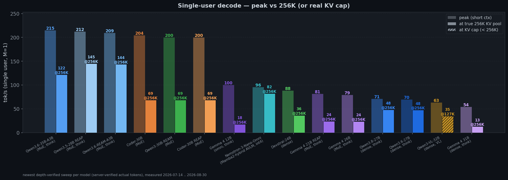
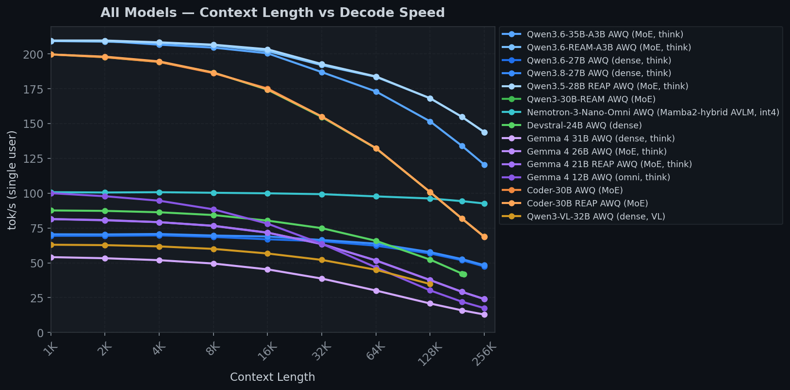
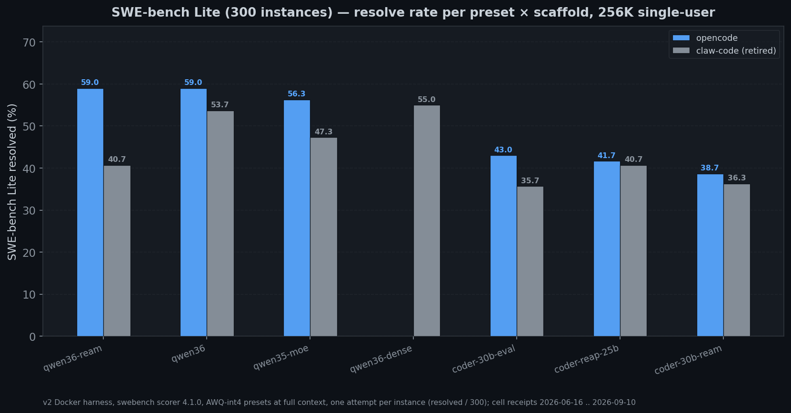

# NVIDIA Inference: SGLang on 2x RTX 3090

Single-user, **256K-context** LLM inference on 2× NVIDIA RTX 3090 (GA102, Ampere, 48 GB total) — SGLang **v0.5.18** + 28 local patches, CUDA 13.2 / PyTorch cu130, every model an **AWQ-int4 ship calibrated in-house** from the upstream BF16 base. This rig owns **all evals + AWQ/INT4 calibrations**; FP8 work lives with the [R9700 RDNA4 stack](https://github.com/mattbucci/2x-R9700-RDNA4-GFX1201-sglang-inference).

Long-form material lives in [`docs/`](docs/) — [decode levers](docs/decode-levers.md) · [SWE-bench harness](docs/swebench-bakeoff.md) · [quality-eval methodology](docs/quality-evals.md) · [roadmap detail](docs/roadmap.md) · [host setup](docs/host-setup.md) · [OCI image](docs/oci-image.md) — and the per-patch history in [`patches/README.md`](patches/README.md). Agent operating rules: [`CLAUDE.md`](CLAUDE.md), [`rules-for-agents.md`](rules-for-agents.md).

## Direction

**We optimize for 256K-context single-user agentic workloads on AWQ-int4 ships.** SWE-bench Lite is the canonical eval — every preset serves at full 256K (or model-card max) so agentic harnesses with multi-turn tool-call context (median ~41K, p90 ~82K, max 230K per instance) actually fit. Decode tok/s / TPOT at depth is the primary metric; multi-user throughput is secondary and never bought with single-user latency.

This rules out three axes other 3090 stacks chase:

| Their focus | Why not ours |
|---|---|
| Short-ctx multi-stream throughput (vLLM-style 80-140 TPS @ <32K) | We need the full prompt of an agentic instance in context; truncating mid-conversation loses correctness. |
| FP8 quantization | **FP8 W8A8 MoE doesn't compile on sm_86** (the Triton fused-MoE kernel needs `fp8e4nv`; Ampere Triton only has e5m2), and even where FP8 is native (R9700 gfx1201), AWQ-int4 wins single-user M=1 decode — weight-byte-bound, FP8 is 2× int4 (Coder-30B 56 vs 38 tok/s). FP8 is the R9700 lane. Receipt: [`benchmarks/fp8-vs-awq-coder-reap.json`](benchmarks/fp8-vs-awq-coder-reap.json). |
| Spec-decode (EAGLE3 / DFlash / MTP) | Draft acceptance collapses at depth and 256K + draft + cuda graphs OOM on 24 GB cards; 97% of SWE-bench prompts exceed the drafts' caps. Short-prompt opt-in only — [`docs/decode-levers.md`](docs/decode-levers.md#speculative-decoding). |

What we **don't** ship: random community quants. Every `mattbucci/*-AWQ` is calibrated end-to-end from the upstream BF16 base via our own GPTQ → CT → AWQ-Marlin pipeline, with thinking + image + video + audio preserved and probed. When a model needs MoE expert compression we run REAP (pruning) or REAM (merging) ourselves on the upstream weights (`scripts/quantize/run_reap.py`, `run_ream_qwen3moe.sh`).

## Results at a glance







Every deep point is **server-verified at its labeled depth** (`actual_input_tokens`; deepest honest point 255K = 262144 − output − margin), single-user (M=1), fresh prefill, at each model's real KV pool. **True-256K decoders:** the A3B DeltaNet MoEs lead (`qwen35-moe` / `qwen36-ream` **144 @255K**, `qwen36` 121, ~210 short), the Mamba2-hybrid `nemotron3-omni` is near-flat (101 → 93), the 30B-A3B coder trio sits at ~69 @255K (200 short), and the dense DeltaNet 27Bs (`qwen36-dense` / `qwen38`) at ~48 (70 short). The Gemma 4 hybrids trail at depth (13–24 tok/s) because their group-32 AWQ + TP-hostile shapes fall off Marlin onto fallback kernels; the opt-in decode-topk lever doubles `gemma4-31b` at depth (12.9 → 26.2). Expert pruning/merging does **not** speed M=1 decode (activated experts + attention dominate) — REAP/REAM win on KV headroom and footprint instead. **Quality:** the Qwen3.6 dense thinker leads agentic coding at **62.3%** on SWE-bench Lite (provisional — that cell ran with a 32K scaffold budget and is being re-rolled at 256K, see the bake-off section); the Qwen3.6 family and the Gemma 4 26B/31B reason and tool-call perfectly at true 256K, while the Coder-30B family hits a ~64K agentic ceiling. Receipts and the full ledger: [`docs/decode-levers.md`](docs/decode-levers.md), [Quality evals](#quality-evals).

## Status & next steps

**Running now:** the **256K re-roll queue** (started 2026-09-11, `evals/swebench/run_all_cycles.sh`). A harness defect found on 2026-09-11 had every scaffold except opencode running with its *own* default context budget instead of the served window: pi/little-coder at 32K (every little-coder cell ever run — pi clones the first packaged `models.json` entry for an unknown model id), prime at 128K, dcode at 170K, and `opencode.json` carried 32K for `qwen36-dense` and 131K for `devstral`. Fixed at `9c31fff`: `docker_rollout.py` reads `max_model_len` from the server's `/v1/models` and writes it into every scaffold's config per run; each cell now records `scaffold_context_window`. Queue order: **`qwen38` six lanes** (the opencode and opencode+DCP cells ran at 262K and are kept; little-coder, little-coder+RTK, prime, dcode restart from scratch) → `qwen36-dense` opencode + little-coder → little-coder for `qwen36`, `qwen36-ream`, `qwen35-moe`, `coder-30b-eval`, `coder-reap-25b`, `coder-30b-ream` → `devstral` opencode. Budget: ~3 days per lane at 256K (qwen38's opencode lane took 76 h incl. per-instance image builds), so ≈ 10–12 days for qwen38 and ≈ 4 weeks for the whole queue; cells land in `benchmarks/quality/bakeoff-<preset>-<scaffold>.json` as they score, and the superseded ones stay as receipts (`bakeoff-*-ctx32k.json` / `-ctx131k.json`). **Production `:30000` is down for the run.** The GPUs are fully committed to the lane server (`--max-running 1`), so everything below waits for the queue.

**Next steps, in order:**

1. **Close the qwen38 cycle** → six-cell table, leader verdict, DCP and RTK A/B deltas (engagement receipts in `benchmarks/quality/{dcp,rtk}-engagement/`; the RTK lane is read through [`ab_lane_receipt.py`](evals/swebench/ab_lane_receipt.py) because the two little-coder lanes pin different pi versions, 0.68 control / 0.83 RTK). Verify on the first new little-coder instances that no `CONTEXT-BUDGET TRIPWIRE` line appears and, at lane close, that [`prompt_sawtooth.py`](evals/swebench/prompt_sawtooth.py) shows no compaction loops on any lane (prime's and dcode's budgets are set for the first time). Then the historical re-roll (queue above), restore production, and the remaining new-lane (prime / dcode / DCP / RTK) cells for the receipted presets; `nemotron3-omni` last.
2. **GPU-profile experiments** — from the live-traffic profile of this cycle ([`benchmarks/qwen38-agentic-workload-profile-2026-09-10.md`](benchmarks/qwen38-agentic-workload-profile-2026-09-10.md)): server time is 86% decode, and a decode step is 57% INT4 weight streaming (78% of DRAM peak), 12% NCCL latency, 10% fp16 `lm_head`, 7% attention — 55% of the bandwidth roofline. Ranked by exposed time, each gated on needle + HumanEval + the tool probe:
   1. **NGRAM speculative decoding on the DeltaNet hybrids** (1.3–2× on copy-heavy agentic output) — blocked on the conv1d spec-verify dtype assert; extend patch 003's cast to the `KERNEL_WIDTH` spec-verify branches. Highest-value serving item for the qwen36/qwen38 family.
   2. **`lm_head` INT8 (or INT4) through Marlin** — the only fp16 weight left in the step (1.27 GB/rank, already at roofline); load-time W8 patch or calibration-recipe change. −4.6% / −7% per step.
   3. **PCIe host-read decisive tests** — 3–4 GB/s of GPU-initiated host reads during decode for no known purpose: 60 s each under `dmon` with `--disable-cuda-graph` and `NCCL_P2P_LEVEL` / `NCCL_WORK_FIFO_DEPTH` variants.
   4. Smaller levers: `in_proj_ba` fp16 gemv → real kernel (−2%), P0 memory clock via `-lmc` (~+1.5%), W4A8 Marlin for prefill (≤−4% e2e, activation-quant quality gate), prefill-only NCCL `Simple` protocol via a tuner plugin (−0.5% e2e). Custom allreduce (−6%) stays blocked on sm_86 graph capture (re-test `ENABLE_CUSTOM_AR=1` at each rebase). 350 W power cap = +5.5% only — rejected, the DIMMs are at ALARM HIGH.
3. **Harness lever — stop building per-instance rollout images.** The scaffold layer costs ~166 s per instance per lane (~14 h per lane, ~9 days across the re-roll queue). Bind-mount a host-built scaffold stack (`/opt/node`, npm prefixes, the A/B HOMEs, dcode's env, `rtk`) read-only into the official `swebench/sweb.eval.x86_64.<iid>` image — same versions, same `testbed` env, zero builds. Candidate for the qwen38 → historical boundary of the re-roll queue (a harness-version change recorded per cell), otherwise after the queue.
4. **Patch 058 observational cell** — a fresh full-300 opencode `devstral` cell post-058 vs the completed pre-058 cell (clean A/B on the empty-diff rate; ship receipt [`devstral-058-baseline`](benchmarks/quality/devstral-058-baseline-2026-07-19.txt)).
5. **Tooling for the MoE backlog:** port the Samsung SAIL REAM merge to the Gemma 4 arch (40–60 h; plan [`scripts/quantize/ream_gemma4_port_plan.md`](scripts/quantize/ream_gemma4_port_plan.md)); extend `run_reap.py` to the Gemma 4 parallel dense+MoE and Nemotron-H Mamba2-hybrid layouts (the fused-`Qwen3_5Moe` unfuse is done, 7/7).
6. **Calibration backlog (calibration device, not this box):** `North-Mini-Code-1.0-AWQ` → `Qwen3.6-35B-A3B-REAP-AWQ` → `gemma-4-26B-A4B-REAM-AWQ` → the `Qwen3.6-VL-30B-A3B` native/REAM/REAP trio with vision retained → `Qwen3-30B-Instruct-2507` native + REAP → `Qwen3.5-28B-A3B` native + REAM → Nemotron REAP/REAM; plus a Marlin-friendly `gemma4` requant (the sole fix for the Gemma fallback-kernel decode). Gated further out: a `Qwen3.8-Flash-Next` REAP/REAM shrink (blocked until sglang ships the QSA model class), the `diffusiongemma-26B-A4B` port, the official Gemma QAT-W4A16 compare. Recipes and rationale: [`docs/roadmap.md`](docs/roadmap.md).
7. **User-gated:** green-light the six prepared upstream-PR packages (`scripts/upstream-pr/`, 011 first — its 7-site hand re-port recurs every rebase); schedule the sudo-domain durable fix for the ~9–17 h docker-I/O kernel BUG (every multi-day cycle eats a crash).

### Known issues (open)

- **`nemotron3-omni` decode −12% at depth on v0.5.18** (93.3 → 82.4 tok/s @261,916). Bisected to the flashinfer-side decode dispatch (0.6.15.post1 → 0.6.17); preset unchanged (still the fastest path), tripwire baseline deliberately kept at 93.3; upstream-report candidate with receipts `benchmarks/regression/exp-nemotron-*.json`.
- **`qwen36-ream` × claw-code is 122/300 with ~30 instances that hard-fail in the scaffold** (`rc=3` GLIBC rollout landmine, not a model issue). claw-code is retired, so the cell stays as scored — read it with that discount.
- **Host reboots every ~9–17 h under sustained docker rollout I/O (kernel BUG).** Predictions on disk survive; `swebench-bakeoff.service` auto-resumes. Durable fix is user-gated (item 7). Forensic recipe: [`CLAUDE.md`](CLAUDE.md) → Operational Lessons.
- `check_awq_scales.py` reads native-AWQ format only — CT-format checkpoints crash its tensor reader (use a native-AWQ mirror or HF Range-fetch mode).

## Model Support

**Max ctx** = what the AWQ ship + 2× 24 GB actually serves end-to-end (validator + bake-off receipts). Every preset defaults to the full ctx; single-user tok/s measured at the listed context with **fresh prefill** (radix cache disabled).

| Model | Type | Max ctx | tok/s | Launch | HF + notes |
|-------|------|:-------:|:----:|:------:|:-------|
| **Qwen3.6-35B-A3B AWQ-Marlin** | DeltaNet+MoE A3B (256 exp, VL) | **262K** | 209 (**121 @255K**) | `qwen36` | [`mattbucci/Qwen3.6-35B-A3B-AWQ`](https://huggingface.co/mattbucci/Qwen3.6-35B-A3B-AWQ). Bake-off top tier (177/300 = 59.0% × opencode at 256K). |
| **Qwen3.6-REAM-A3B AWQ** | DeltaNet+MoE A3B (192 exp, VL) | **262K** | 209 (**144 @255K**) | `qwen36-ream` | [`mattbucci/Qwen3.6-REAM-A3B-AWQ`](https://huggingface.co/mattbucci/Qwen3.6-REAM-A3B-AWQ). Vision tower grafted. Bake-off 177/300 = 59.0% × opencode at 256K. |
| **Qwen3-30B-Instruct-2507 REAM AWQ** | MoE A3B (96 exp) | **262K** | 200 (**69 @255K**) | `qwen3-ream` | [`mattbucci/Qwen3-30B-Instruct-2507-REAM-AWQ`](https://huggingface.co/mattbucci/Qwen3-30B-Instruct-2507-REAM-AWQ). REAM 128→96; text-only generalist. |
| **Qwen3.5-28B MoE REAP** | DeltaNet+MoE A3B (205 exp, VL) | **262K** | 210 (**144 @255K**) | `qwen35-moe` | Cerebras REAP of Qwen3.5-28B-A3B; thinking+vision. |
| **Nemotron-3-Nano-Omni-30B-A3B AWQ** | Mamba2-hybrid MoE A3B (128 exp, AVLM) | **262K** ✓ (5.25M pool) | 101 (**93 @255K**) | `nemotron3-omni` | [`mattbucci/Nemotron-3-Nano-Omni-30B-A3B-Reasoning-AWQ`](https://huggingface.co/mattbucci/Nemotron-3-Nano-Omni-30B-A3B-Reasoning-AWQ). int4; **6/6 caps** (basic+thinking+tool+vision+**video**+**audio** — the only audio ship). Serves via **`QUANT=moe_wna16`** (baked into the preset; the auto-detected awq_marlin path fails on this model's TP=2 shard shapes — mechanism in `patches/v0.5.14-rebase-status.md`), enabled by **patches 052** (non-gated squared-ReLU moe_wna16) + **053** (EVS video routing). Mamba2 O(1) recurrent → decode ~flat (101→93 @255K); beats R9700 FP8 (74.79/49.22). ⚠ **Agentic depth 131K (needs ≥8K token budget; 76K at 2K)**: ≥196K it spirals past even 8K and at 253K stops calling entirely — flat decode does not buy agentic 256K here. |
| **Qwen3-Coder-30B-A3B AWQ** | MoE A3B (128 exp) | **262K** | 200 (**69 @255K**) | `coder-30b` or `coder-30b-eval` | [`mattbucci/Qwen3-Coder-30B-A3B-AWQ`](https://huggingface.co/mattbucci/Qwen3-Coder-30B-A3B-AWQ). Two presets serve the same model; for short-ctx batch-decode benchmarks override `CTX=16384 MAX_RUNNING=32 ./scripts/launch.sh coder-30b`. |
| Coder-REAP-30B AWQ-Marlin | MoE A3B (96 exp) | **262K** | 200 (**69 @255K**) | `coder-reap-25b` | [`mattbucci/Qwen3-Coder-30B-A3B-REAP-AWQ`](https://huggingface.co/mattbucci/Qwen3-Coder-30B-A3B-REAP-AWQ) (R9700 in-house). |
| **Gemma 4 31B Dense AWQ** | Dense (VL) | **262K** ✓ (347K pool) | 54 (30 @64K, **13 @255K**; 26 @255K with the topk lever) | `gemma4-31b` | [`mattbucci/gemma-4-31B-AWQ`](https://huggingface.co/mattbucci/gemma-4-31B-AWQ). LM INT4, vision tower FP16, **KV fp8_e5m2**. Tool-use 1.0 → 258K true tokens, 5/5 caps incl. video. 347K pool via `--swa-full-tokens-ratio 0.05` + `MEM 0.92` + e5m2 FP8 KV (the only FP8 that compiles on the triton-forced path — sm_86 rejects e4m3). |
| **Gemma 4 26B MoE AWQ** | MoE A4B (103 exp, VL) | **262K** ✓ | 81 (**24 @255K**) | `gemma4` | [`mattbucci/gemma-4-26B-AWQ`](https://huggingface.co/mattbucci/gemma-4-26B-AWQ). **Tool-use 1.0 → 258K true tokens, 5/5 caps** incl. video. 652K-token full pool via `--swa-full-tokens-ratio 0.0625`. |
| **Gemma 4 12B Unified AWQ** | Omni, encoder-free | **262K** ✓ | 100 (**17.5 @255K**) | `gemma4-12b` | [`mattbucci/gemma-4-12B-AWQ`](https://huggingface.co/mattbucci/gemma-4-12B-AWQ). In-house int4 RTN-from-QAT. MMLU 77 / HE 93 / **tool-use 1.0 → 258K true tokens**, **5/5 omni** (vision + video ✓; gemma4_unified is native since transformers 5.12.1). 565K-token full pool via `--swa-full-tokens-ratio 0.0625`. |
| **Qwen3.6-27B Dense AWQ** | Dense + DeltaNet (VL) | **262K** (657K KV) | 69 (**47 @255K**) | `qwen36-dense` | [`mattbucci/Qwen3.6-27B-AWQ`](https://huggingface.co/mattbucci/Qwen3.6-27B-AWQ) (R9700 self-cal). Bake-off leader at 187/300 = 62.3% (× opencode, 32K scaffold budget — 256K re-roll queued). |
| **Qwen3.8-27B AWQ** | Dense + DeltaNet (VL **+video**) | **262K** (652K KV @ M=1) | 71 (**48 @262K**) | `qwen38` | [`mattbucci/Qwen3.8-27B-AWQ`](https://huggingface.co/mattbucci/Qwen3.8-27B-AWQ) (3090 self-cal 2026-08-18, GPTQ `thinking_vision_video`). MMLU **0.93** · HE **0.96** · needle **1.0** at server-verified 250,077 actual · caps **5/5** incl. video (LAB 0.16 — inside the DeltaNet-family spread 0.11–0.32 on a 56-question probe; watch item). 48 GDN + 16 full-attn layers; ships MTP weights (inert — main loader skips them). ⚠ `--max-running 1` is load-bearing: at 8 the KV pool collapses 652K→32K (18.7 GB ship: untied 248,320 vocab + BF16 lm_head, and DeltaNet state replicates per slot). |
| **Devstral-Small-2-24B AWQ** | Dense (VL) | **262K** ✓ (339K pool, patch 062) | 88 (52 @128K, **36 @262K**) | `devstral` | [`mattbucci/Devstral-Small-2-24B-AWQ`](https://huggingface.co/mattbucci/Devstral-Small-2-24B-AWQ). The canonical Devstral; built from [`mistralai/Devstral-Small-2-24B-Instruct-2512`](https://huggingface.co/mistralai/Devstral-Small-2-24B-Instruct-2512). FP8→BF16→GPTQ+tool-cal→AWQ. KV 202K → **339K on v0.5.18+062** (the loader-garbage fix recovered ~5.3 GB/rank): true 256K with headroom. |
| **Qwen3-VL-32B Instruct AWQ** | Dense (VL) | **131K** (model-card cap) | 63 (**35 @127K**) | `qwen3-vl-32b` | [`mattbucci/Qwen3-VL-32B-AWQ`](https://huggingface.co/mattbucci/Qwen3-VL-32B-AWQ) (R9700). 63→45→35 tok/s @ 1K/64K/127K. |
| Gemma 4 21B REAP AWQ | MoE (VL) | **262K** ✓ (653K pool) | 81 (**24 @255K**) | `gemma4-21b-reap` | [`mattbucci/gemma-4-21B-REAP-AWQ`](https://huggingface.co/mattbucci/gemma-4-21B-REAP-AWQ). Cerebras-style expert prune of the 26B parent; same Gemma 4 serving flags (graphs ON + `--swa-full-tokens-ratio 0.0625` → 652K pool); tool-use 1.0/1.0 on the standard ladder. ⚠ HumanEval 0% (REAP prune lost coding — Quality Evals below): vision/chat ship, not code. |

Per-preset receipts for the current stack: `benchmarks/quality/*-v0518.json` (flip smoke) + `cap-*-v0518.json` (capability matrix); flip table in [`patches/v0.5.18-rebase-status.md`](patches/v0.5.18-rebase-status.md).

### HuggingFace model zoo

Every `mattbucci/*-AWQ` row is built end-to-end from the linked upstream BF16 tensor — calibration, CT export, native AWQ conversion, scales audit, ship. **No 3rd-party pre-quantized AWQ used as a base.** ⚠ rows were calibrated on a 3rd-party pre-pruned BF16 (Cerebras / atbender) before the prune-ourselves rule; they're grandfathered live until in-house rebuilds replace them (rebuild paths in the [MoE coverage matrix](#moe-coverage-matrix)).

> **HF naming convention:** `mattbucci/<ModelName>-<format>` only. No descriptive suffixes (`-thinking-vision`, `-4bit`, `-native`, `-v2-fixed`) — the model card carries detail. `<format>` is `AWQ`, `AWQ-CT`, `GPTQ`, or `GPTQ-CT`. REAM/REAP are part of the model name, not a format suffix.

| Ship | HuggingFace | Upstream base |
|------|-------------|---------------|
| Qwen3.6-35B-A3B AWQ | [mattbucci/Qwen3.6-35B-A3B-AWQ](https://huggingface.co/mattbucci/Qwen3.6-35B-A3B-AWQ) (native AWQ-Marlin) · [mattbucci/Qwen3.6-35B-A3B-AWQ-CT](https://huggingface.co/mattbucci/Qwen3.6-35B-A3B-AWQ-CT) (compressed-tensors) | [Qwen/Qwen3.6-35B-A3B](https://huggingface.co/Qwen/Qwen3.6-35B-A3B) |
| Qwen3.6-REAM-A3B AWQ | [mattbucci/Qwen3.6-REAM-A3B-AWQ](https://huggingface.co/mattbucci/Qwen3.6-REAM-A3B-AWQ) (native) · [mattbucci/Qwen3.6-REAM-A3B-AWQ-CT](https://huggingface.co/mattbucci/Qwen3.6-REAM-A3B-AWQ-CT) | [Qwen/Qwen3.6-35B-A3B](https://huggingface.co/Qwen/Qwen3.6-35B-A3B) (Samsung SAIL `merge.py`, 256→192 experts) |
| Qwen3.6-27B Dense AWQ | [mattbucci/Qwen3.6-27B-AWQ](https://huggingface.co/mattbucci/Qwen3.6-27B-AWQ) (native) · [mattbucci/Qwen3.6-27B-AWQ-CT](https://huggingface.co/mattbucci/Qwen3.6-27B-AWQ-CT) | [Qwen/Qwen3.6-27B](https://huggingface.co/Qwen/Qwen3.6-27B) (R9700 self-cal) |
| Qwen3.8-27B AWQ | [mattbucci/Qwen3.8-27B-AWQ](https://huggingface.co/mattbucci/Qwen3.8-27B-AWQ) | [Qwen/Qwen3.8-27B](https://huggingface.co/Qwen/Qwen3.8-27B) (3090 self-cal, `thinking_vision_video` recipe) |
| Qwen3-30B-Instruct-2507 REAM AWQ | [mattbucci/Qwen3-30B-Instruct-2507-REAM-AWQ](https://huggingface.co/mattbucci/Qwen3-30B-Instruct-2507-REAM-AWQ) | [Qwen/Qwen3-30B-A3B-Instruct-2507](https://huggingface.co/Qwen/Qwen3-30B-A3B-Instruct-2507) (Samsung SAIL `merge.py`, 128→96 experts) |
| Qwen3-Coder-30B-A3B AWQ | [mattbucci/Qwen3-Coder-30B-A3B-AWQ](https://huggingface.co/mattbucci/Qwen3-Coder-30B-A3B-AWQ) | [Qwen/Qwen3-Coder-30B-A3B-Instruct](https://huggingface.co/Qwen/Qwen3-Coder-30B-A3B-Instruct) |
| Qwen3-Coder-30B-A3B-REAM AWQ | [mattbucci/Qwen3-Coder-30B-A3B-REAM-AWQ](https://huggingface.co/mattbucci/Qwen3-Coder-30B-A3B-REAM-AWQ) | [Qwen/Qwen3-Coder-30B-A3B-Instruct](https://huggingface.co/Qwen/Qwen3-Coder-30B-A3B-Instruct) (Samsung SAIL `merge.py`, 128→96 experts) |
| Qwen3-Coder-30B-A3B-REAP AWQ | [mattbucci/Qwen3-Coder-30B-A3B-REAP-AWQ](https://huggingface.co/mattbucci/Qwen3-Coder-30B-A3B-REAP-AWQ) | [Qwen/Qwen3-Coder-30B-A3B-Instruct](https://huggingface.co/Qwen/Qwen3-Coder-30B-A3B-Instruct) (in-house `scripts/quantize/run_reap.py`, 128→96 experts) |
| Qwen3-Coder-Next-REAM AWQ | [mattbucci/Qwen3-Coder-Next-REAM-AWQ](https://huggingface.co/mattbucci/Qwen3-Coder-Next-REAM-AWQ) | [Qwen/Qwen3-Coder-Next-80B-A3B](https://huggingface.co/Qwen/Qwen3-Coder-Next-80B-A3B) (Samsung SAIL `merge.py`, 512→384 experts, ~60B effective; doesn't fit at AWQ on 24 GB cards — for R9700 / bigger-card use) |
| Qwen3-VL-32B Dense AWQ | [mattbucci/Qwen3-VL-32B-AWQ](https://huggingface.co/mattbucci/Qwen3-VL-32B-AWQ) | [Qwen/Qwen3-VL-32B-Instruct](https://huggingface.co/Qwen/Qwen3-VL-32B-Instruct) (R9700 self-cal, `balanced_thinking_vision` recipe) |
| Devstral-Small-2-24B AWQ ★ canonical Devstral | [mattbucci/Devstral-Small-2-24B-AWQ](https://huggingface.co/mattbucci/Devstral-Small-2-24B-AWQ) | [mistralai/Devstral-Small-2-24B-Instruct-2512](https://huggingface.co/mistralai/Devstral-Small-2-24B-Instruct-2512) (FP8→BF16→GPTQ+tool-cal→AWQ; `code_vision_tools` recipe) |
| Nemotron-3-Nano-Omni-30B-A3B AWQ | [mattbucci/Nemotron-3-Nano-Omni-30B-A3B-Reasoning-AWQ](https://huggingface.co/mattbucci/Nemotron-3-Nano-Omni-30B-A3B-Reasoning-AWQ) | [nvidia/Nemotron-3-Nano-Omni-30B-A3B-Reasoning](https://huggingface.co/nvidia/Nemotron-3-Nano-Omni-30B-A3B-Reasoning) (in-house; audio + video preserved) |
| Gemma 4 26B A4B MoE AWQ | [mattbucci/gemma-4-26B-AWQ](https://huggingface.co/mattbucci/gemma-4-26B-AWQ) | [google/gemma-4-26b-a4b-it](https://huggingface.co/google/gemma-4-26b-a4b-it) |
| Gemma 4 31B Dense AWQ | [mattbucci/gemma-4-31B-AWQ](https://huggingface.co/mattbucci/gemma-4-31B-AWQ) (in-house BF16→GPTQ→AWQ, vision tower FP16) | [google/gemma-4-31b-it](https://huggingface.co/google/gemma-4-31b-it) |
| Gemma 4 12B Unified AWQ | [mattbucci/gemma-4-12B-AWQ](https://huggingface.co/mattbucci/gemma-4-12B-AWQ) (in-house data-free RTN-from-QAT, full omni) | [google/gemma-4-12B-it](https://huggingface.co/google/gemma-4-12B-it) (via QAT base `gemma-4-12B-it-qat-q4_0-unquantized`) |
| Gemma 4 21B REAP AWQ | [mattbucci/gemma-4-21B-REAP-AWQ](https://huggingface.co/mattbucci/gemma-4-21B-REAP-AWQ) | [google/gemma-4-26b-a4b-it](https://huggingface.co/google/gemma-4-26b-a4b-it) (smaller Cerebras-style REAP variant of the 26B parent; in-house regex-`ignore` calibration) |
| Qwen3.5-27B Dense AWQ | [mattbucci/Qwen3.5-27B-AWQ](https://huggingface.co/mattbucci/Qwen3.5-27B-AWQ) | [Qwen/Qwen3.5-27B](https://huggingface.co/Qwen/Qwen3.5-27B) (R9700 self-cal) |
| ⚠ Qwen3-Coder-REAP-25B-A3B AWQ (3rd-party-base, legacy) | [mattbucci/Qwen3-Coder-REAP-25B-A3B-AWQ](https://huggingface.co/mattbucci/Qwen3-Coder-REAP-25B-A3B-AWQ) | **Upstream:** [Qwen/Qwen3-Coder-30B-A3B-Instruct](https://huggingface.co/Qwen/Qwen3-Coder-30B-A3B-Instruct). **Shipped from 3rd-party pre-pruned BF16:** [cerebras/Qwen3-Coder-REAP-25B-A3B](https://huggingface.co/cerebras/Qwen3-Coder-REAP-25B-A3B). Superseded by `Qwen3-Coder-30B-A3B-REAP-AWQ` (in-house) — kept live for backward compat. |
| ⚠ Qwen3.6-VL-REAP-26B-A3B AWQ (3rd-party-base, vision broken) | [mattbucci/Qwen3.6-VL-REAP-26B-A3B-AWQ](https://huggingface.co/mattbucci/Qwen3.6-VL-REAP-26B-A3B-AWQ) | **Upstream:** Qwen/Qwen3.6-VL-30B-A3B-Instruct. **Shipped from 3rd-party pre-pruned BF16:** [atbender/Qwen3.6-VL-REAP-26B-A3B](https://huggingface.co/atbender/Qwen3.6-VL-REAP-26B-A3B) — vision tensors dropped at the pre-prune layer → no working vision. Rebuild queued (calibration backlog). |
| ⚠ Qwen3.5-28B-A3B-REAP AWQ (3rd-party-base) | [mattbucci/Qwen3.5-28B-A3B-REAP-AWQ](https://huggingface.co/mattbucci/Qwen3.5-28B-A3B-REAP-AWQ) | **Upstream:** [Qwen/Qwen3.5-35B-A3B](https://huggingface.co/Qwen/Qwen3.5-35B-A3B). **Shipped from 3rd-party pre-pruned BF16:** [cerebras/Qwen3.5-28B-A3B-REAP](https://huggingface.co/cerebras/Qwen3.5-28B-A3B-REAP) (vision tensors retained at pre-prune, so vision works). Rebuild queued via in-house REAP. |

### MoE coverage matrix

Each MoE base should ship in three flavors: **native** (no expert compression), **REAP** (Cerebras-style pruning, in-house via `scripts/quantize/run_reap.py`), **REAM** (Samsung SAIL merging, in-house via `scripts/quantize/run_ream_qwen3moe.sh`). All entries are self-calibrated AWQ-int4 from the upstream BF16 base. The missing cells are the calibration backlog (Next steps item 6; recipes in [`docs/roadmap.md`](docs/roadmap.md)).

| Base | Native AWQ | REAP AWQ | REAM AWQ |
|---|:---:|:---:|:---:|
| Qwen3-Coder-30B-A3B (128e) | ✅ | ✅ (in-house + Cerebras variants) | ✅ |
| Qwen3.6-35B-A3B (256e, DeltaNet+VL) | ✅ | ❌ | ✅ 192e |
| Qwen3-30B-Instruct-2507 (A3B) | ❌ | ❌ | ✅ 96e |
| Qwen3.5-28B-A3B (DeltaNet+VL) | ❌ | ✅ (Cerebras-based) | ❌ |
| Qwen3.6-VL-30B-A3B (multimodal A3B) | ❌ | ⚠ atbender pre-pruned, vision broken | ❌ |
| Gemma 4 26B A4B (103e MoE+VL) | ✅ | ✅ (21B-REAP, Cerebras) | ❌ |
| Qwen3-Coder-Next-80B-A3B (512e) | — too big @ AWQ | — | ✅ ~60B effective |
| Nemotron-3-Nano-Omni-30B-A3B (128e, AVLM) | ✅ serves (moe_wna16 + patches 052/053, 6/6 caps) | ❌ | ❌ |

### VRAM context limits

TP=2, 48 GB total. **"Max context" is the real KV-pool capacity** (`max_total_num_tokens` from the serve log), not the declared `--context-length`. The heavy-VL ships are KV-bound; the SWA-hybrid Gemmas recover it with `--swa-full-tokens-ratio` right-sizing (sliding layers attend only `window=1024`) and, on the 31B, e5m2 FP8 KV. Devstral's full-attention GQA-8 layout (~40 KB/token) is ~3–4× heavier than gemma-4-31B's MQA-4 SWA hybrid (~12 KB), which is why the smaller model caps lower. Detail: [`docs/decode-levers.md`](docs/decode-levers.md#kv-pools-and-context-limits).

| Model | Wt/GPU | KV/token | Max context |
|-------|:------:|:--------:|:-----------:|
| Qwen3-30B-Instruct-2507 REAM AWQ | 6.2 GB | 36 KB | 262K (578K pool) |
| Qwen3.5-28B-A3B REAP AWQ | 8.1 GB | 5 KB | 262K |
| Qwen3.6-35B-A3B AWQ-Marlin | 9.87 GB | ~8 KB hybrid | 262K (996K pool) |
| Qwen3.6-REAM-A3B AWQ | 7.4 GB | ~8 KB hybrid | 262K (2.4M pool) |
| Qwen3-Coder-30B-A3B AWQ | 8.0 GB | 36 KB | 262K (~900K pool) |
| Qwen3-Coder-30B-A3B-REAP AWQ | 6.5 GB | 72 KB | 262K |
| Qwen3.6-27B Dense AWQ | 8.8 GB (measured; sharded) | 24 KB | 262K (657K pool) |
| Qwen3.8-27B AWQ | ~9.4 GB (18.7 GB ship) | 24 KB | 262K (652K pool @ M=1) |
| Devstral-Small-2-24B AWQ | 7.0 GB | ~40 KB (fp8 KV) | **339K** (MEM 0.90, patch 062) |
| Gemma 4 26B A4B MoE AWQ | 6.5 GB | ~12 KB (SWA) | **652K full / 41K swa** (262K ✓ @ ratio 0.0625) |
| Gemma 4 21B REAP AWQ | ~5 GB | ~12 KB (SWA) | **653K full / 41K swa** (262K ✓ @ ratio 0.0625) |
| Gemma 4 31B Dense AWQ | 7.7 GB | ~12 KB (SWA, fp8_e5m2) | **347K full / 17K swa** (`--swa-full-tokens-ratio 0.05` + MEM 0.92 + e5m2 KV) |
| Gemma 4 12B Unified AWQ | 5.4 GB | 15.3 KB full + 152.6 KB swa | **565K full / 35K swa** (262K ✓ @ ratio 0.0625) |
| Qwen3-VL-32B Dense AWQ | 10.0 GB | 24 KB | 131K (model-card cap) |

## Coding-eval bake-off (SWE-bench Lite)

Full 300-instance SWE-bench Lite, v2 Docker harness, one attempt per instance, single-user, `swebench==4.1.0` scorer. **Only full-300 cells are compared, and only cells whose scaffold ran at the served 262K window count** — since 2026-09-11 the harness hands every scaffold the server's `max_model_len` per run and records it per cell (`scaffold_context_window`). Current roster: opencode, opencode+DCP, little-coder, little-coder+RTK, prime, dcode (claw-code retired 2026-08-31; its column stays as a receipt). Harness mechanics, A/B-lane engagement receipts, and exclusions: [`docs/swebench-bakeoff.md`](docs/swebench-bakeoff.md).

| Preset | opencode | claw-code (retired) | little-coder |
|--------|:--------:|:---------:|:------------:|
| `qwen36-dense` (Qwen3.6-27B Dense AWQ, thinking) | 187/300 = 62.3% ‡ | **165/300 = 55.0%** | 187/300 = 62.3% ‡ |
| `qwen36` (Qwen3.6-35B-A3B AWQ-Marlin, thinking) | **177/300 = 59.0%** | **161/300 = 53.7%** | 177/300 = 59.0% ‡ |
| `qwen36-ream` (Qwen3.6-REAM-A3B-AWQ, thinking) | **177/300 = 59.0%** | 122/300 = 40.7% † | 150/300 = 50.0% ‡ |
| `qwen35-moe` (Qwen3.5-28B-A3B-REAP-AWQ, thinking) | 169/300 = 56.3% | 142/300 = 47.3% | 138/300 = 46.0% ‡ |
| `coder-30b-eval` (Qwen3-Coder-30B-A3B-AWQ CT) | 129/300 = 43.0% | 107/300 = 35.7% | 74/300 = 24.7% ‡ |
| `coder-reap-25b` (Cerebras Qwen3-Coder-REAP-25B-A3B-AWQ) | 125/300 = 41.7% | 122/300 = 40.7% | 107/300 = 35.7% ‡ |
| `coder-30b-ream` (Samsung SAIL Qwen3-Coder-30B-A3B-REAM-AWQ) | 116/300 = 38.7% | 109/300 = 36.3% | 76/300 = 25.3% ‡ |
| `devstral` (Devstral-Small-2-24B-AWQ) | 40/300 = 13.3% ‡ | — | — |
| `qwen38` (Qwen3.8-27B AWQ, thinking) | *rolled, scores with the cycle* | — | *re-rolling* (+ DCP / RTK / prime / dcode lanes) |

‡ **Superseded — re-rolling at 256K.** The scaffold ran below the served window: every little-coder cell at pi's 32K fallback, `qwen36-dense` opencode at a 32K `opencode.json` entry, `devstral` opencode at 131K. The numbers stay as the last receipt (`benchmarks/quality/bakeoff-*-ctx32k.json`, `-ctx131k.json`) until the 256K cell lands; the chart above already omits them. claw-code is retired and its budget was never audited; its column is a receipt only.

**Read (256K opencode cells):** `qwen36` and `qwen36-ream` tie at 59.0% — REAM does not degrade agentic coding on the A3B MoE; `qwen35-moe` follows at 56.3%; the coder specialists cluster at 39–43%. `qwen36-dense`'s 62.3% led both scaffolds but ran at a 32K budget, so the leader verdict waits for its 256K cells (second in the queue). The little-coder column is being rebuilt end-to-end; the earlier "REAM trails ~9 pp on little-coder" read was made on 32K cells and is withdrawn until the re-roll. `qwen3-ream` is excluded on model grounds (can't sustain agentic sessions — [verdict](benchmarks/quality/bakeoff-qwen3-ream-verdict-2026-07-17.md)). † `qwen36-ream` claw: ~30 instances hard-fail in the retired scaffold (Known issues). Per-cell receipts: [`benchmarks/quality/bakeoff-*.json`](benchmarks/quality/); failure-mode analysis (over-edit signature, per-repo skew, oracle-ensemble ceiling): [`patches/README.md`](patches/README.md).

## Quality evals

Every shipped AWQ model is scale-integrity clean (fleet `check_awq_scales.py --base` audit, [receipt](benchmarks/quality/fleet-integrity-audit-2026-05-31.json)) and passes every applicable capability probe (thinking / image / video / audio / tool) on the current stack (`cap-*-v0518.json`). Methodology, footnotes, and per-probe findings: [`docs/quality-evals.md`](docs/quality-evals.md).

**Static evals** (`scripts/eval/eval_quality.py`: MMLU, HumanEval pass@1 no-think chat, [LAB-Bench](https://github.com/Future-House/LAB-Bench), Needle 1K → 250K; ±a few points is noise):

| Model | MMLU | HumanEval | LAB-Bench | Needle | Source |
|-------|:----:|:---------:|:---------:|:------:|:------:|
| Qwen3-VL-32B AWQ | **91.2%** | 83.3% | **39.8%** | 100% | `Qwen3-VL-32B-v0511.json` |
| Qwen3-Coder-30B-A3B AWQ | **91.2%** | **96.7%** | 33.3% | 100% | `Coder-30B-v0511.json` |
| Gemma 4 21B REAP AWQ | 80.7% | 0.0% † | — | — | `Gemma4-21B-REAP-v0511.json` |
| Qwen3-Coder-REAP-25B-A3B AWQ | 77.2% | **96.7%** | 30.5% | 100% | `Coder-REAP-25B-v0511.json` |
| Qwen3.6-35B-A3B AWQ-CT | 73.7% | 80.0% | — | — | `Qwen3.6-35B-A3B-CT-v0511.json` |
| Qwen3.5-28B-A3B-REAP AWQ | 69.6% | 80.0% | 15.9% ‡ | 100% | `REAP-28B.json` |
| Qwen3.6-REAM-A3B AWQ | 84.2% | **97.5%** | 24.3% | **✓ 250K** | `qwen36-ream.json` |
| Qwen3-30B-Instruct-2507 REAM AWQ | 80.7% | 27.5% ◊ | 35.0% | **✓ 250K** | `qwen3-ream.json` |
| Qwen3.6-35B-A3B AWQ-Marlin | 93.0% | **97.5%** | 21.4% | **✓ 250K** | `qwen36.json` |
| Qwen3.6-27B Dense AWQ | **98.2%** | **97.5%** | 27.1% | **✓ 250K** | `qwen36-dense.json` |
| Devstral-Small-2-24B AWQ | 77.2% | 80.0% | 33.6% | ✓131K (pool cap at measurement) | `devstral.json` |
| Gemma 4 31B Dense AWQ | 93.0% | **97.5%** | **42.9%** | **✓250K** | `gemma4-31b.json` |
| Gemma 4 26B MoE AWQ | 82.5% | **97.5%** | 36.4% | **✓250K** | `gemma4.json` |
| Gemma 4 12B Unified AWQ | 77.2% | 92.5% | 29.3% | **✓250K** | `gemma4-12b.json` |

† REAP prune lost coding (use `gemma4-31b` for code). ‡ partial 333-question LAB subset. ◊ non-coder text generalist on a code task.

**256K tool-use probe** (`scripts/eval/probe_256k_tooluse.py`) — plants a needle deep in filler and measures whether the model emits a valid, correctly-argumented tool call with the planted value, bucketed by TRUE `prompt_tokens`. The agentic 256K signal SWE-bench Lite (tops ~128K) never reaches:

| Preset | valid tool call | correct args | max TRUE tokens still correct |
|---|:---:|:---:|:---:|
| `qwen36` (MoE-thinking) | **1.0** | **1.0** | **255,889** |
| `qwen36-ream` (MoE-thinking) | **1.0** | **1.0** | **255,889** |
| `qwen36-dense` (dense-thinking) | **1.0** | **1.0** | **258K** |
| `gemma4` (26B MoE) | **1.0** | **1.0** | **255,957** |
| `gemma4-12b` / `21b-reap` / `31b` | **1.0** | **1.0** | **258K** |
| `qwen35-moe` (DeltaNet MoE) | **1.0** | **1.0** | **255,889** |
| `qwen3-ream` (text generalist) | **1.0** | **1.0** | 148K single-turn (multi-turn agentic fails — bake-off-excluded) |
| `coder-30b-eval` / `coder-reap-25b` | 0.4 | 0.4 | **~64K agentic ceiling** — prose-stop instead of calls at ≥131K true |
| `devstral` (dense, tool) | **1.0** | **1.0** | **132K** firm; 178K flaky (measured at the pre-062 202K pool) |
| `nemotron3-omni` (Mamba2 AVLM) | 0.6 | 0.6 | **131K @8K budget** (76K @2K); ≥196K spirals past 8K, 253K prose-stops |

The flagship MoE thinkers and gemma4 hold perfect tool-calling at TRUE 256K, at every needle depth (0.1 / 0.5 / 0.9 — no lost-in-the-middle). The Coder-30B family does not: route agentic work beyond ~64K to the qwen36 family.

**256K reasoning probe** (`scripts/eval/probe_256k_quality.py`) — multi-key retrieval + variable-tracking + aggregation over a full context, identical task instances at every length (temp=0), measured at TRUE actual-token lengths (top point 255,800):

| Preset | 1K | 32K | 65K | 131K | 200K | 256K | overall |
|---|:--:|:--:|:--:|:--:|:--:|:--:|:--:|
| `gemma4` (26B MoE) | 100 | 67§ | 100 | 100 | 100 | **100** | 94 |
| `gemma4-31b` (dense) | 100 | 100 | 100 | 100 | 100 | **100** | **100** |
| `gemma4-21b-reap` (MoE) | 100 | 100 | 100 | 100 | 100 | 67§ | 94 |
| `gemma4-12b` (unified omni, int4 RTN) | 100 | 67◊ | 67◊ | 33◊ | 33◊ | 67◊ | 61 |
| `qwen36` / `qwen36-dense` / `qwen36-ream` | 100 | 100 | 100 | 100 | 100 | **100** | **100** |

§ isolated single-cell misses, non-monotonic (noise, not a depth cliff). ◊ `gemma4-12b` chain-reasons to 256K but its multi-needle retrieval saturates at ~3 needles at depth. `qwen35-moe` is genuinely soft at depth (0.72 overall — `multikey` fails ≥131K); at 178K `qwen3-ream` 100%, `devstral` ~80%.

**Every new AWQ ship must pass `scripts/eval/validate_capabilities.py`** (basic + thinking + image + video + audio + tool, per applicable modality) before entering these tables.

## Quick start

```bash
./scripts/setup.sh                          # clone SGLang v0.5.18, apply patches/, create the conda env

./scripts/launch.sh qwen36                  # Qwen3.6-35B-A3B MoE AWQ-Marlin — 256K, thinking+vision   (eval port :23334)
./scripts/launch.sh qwen36-dense            # Qwen3.6-27B Dense AWQ — bake-off leader (32K-budget cell; 256K re-roll queued)
./scripts/launch.sh qwen38                  # Qwen3.8-27B AWQ — thinking+image+video
./scripts/launch.sh coder-30b               # Qwen3-Coder-30B-A3B MoE — peak throughput
./scripts/launch.sh gemma4-31b              # Gemma 4 31B Dense AWQ (thinking+image+video)
./scripts/launch.sh devstral                # Devstral-Small-2-24B AWQ (tool+vision)
# full preset list: grep -E "^        [a-z][a-zA-Z0-9-]*[\|\)]" scripts/launch.sh

./scripts/serve_production.sh gemma4-31b    # persistent PRODUCTION endpoint on :30000 (start/stop/status/restart, detached, health-checked)
EXTRA='--decode-topk-pages 256 --decode-topk-page-size 64' ./scripts/serve_production.sh gemma4-31b   # deep-context topk lever (patch 059)

python scripts/eval/validate_capabilities.py --port 23334    # auto-skips thinking/vision/video per preset
python scripts/bench/bench_long_context.py --port 23334 --name "Model" --contexts 1024 16384 131072 250000
BASELINE=save scripts/bench/bench_regression.sh <preset>     # lock a new perf level into the tripwire
```

Production on :30000 and the eval harness on :23334 don't collide, so a capability/bench sweep can run against :23334 while :30000 serves (the script refuses to start if another sglang server already holds the GPUs). Every preset carries an explicit `--tool-call-parser` matching its chat template (Qwen3-Coder + Qwen3.5/3.6/3.8 → `qwen3_coder`; Qwen3-VL / Qwen3-30B REAM → `qwen25`; Devstral → `mistral`; Gemma 4 → `gemma4`); thinking presets launch with `--sampling-defaults model`. Use `temperature >= 0.3` on the Qwen3 family — greedy decode loops.

## Stack

| Component | Version |
|-----------|---------|
| SGLang | v0.5.18 + 28 local patches (`/data/sglang-rebase-v0518`, env `sglang-v0518`; v0.5.17 tree + env kept for one-revert rollback) |
| PyTorch | 2.13.0 + cu130 |
| CUDA | 13.2 driver (595.71.05) / cu130 wheel |
| transformers | 5.12.1 (ships gemma4_unified natively; routes Mistral ckpts to MistralCommonBackend — countered by patch 057) |
| FlashInfer | 0.6.17 [cu13] |
| compressed-tensors | serving env pin; 0.15.1.dev in the separate `quant` calibration env |

**Patches** — 28 logical units in [`patches/`](patches/), applied idempotently by `setup.sh`: AWQ/CT int4 weight loading, Qwen3.5/3.6/3.8 enablement, Gemma 4 bring-up (26B MoE / 31B dense / 12B unified omni), Nemotron-3-Nano-Omni serving, MoE gelu coverage, kernel precision, sm_86 enablement, serving/agentic robustness. Each rebase is gated by the 3-gate pristine replay (`scripts/test_patch_gates.sh`) and a per-tokenizer-family A/B encode (`scripts/eval/tokenizer_ab_encode.py`), then a detached fleet validation campaign (`scripts/eval/flip_campaign.sh`). Narratives, the upstream-PR ledger, and per-flip receipts: [`patches/README.md`](patches/README.md).

**OCI image** — `Dockerfile` builds the CUDA/v0.5.18 stack without a GPU (pinned wheels, driver injected by the NVIDIA container toolkit); runs unprivileged with `SGLANG_SECURE_LAUNCH=1` (API keys from files, protected server options refused, NCCL on loopback). Build, run, and the security caveats vs the R9700 image: [`docs/oci-image.md`](docs/oci-image.md).

**Quantization** (the `quant` conda env, calibration device):

```bash
conda activate quant
REAP_ENV=quant ./scripts/quantize/run_reap.sh --model <bf16> --save-path <reap_bf16> --keep-experts N  # MoE expert prune
./scripts/quantize/run_ream_qwen3moe.sh <bf16> <ream_bf16>                                    # MoE expert merge (Samsung SAIL)
CUDA_VISIBLE_DEVICES="" python -u scripts/quantize/quantize_qwen36_27b_thinking_vision.py   # 27B template (GPTQ → CT)
python scripts/quantize/convert_moe_ct_to_awq.py <ct_src> <awq_dst>                          # MoE CT→native AWQ
python scripts/eval/check_awq_scales.py <awq_dst> --base <bf16_base_dir>                      # ship gate: 0 = clean
```

`scripts/quantize/calibration_datasets.py` builds capability-preserving recipes (`thinking_vision_video` / `code_vision_tools` / `balanced_thinking_vision` …) from AM-Thinking-v1, NuminaMath-CoT, LLaVA-Instruct / LLaVA-Video, Hermes-function-calling, UltraChat. `check_awq_scales.py --base` is the dead-channel comparator that separates benign MoE structural-sparsity zero-scales from real defects. REAP vs REAM: [`scripts/quantize/REAM.md`](scripts/quantize/REAM.md).

## Hardware

| Component | Spec |
|-----------|------|
| GPU | 2× NVIDIA RTX 3090 (24 GB each) — NVLink bridge, `nvidia-smi topo -m` reports `NV4` (~56 GB/s aggregate); 260 W power cap (cooling profile, load-bearing) |
| CPU / RAM | AMD Ryzen 9 7900 (12C/24T) / 64 GB DDR5-6000 |
| Storage | 2× 2 TB NVMe (`/data` = models + caches) |
| OS / Kernel | Arch (EndeavourOS) / `linux-zen-p2p` 6.18 (pinned) · `nvidia-open-dkms` 595.71.05 · `amd_iommu=on iommu=pt pcie_acs_override=downstream,multifunction` |

Why each of those is load-bearing (NVLink/P2P boot args, the zen kernel, the cooling units under [`systemd/`](systemd/), Arch toolchain gotchas): [`docs/host-setup.md`](docs/host-setup.md).

## Sister teams

- **[R9700 (RDNA4, ROCm)](https://github.com/mattbucci/2x-R9700-RDNA4-GFX1201-sglang-inference)** — FP8 calibration owner + RDNA4 serving stack; we own evals + AWQ/INT4 + EAGLE3 draft training. Patches port both ways; model-behavior findings always do. **Open asks to them:** (1) the host-side BF16→AWQ trap defuse + double-quant guard port before the next `gemma4-26b` recal (this box is clean — [manifest](benchmarks/models-manifest-letsrtfm-amd-2026-07-19.json)); (2) host the memory-marginal `Qwen3.6-35B-A3B` REAP prune on their 64 GB — the fused-`Qwen3_5Moe` unfuse tooling is ready to port to their `ream-patches/`.
- **[M4 (Apple Silicon, MLX)](https://github.com/mattbucci/m4-sglang-inference)** — MLX bridge; cross-checks chat-template + multimodal plumbing. No open asks either way.

## Repo layout

```
README.md                 # this file: direction, results, status + next steps, model/quality tables
docs/                     # long-form: decode-levers, swebench-bakeoff, quality-evals, roadmap, host-setup, oci-image
patches/                  # SGLang v0.5.18 patches (28) — narratives + rebase receipts in patches/README.md
benchmarks/               # charts, per-model regression JSON, lever receipts; quality/ = eval + bake-off receipts
evals/swebench/           # SWE-bench Lite v2 Docker harness (cycle driver, scaffolds, scorer, aggregation)
scripts/
  launch.sh / serve_production.sh / common.sh / setup.sh
  bench/ eval/ quantize/ specforge/ upstream-pr/ maint/ host-setup/
docker/                   # OCI image entrypoint + secure launcher
systemd/                  # cooling profile + bake-off auto-resume units
components/sglang/        # legacy vendored SGLang tree (historical; live serving trees are under /data/)
```
