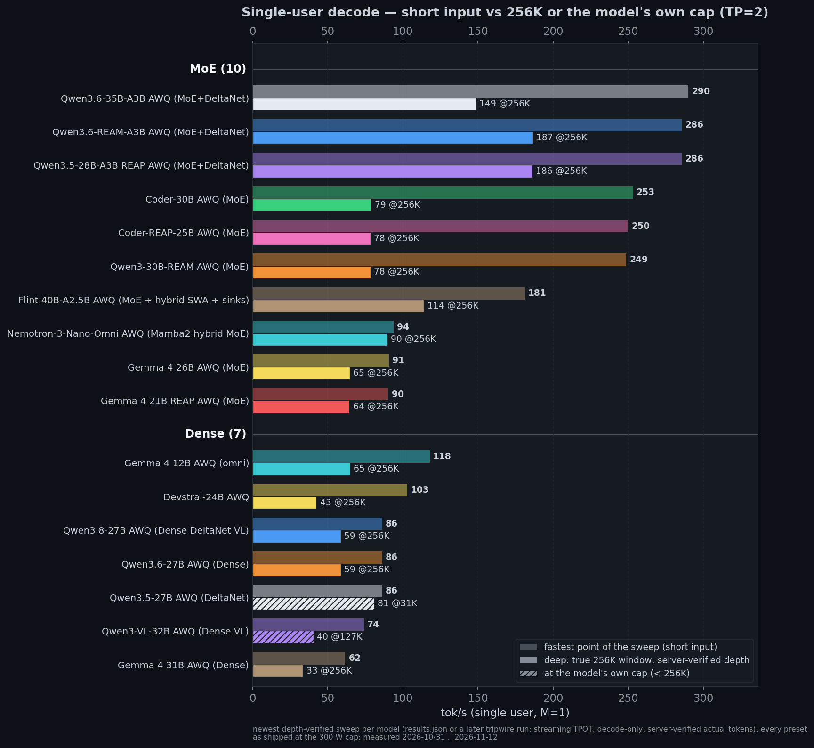
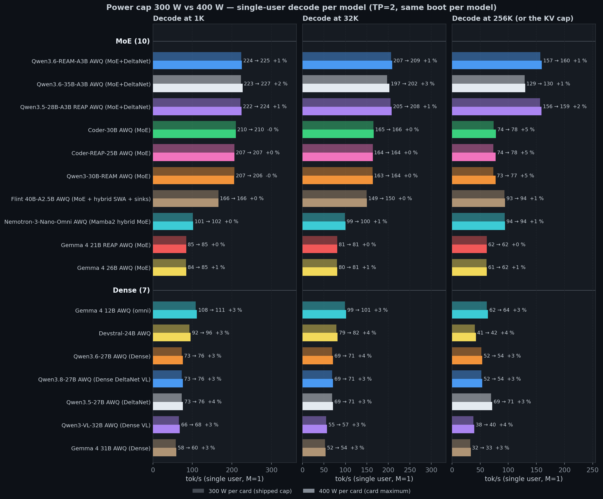
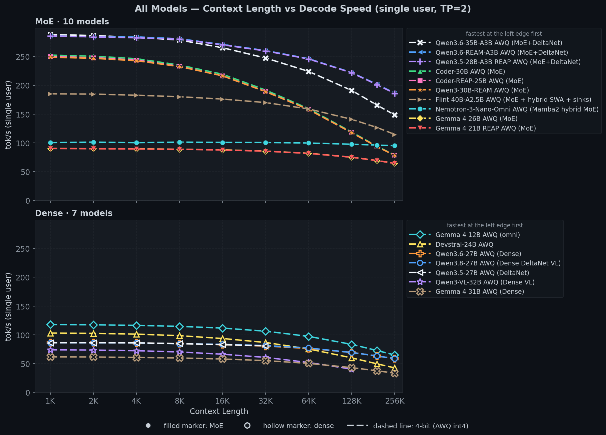
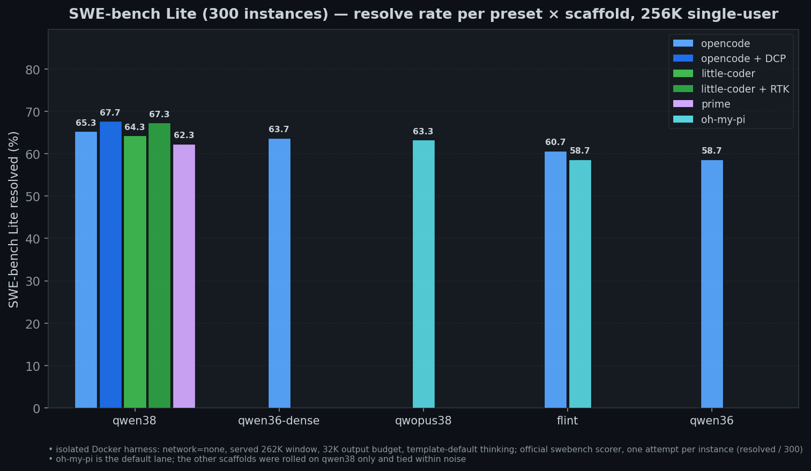
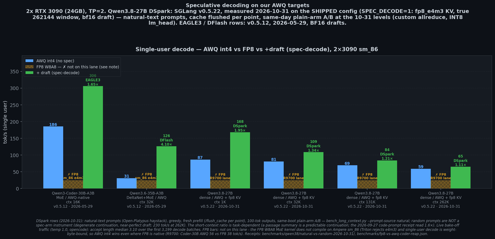
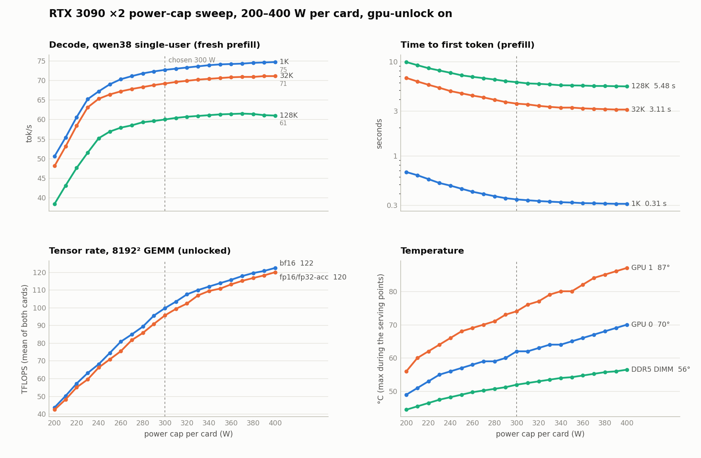

# NVIDIA Inference: SGLang on 2x RTX 3090

Single-user, **256K-context** LLM inference on 2× NVIDIA RTX 3090 (GA102, Ampere, 48 GB total) — SGLang **v0.5.22** + 32 local patches, CUDA 13.2 / PyTorch cu130, every model an **AWQ-int4 ship calibrated in-house** from the upstream BF16 base. This rig owns **all evals + AWQ/INT4 calibrations**; FP8 work lives with the [R9700 RDNA4 stack](https://github.com/mattbucci/2x-R9700-RDNA4-GFX1201-sglang-inference).

Long-form material lives in [`docs/`](docs/) — [decode levers](docs/decode-levers.md) · [SWE-bench harness](docs/swebench-bakeoff.md) · [quality-eval methodology](docs/quality-evals.md) · [roadmap detail](docs/roadmap.md) · [host setup](docs/host-setup.md) · [OCI image](docs/oci-image.md) — the per-patch history in [`patches/README.md`](patches/README.md), and known issues in the [issue tracker](https://github.com/mattbucci/2x-3090-GA102-300-A1-sglang-inference/issues). Agent operating rules: [`CLAUDE.md`](CLAUDE.md), [`rules-for-agents.md`](rules-for-agents.md).

## Direction

**We optimize for 256K-context single-user agentic workloads on AWQ-int4 ships.** SWE-bench Lite is the canonical eval — every preset serves at full 256K (or model-card max) so agentic harnesses with multi-turn tool-call context (median ~41K, p90 ~82K, max 230K per instance) actually fit. Decode tok/s / TPOT at depth is the primary metric; multi-user throughput is secondary and never bought with single-user latency.

This rules out three axes other 3090 stacks chase:

| Their focus | Why not ours |
|---|---|
| Short-ctx multi-stream throughput (vLLM-style 80-140 TPS @ <32K) | We need the full prompt of an agentic instance in context; truncating mid-conversation loses correctness. |
| FP8 quantization | **FP8 W8A8 MoE doesn't compile on sm_86** (the Triton fused-MoE kernel needs `fp8e4nv`; Ampere Triton only has e5m2), and even where FP8 is native (R9700 gfx1201), AWQ-int4 wins single-user M=1 decode — weight-byte-bound, FP8 is 2× int4 (Coder-30B 56 vs 38 tok/s). FP8 is the R9700 lane. Receipt: [`benchmarks/fp8-vs-awq-coder-reap.json`](benchmarks/fp8-vs-awq-coder-reap.json). |
| Spec-decode (EAGLE3 / DFlash / MTP) | Draft acceptance collapses at depth and 256K + draft + cuda graphs OOM on 24 GB cards; 97% of SWE-bench prompts exceed the drafts' caps. Opt-ins only — the one that holds at true 256K is DSpark on `qwen38` (fp8 KV; natural text 1.95× / 1.34× / 1.21× / 1.11× at 1K / 32K / 131K / 262K, 2026-10-31) — [`docs/decode-levers.md`](docs/decode-levers.md#speculative-decoding). |

What we **don't** ship: random community quants. Every `mattbucci/*-AWQ` is calibrated end-to-end from the upstream BF16 base via our own GPTQ → CT → AWQ-Marlin pipeline, with thinking + image + video + audio preserved and probed. When a model needs MoE expert compression we run REAP (pruning) or REAM (merging) ourselves on the upstream weights (`scripts/quantize/run_reap.py`, `run_ream_qwen3moe.sh`).

## Results at a glance













Every deep point is **server-verified at its labeled depth** (`actual_input_tokens`; deepest honest point 255K = 262144 − output − margin), single-user (M=1), fresh prefill, at each model's real KV pool. **True-256K decoders (2026-10-31 levels):** the A3B DeltaNet MoEs lead (`qwen36-ream` **187 @255K**, `qwen35-moe` 186, `qwen36` 148; ~286 short), the Mamba2-hybrid `nemotron3-omni` is near-flat (101 → 95), the 30B-A3B coder trio sits at ~78 @255K, the dense DeltaNet 27Bs (`qwen36-dense` / `qwen38`) at 58, and the triton-backend presets at `flint` **115**, the Gemma 4 MoEs 64–65, `gemma4-31b` 33 (`--triton-attention-num-kv-splits 64` on all five). Expert pruning/merging does **not** speed M=1 decode — REAP/REAM win on KV headroom and footprint. **Agentic follow-up turns at depth are flat since 2026-11-01:** a 1-token turn at 197K costs 85 / 72 / 82 ms on Flint / `qwen38` / Gemma 4 31B (was 331 / 364 / 392) — see Status item 2.1. **Quality:** `qwen38` **196/300 (65.3 %)** on SWE-bench Lite under the isolated harness; the Qwen3.6 family and Gemma 4 26B/31B reason and tool-call perfectly at true 256K, the Coder-30B family hits a ~64K agentic ceiling. **Speculative decoding:** DSpark on `qwen38` holds **1.21× at 250K actual** with the true 256K window (fp8 KV) and serves its bake-off cycle (`SPEC_DECODE=1`); other drafts collapse at depth ([ledger](docs/decode-levers.md#speculative-decoding)). The decode/context PNGs predate the 2026-10-31 levers for most presets; the fleet re-measure is queued for the next serving-only window.

## Status & next steps

**Live:** the SWE-bench Lite re-roll is **paused since 2026-10-31** (user call) with `qwen36-ream` at 117/300; it resumes from that row via `swebench-bakeoff.service` (`qwen35-moe`, `coder-30b-eval`, `coder-reap-25b`, `coder-30b-ream`, `devstral`, `gemma4`, `nemotron3-omni` behind it, about a day each). Closed: `qwen38` 196, `qwen36-dense` 191, `flint` 182 (`omp` 186), `qwen36` 176 of 300 — table below. The GPUs run the overnight serving chain in item 1 until then. Campaign history: [`docs/swebench-bakeoff.md`](docs/swebench-bakeoff.md#campaign-history).

**Next steps, in order:**

1. **Running now (one GPU chain, finishes overnight):** the W4A8-prefill fleet sweep (five presets left: `gemma4`, `qwen35-moe`, `coder-30b-eval`, `devstral`, `nemotron3-omni` — TTFT off/on at 32K / 131K, needle, MMLU-57 / HumanEval on the INT8 arm; receipt [`benchmarks/fleet-w4a8-2026-11-01/`](benchmarks/fleet-w4a8-2026-11-01/)), then the small-extend CUDA-graph gate on the flashinfer presets (`qwen36`, `qwen36-dense`, `qwen35-moe`, `coder-30b-eval`, `devstral`, `nemotron3-omni`), then the serving-image rebuild + smoke. Presets flip when they clear ≥ 5 % at 131K (W4A8) or a faster agentic turn (graph) at quality parity.
2. **Uplift queue (decode is at the GA102 roofline — [ledger](docs/decode-levers.md), [profiles](benchmarks/profiling/decode-profile-2026-10-31.md)):**
   1. **Agentic follow-up turn at depth — four levers shipped 2026-11-01** ([receipt](benchmarks/profiling/multiturn-cache-2026-11-01/README.md), [kernel receipt](benchmarks/quality/cache-hit-extend-2026-11-01.md)): the triton split-KV route for turns of ≤ 64 new tokens on a cached prefix (patch 070, `flint` / `gemma4-31b` / `gemma4`), incremental tokenization of the re-sent conversation (patch 072, every preset — ~90 % of a deep turn was `tokenizer.encode`), a lazy multimodal decode-back, and a prefill CUDA graph for 8–128-token extends on `qwen38`, `qwen36`, `qwen36-dense`, `qwen35-moe` and `coder-30b-eval` (the flashinfer extend was launch-bound; 1-token turn at 32K / 131K / 197K `qwen36` 77 / 89 / 83 → 32 / 37 / 37 ms, `qwen36-dense` 84 / 91 / 90 → – / 44 / 48 ms, `qwen35-moe` 78 / 88 / 83 → 32 / 34 / 38 ms, `coder-30b-eval` 84 / 108 → 63 / 84 ms at 131K / 197K, all at parity on MMLU / HumanEval / needle / capabilities). `devstral`'s arm crashed at capture — the runner read `quant_config` off a multimodal proxy class that has none — fixed as patch 073 and re-gated after the overnight chain; `nemotron3-omni` gates last. **1-token turn at 32K / 131K / 197K: Flint 120 / 239 / 331 → 76 / 82 / 85 ms, `qwen38` 123 / 254 / 364 → 39 / ~90 / 72 ms, Gemma 4 31B 392 → 82 ms at 197K; 64-token turn at 197K Flint 442 → 104 ms, Gemma 4 31B 666 → 270 ms**, all at quality parity (MMLU / HumanEval / needle / capabilities per preset in the receipts). Next: the graph gate on the other flashinfer presets (item 1), a prefix-aware route cap (128 is 2.9× at 197K, ≤ 1.2× at 8K), and the reproducible first-two-turns effect at 131K on `qwen38` (~120 ms, graph-independent).
   2. **W4A8 prefill (patch 071) — default on `qwen38`, `qwen36-dense`, `gemma4-31b`, `qwen35-moe` and `qwen36`** ([fleet sweep receipt](benchmarks/fleet-w4a8-2026-11-01/README.md)). For AWQ-Marlin dense linears with ≥ 2048 rows, per-token INT8 activations × a per-channel INT8 copy of the Marlin weight through CUTLASS `int8_scaled_mm` (the unlocked GA102 INT8 path runs 163–196 TOPS against 82–111 FP16 TFLOPS; the Marlin W4A16 chain was 46–67 % of a cold fill — [profile](benchmarks/profiling/prefill-profile-2026-11-01.md), [kernel bench](benchmarks/profiling/prefill-gemm-paths-2026-11-01.md)). Fresh-prefill TTFT, decode identical: `qwen38` **13.4 → 8.6 s @32K, 71.4 → 51.0 s @131K, 185.6 → 144.9 s @262K** ([receipt](benchmarks/qwen38/w4a8-prefill-2026-11-01/README.md)); `qwen36-dense` **71.6 → 50.8 s @131K**; `gemma4-31b` **169 → 147 s @131K** (its fill is attention-heavy on the 512-wide global layers); `qwen35-moe` 18.0 → 17.0 s @131K (−5 %, MMLU 49/57, HE 30/30); `devstral` **69.8 → 52.7 s @131K (−25 %)**, HE 29/30 and needle 3/3 at parity but MMLU 41/57 against 43/57 — a second MMLU read on both arms runs after the overnight chain and decides its flip. `qwen36` 16.7 → 15.9 s @131K (−5 %, parity). Off: `gemma4` (−3 %, MMLU 43/57 against 46) and `flint` (−2 %, HumanEval 21/30 against 25); not on the path for the compressed-tensors `coder-30b-eval` and the `moe_wna16` `nemotron3-omni` (the patch hooks the AWQ-Marlin dense kernel only; routed experts run Marlin-MoE everywhere, which is why the A3B MoEs gain ~5 % and the dense 24–31Bs 13–29 %). Gate per preset: TTFT + needle + MMLU-57 / HumanEval on the INT8 arm (INT8 activations shape the KV cache for the whole context).
   3. **A3B MoE kernel count.** `qwen36` / `qwen35-moe` carry a 14 % idle gap per short step (~1,000 kernels: fills, `align_single_token`, router, `moe_sum_reduce`); a fused MoE-glue path is upstream territory — re-test at each rebase.
   4. **Model-side decode:** a 256K-trained draft for the A3B presets the way DSpark's is for `qwen38` (SpecForge on the calibration device), fewer KV bytes; the `qwen38-spec` arm is the tripwire template for any new draft.
   5. **Flint follow-ups** ([bring-up notes](docs/flint.md)): re-roll `flint:omp` under the fixed tool grammar (the landed 186/300 is a floor), `--mem-fraction-static` (pool is 4.5× the window), prefill on triton (1–2.4K tok/s), a calibrated g32 build as a quality A/B.
   6. **Instrument:** make the natural-text sweep's prompt slice deterministic per context point (a spec arm's deep point moves ±15 % with the continuation — `qwen38-spec` 65.0 vs 74.8 at 262K on an identical config, so a tripwire flag there needs a second run); add a natural-text TTFT column to the charts (the random instrument's deep TTFT is a prefix-cache hit).
3. **Open investigations:** the harness Phase-4.5 leak-audit gate has misfired on a new false-positive shape at each of the last three lane closes — re-run the audit the hour a lane closes until two closes go clean. Known model and host issues are tracked in [GitHub issues](https://github.com/mattbucci/2x-3090-GA102-300-A1-sglang-inference/issues).
4. **Resume and finish the re-roll queue (user call).** Each lane closes on `audit_leakage.py --require-isolation` + the recall audit, then its row fills in. The `devstral` cell doubles as the post-patch-058 observational cell against its pre-058 receipt ([`devstral-058-baseline`](benchmarks/quality/devstral-058-baseline-2026-07-19.txt)). `nemotron3-omni` last.
5. **Harness lever — stop building per-instance rollout images.** The GPUs are busy 73 % of an opencode lane's wall clock; the per-instance build is 176 s median and a network dependency that has cost 85 rows to registry / installer outages ([receipt](benchmarks/quality/gpu-utilization-harness-overhead-2026-09-26.md); R9700's hub image + bind-mounted toolchain measures 97 % busy). Bind-mount a host-built scaffold stack read-only into the official `swebench/sweb.eval.x86_64.<iid>` image — a harness-version change recorded per cell, after the queue.
6. **Tooling for the MoE backlog:** port the Samsung SAIL REAM merge to the Gemma 4 arch (40–60 h; plan [`scripts/quantize/ream_gemma4_port_plan.md`](scripts/quantize/ream_gemma4_port_plan.md)); extend `run_reap.py` to the Gemma 4 parallel dense+MoE and Nemotron-H Mamba2-hybrid layouts (the fused-`Qwen3_5Moe` unfuse is done, 7/7).
7. **Calibration backlog (calibration device, not this box):** **`Qwopus3.8-27B-Coder-Flash-AWQ`** (user ask: a coding / agentic SFT of Qwen3.8-27B, same architecture as `qwen38` — the existing `quantize_qwen38_27b_thinking_vision_video.py` recipe with the base swapped; serves on the `qwen38` preset and gets a full-300 SWE-bench cell against its 196/300; R9700's FP8 build already reads at base quality with vision + video intact, DSpark −15 % at depth) → `North-Mini-Code-1.0-AWQ` → `Qwen3.6-35B-A3B-REAP-AWQ` → `gemma-4-26B-A4B-REAM-AWQ` → the `Qwen3.6-VL-30B-A3B` native/REAM/REAP trio with vision retained → `Qwen3-30B-Instruct-2507` native + REAP → `Qwen3.5-28B-A3B` native + REAM → Nemotron REAP/REAM; plus a Marlin-friendly `gemma4` requant (the sole fix for the Gemma fallback-kernel decode). Gated further out: a `Qwen3.8-Flash-Next` INT4 body (the tree serves it with the n-gram table offloaded to pinned host memory; blocked on an INT4 checkpoint — the bf16 is 360 GB), the `diffusiongemma-26B-A4B` port, the official Gemma QAT-W4A16 compare. Recipes and rationale: [`docs/roadmap.md`](docs/roadmap.md).
8. **User-gated:** schedule the sudo-domain durable fix for the ~9–17 h docker-I/O kernel BUG ([issue #6](https://github.com/mattbucci/2x-3090-GA102-300-A1-sglang-inference/issues/6); every multi-day cycle eats a crash).

## Model Support

**Max ctx** = what the AWQ ship + 2× 24 GB actually serves end-to-end (validator + bake-off receipts). Every preset defaults to the full ctx; single-user tok/s = the 2026-10-31 fleet refresh (300 W cap, gpu-unlock on, CPU boost off; the 10-point depth sweep in `benchmarks/<model>/results.json`; the 2026-10-25 pair `results-300w.json` / `results-400w.json` backs the power-cap chart); **re-measured 2026-10-31** (tripwire instrument, same three points) under the day's three levers — custom allreduce, INT8 `lm_head`, GDN conv state in the model dtype — for every preset (the nine tripwire presets on the tripwire instrument, the rest from the same-day 10-point chart sweep, which agrees with the tripwire to ±1 tok/s on the presets both cover): short context (32K, **deepest point**).

| Model | Type | Max ctx | tok/s | Launch | HF + notes |
|-------|------|:-------:|:----:|:------:|:-------|
| **Qwen3.6-35B-A3B AWQ-Marlin** | DeltaNet+MoE A3B (256 exp, VL) | **262K** | 289 (248 @32K, **148 @255K**) | `qwen36` | [`mattbucci/Qwen3.6-35B-A3B-AWQ`](https://huggingface.co/mattbucci/Qwen3.6-35B-A3B-AWQ). |
| **Qwen3.6-REAM-A3B AWQ** | DeltaNet+MoE A3B (192 exp, VL) | **262K** | 286 (260 @32K, **187 @255K**) | `qwen36-ream` | [`mattbucci/Qwen3.6-REAM-A3B-AWQ`](https://huggingface.co/mattbucci/Qwen3.6-REAM-A3B-AWQ). Vision tower grafted. |
| **Qwen3-30B-Instruct-2507 REAM AWQ** | MoE A3B (96 exp) | **262K** | 249 (189 @32K, **78 @255K**) | `qwen3-ream` | [`mattbucci/Qwen3-30B-Instruct-2507-REAM-AWQ`](https://huggingface.co/mattbucci/Qwen3-30B-Instruct-2507-REAM-AWQ). REAM 128→96; text-only generalist. |
| **Qwen3.5-28B MoE REAP** | DeltaNet+MoE A3B (205 exp, VL) | **262K** | 286 (258 @32K, **186 @255K**) | `qwen35-moe` | Cerebras REAP of Qwen3.5-28B-A3B; thinking+vision. |
| **Nemotron-3-Nano-Omni-30B-A3B AWQ** | Mamba2-hybrid MoE A3B (128 exp, AVLM) | **262K** ✓ (5.25M pool) | 101 (100 @32K, **95 @255K**) | `nemotron3-omni` | [`mattbucci/Nemotron-3-Nano-Omni-30B-A3B-Reasoning-AWQ`](https://huggingface.co/mattbucci/Nemotron-3-Nano-Omni-30B-A3B-Reasoning-AWQ). int4; **6/6 caps** (the only audio ship). Serves via `QUANT=moe_wna16` (patches 052 + 053; awq_marlin fails on its TP=2 shard shapes). Mamba2 O(1) recurrent → near-flat decode. ⚠ Agentic depth 131K (needs ≥8K token budget); ≥196K it spirals and at 253K stops calling. |
| **Qwen3-Coder-30B-A3B AWQ** | MoE A3B (128 exp) | **262K** | 253 (191 @32K, **79 @255K**) | `coder-30b` or `coder-30b-eval` | [`mattbucci/Qwen3-Coder-30B-A3B-AWQ`](https://huggingface.co/mattbucci/Qwen3-Coder-30B-A3B-AWQ). Two presets serve the same model; for short-ctx batch-decode benchmarks override `CTX=16384 MAX_RUNNING=32 ./scripts/launch.sh coder-30b`. |
| Coder-REAP-30B AWQ-Marlin | MoE A3B (96 exp) | **262K** | 250 (189 @32K, **78 @255K**) | `coder-reap-25b` | [`mattbucci/Qwen3-Coder-30B-A3B-REAP-AWQ`](https://huggingface.co/mattbucci/Qwen3-Coder-30B-A3B-REAP-AWQ) (R9700 in-house). |
| **Gemma 4 31B Dense AWQ** | Dense (VL) | **262K** ✓ (347K pool) | 62 (55 @32K, **33 @255K**) | `gemma4-31b` | [`mattbucci/gemma-4-31B-AWQ`](https://huggingface.co/mattbucci/gemma-4-31B-AWQ). LM INT4, vision tower FP16, **KV fp8_e5m2**. Tool-use 1.0 → 258K true tokens, 5/5 caps incl. video. 347K pool via `--swa-full-tokens-ratio 0.05` + `MEM 0.92` + e5m2 FP8 KV (the only FP8 that compiles on the triton-forced path — sm_86 rejects e4m3). |
| **Gemma 4 26B MoE AWQ** | MoE A4B (103 exp, VL) | **262K** ✓ | 90 (86 @32K, **64 @255K**) | `gemma4` | [`mattbucci/gemma-4-26B-AWQ`](https://huggingface.co/mattbucci/gemma-4-26B-AWQ). **Tool-use 1.0 → 258K true tokens, 5/5 caps** incl. video. 652K-token full pool via `--swa-full-tokens-ratio 0.0625`. |
| **Gemma 4 12B Unified AWQ** | Omni, encoder-free | **262K** ✓ | 118 (106 @32K, **65 @255K**) | `gemma4-12b` | [`mattbucci/gemma-4-12B-AWQ`](https://huggingface.co/mattbucci/gemma-4-12B-AWQ). In-house int4 RTN-from-QAT. MMLU 77 / HE 93 / **tool-use 1.0 → 258K true tokens**, **5/5 omni** (vision + video ✓; gemma4_unified is native since transformers 5.12.1). 565K-token full pool via `--swa-full-tokens-ratio 0.0625`. |
| **Qwen3.6-27B Dense AWQ** | Dense + DeltaNet (VL) | **262K** (657K KV) | 86 (81 @32K, **58 @255K**) | `qwen36-dense` | [`mattbucci/Qwen3.6-27B-AWQ`](https://huggingface.co/mattbucci/Qwen3.6-27B-AWQ) (R9700 self-cal). |
| **Qwen3.8-27B AWQ** | Dense + DeltaNet (VL **+video**) | **262K** (652K KV @ M=1; 307K under the DSpark draft) | 86 (81 @32K, **58 @255K**) · `SPEC_DECODE=1` **125 / 90 @49K / 75 @130K / 58 @250K** | `qwen38` | [`mattbucci/Qwen3.8-27B-AWQ`](https://huggingface.co/mattbucci/Qwen3.8-27B-AWQ) (3090 self-cal, GPTQ `thinking_vision_video`). MMLU **0.93** · HE **0.96** · needle **1.0** at 250,077 actual · caps **5/5** incl. video. 48 GDN + 16 full-attn layers; ships MTP weights (inert). ⚠ `--max-running 1` is load-bearing: at 8 the KV pool collapses 652K→32K (untied 248,320 vocab + BF16 lm_head, DeltaNet state per slot). |
| **Flint 40B-A2.5B AWQ** | MoE A2.5B (256 experts top-6 + shared; 35 SWA-513 + 14 **NoPE** full-attention layers, learned sinks; thinking + tools, text-only) | **262K** ✓ (1.18M full / 59K SWA pool) | 185 (170 @32K, **115 @255K**) | `flint` | [`mattbucci/Flint-AWQ`](https://huggingface.co/mattbucci/Flint-AWQ) (3090 calibrated AWQ g64 — AWQ scale search + GPTQ on activation Grams, [`quantize_flint_awq_calib.py`](scripts/quantize/quantize_flint_awq_calib.py)). Triton attention only on Ampere (sinks + `SWAKVPool`), **`fp8_e5m2` KV** (+11 % @262K at parity, [receipt](benchmarks/flint/kv-dtype-ab-2026-10-31.md)), `FLINT_STRICT_TOOLS=1` (the model ignores JSON-schema `required` keys without grammar). Needle: probe with a natural-text haystack — the stock filler is a NoPE repetition attractor ([receipt](benchmarks/quality/flint/needle-haystack-discriminator-2026-10-22.md)). Model code: `plugins/flint_sglang` (vendor 0.1.4 ported to v0.5.22); bring-up detail in [`docs/flint.md`](docs/flint.md). |
| **Devstral-Small-2-24B AWQ** | Dense (VL) | **262K** ✓ (339K pool, patch 062) | 103 (87 @32K, **43 @255K**) | `devstral` | [`mattbucci/Devstral-Small-2-24B-AWQ`](https://huggingface.co/mattbucci/Devstral-Small-2-24B-AWQ). The canonical Devstral; built from [`mistralai/Devstral-Small-2-24B-Instruct-2512`](https://huggingface.co/mistralai/Devstral-Small-2-24B-Instruct-2512). FP8→BF16→GPTQ+tool-cal→AWQ. KV 202K → **339K on v0.5.18+062** (the loader-garbage fix recovered ~5.3 GB/rank): true 256K with headroom. |
| **Qwen3-VL-32B Instruct AWQ** | Dense (VL) | **131K** (model-card cap) | 74 (61 @32K, **41 @127K**) | `qwen3-vl-32b` | [`mattbucci/Qwen3-VL-32B-AWQ`](https://huggingface.co/mattbucci/Qwen3-VL-32B-AWQ) (R9700). 63→45→35 tok/s @ 1K/64K/127K. |
| Gemma 4 21B REAP AWQ | MoE (VL) | **262K** ✓ (653K pool) | 90 (86 @32K, **65 @255K**) | `gemma4-21b-reap` | [`mattbucci/gemma-4-21B-REAP-AWQ`](https://huggingface.co/mattbucci/gemma-4-21B-REAP-AWQ). Cerebras-style expert prune of the 26B parent; same Gemma 4 serving flags (graphs ON + `--swa-full-tokens-ratio 0.0625` → 652K pool); tool-use 1.0/1.0 on the standard ladder. ⚠ HumanEval 0% (REAP prune lost coding — Quality Evals below): vision/chat ship, not code. |

Per-preset receipts for the current stack: `benchmarks/quality/*-v0522.json` (flip smoke) + `cap-*-v0522.json` (capability matrix); flip table in [`patches/v0.5.22-rebase-status.md`](patches/v0.5.22-rebase-status.md) (previous stack: [`v0.5.20-rebase-status.md`](patches/v0.5.20-rebase-status.md)).

### HuggingFace model zoo

Every `mattbucci/*-AWQ` row is built end-to-end from the linked upstream BF16 tensor — calibration, CT export, native AWQ conversion, scales audit, ship. **No 3rd-party pre-quantized AWQ used as a base.** ⚠ rows were calibrated on a 3rd-party pre-pruned BF16 (Cerebras / atbender) before the prune-ourselves rule; they're grandfathered live until in-house rebuilds replace them (rebuild paths in the [MoE coverage matrix](#moe-coverage-matrix)).

> **HF naming convention:** `mattbucci/<ModelName>-<format>` only. No descriptive suffixes (`-thinking-vision`, `-4bit`, `-native`, `-v2-fixed`) — the model card carries detail. `<format>` is `AWQ`, `AWQ-CT`, `GPTQ`, or `GPTQ-CT`. REAM/REAP are part of the model name, not a format suffix.

| Ship | HuggingFace | Upstream base |
|------|-------------|---------------|
| Qwen3.6-35B-A3B AWQ | [mattbucci/Qwen3.6-35B-A3B-AWQ](https://huggingface.co/mattbucci/Qwen3.6-35B-A3B-AWQ) (native AWQ-Marlin) · [mattbucci/Qwen3.6-35B-A3B-AWQ-CT](https://huggingface.co/mattbucci/Qwen3.6-35B-A3B-AWQ-CT) (compressed-tensors) | [Qwen/Qwen3.6-35B-A3B](https://huggingface.co/Qwen/Qwen3.6-35B-A3B) |
| Qwen3.6-REAM-A3B AWQ | [mattbucci/Qwen3.6-REAM-A3B-AWQ](https://huggingface.co/mattbucci/Qwen3.6-REAM-A3B-AWQ) (native) · [mattbucci/Qwen3.6-REAM-A3B-AWQ-CT](https://huggingface.co/mattbucci/Qwen3.6-REAM-A3B-AWQ-CT) | [Qwen/Qwen3.6-35B-A3B](https://huggingface.co/Qwen/Qwen3.6-35B-A3B) (Samsung SAIL `merge.py`, 256→192 experts) |
| Qwen3.6-27B Dense AWQ | [mattbucci/Qwen3.6-27B-AWQ](https://huggingface.co/mattbucci/Qwen3.6-27B-AWQ) (native) · [mattbucci/Qwen3.6-27B-AWQ-CT](https://huggingface.co/mattbucci/Qwen3.6-27B-AWQ-CT) | [Qwen/Qwen3.6-27B](https://huggingface.co/Qwen/Qwen3.6-27B) (R9700 self-cal) |
| Qwen3.8-27B AWQ | [mattbucci/Qwen3.8-27B-AWQ](https://huggingface.co/mattbucci/Qwen3.8-27B-AWQ) | [Qwen/Qwen3.8-27B](https://huggingface.co/Qwen/Qwen3.8-27B) (3090 self-cal, `thinking_vision_video` recipe) |
| Flint AWQ | [mattbucci/Flint-AWQ](https://huggingface.co/mattbucci/Flint-AWQ) | [RecursiveSI/flint](https://huggingface.co/RecursiveSI/flint) (3090 calibrated AWQ g64, integer zeros — `scripts/quantize/quantize_flint_awq_calib.py`, a reference-forward calibrator: AWQ scale search + GPTQ on activation Grams, expert-Gram shrinkage for the routed experts; the vendor MLX int4 has a free per-group bias and is not AWQ-representable; `quantize_flint_rtn_awq.py` is the data-free fallback) |
| Qwen3-30B-Instruct-2507 REAM AWQ | [mattbucci/Qwen3-30B-Instruct-2507-REAM-AWQ](https://huggingface.co/mattbucci/Qwen3-30B-Instruct-2507-REAM-AWQ) | [Qwen/Qwen3-30B-A3B-Instruct-2507](https://huggingface.co/Qwen/Qwen3-30B-A3B-Instruct-2507) (Samsung SAIL `merge.py`, 128→96 experts) |
| Qwen3-Coder-30B-A3B AWQ | [mattbucci/Qwen3-Coder-30B-A3B-AWQ](https://huggingface.co/mattbucci/Qwen3-Coder-30B-A3B-AWQ) | [Qwen/Qwen3-Coder-30B-A3B-Instruct](https://huggingface.co/Qwen/Qwen3-Coder-30B-A3B-Instruct) |
| Qwen3-Coder-30B-A3B-REAM AWQ | [mattbucci/Qwen3-Coder-30B-A3B-REAM-AWQ](https://huggingface.co/mattbucci/Qwen3-Coder-30B-A3B-REAM-AWQ) | [Qwen/Qwen3-Coder-30B-A3B-Instruct](https://huggingface.co/Qwen/Qwen3-Coder-30B-A3B-Instruct) (Samsung SAIL `merge.py`, 128→96 experts) |
| Qwen3-Coder-30B-A3B-REAP AWQ | [mattbucci/Qwen3-Coder-30B-A3B-REAP-AWQ](https://huggingface.co/mattbucci/Qwen3-Coder-30B-A3B-REAP-AWQ) | [Qwen/Qwen3-Coder-30B-A3B-Instruct](https://huggingface.co/Qwen/Qwen3-Coder-30B-A3B-Instruct) (in-house `scripts/quantize/run_reap.py`, 128→96 experts) |
| Qwen3-Coder-Next-REAM AWQ | [mattbucci/Qwen3-Coder-Next-REAM-AWQ](https://huggingface.co/mattbucci/Qwen3-Coder-Next-REAM-AWQ) | [Qwen/Qwen3-Coder-Next-80B-A3B](https://huggingface.co/Qwen/Qwen3-Coder-Next-80B-A3B) (Samsung SAIL `merge.py`, 512→384 experts, ~60B effective; doesn't fit at AWQ on 24 GB cards — for R9700 / bigger-card use) |
| Qwen3-VL-32B Dense AWQ | [mattbucci/Qwen3-VL-32B-AWQ](https://huggingface.co/mattbucci/Qwen3-VL-32B-AWQ) | [Qwen/Qwen3-VL-32B-Instruct](https://huggingface.co/Qwen/Qwen3-VL-32B-Instruct) (R9700 self-cal, `balanced_thinking_vision` recipe) |
| Devstral-Small-2-24B AWQ ★ canonical Devstral | [mattbucci/Devstral-Small-2-24B-AWQ](https://huggingface.co/mattbucci/Devstral-Small-2-24B-AWQ) | [mistralai/Devstral-Small-2-24B-Instruct-2512](https://huggingface.co/mistralai/Devstral-Small-2-24B-Instruct-2512) (FP8→BF16→GPTQ+tool-cal→AWQ; `code_vision_tools` recipe) |
| Nemotron-3-Nano-Omni-30B-A3B AWQ | [mattbucci/Nemotron-3-Nano-Omni-30B-A3B-Reasoning-AWQ](https://huggingface.co/mattbucci/Nemotron-3-Nano-Omni-30B-A3B-Reasoning-AWQ) | [nvidia/Nemotron-3-Nano-Omni-30B-A3B-Reasoning](https://huggingface.co/nvidia/Nemotron-3-Nano-Omni-30B-A3B-Reasoning) (in-house; audio + video preserved) |
| Gemma 4 26B A4B MoE AWQ | [mattbucci/gemma-4-26B-AWQ](https://huggingface.co/mattbucci/gemma-4-26B-AWQ) | [google/gemma-4-26b-a4b-it](https://huggingface.co/google/gemma-4-26b-a4b-it) |
| Gemma 4 31B Dense AWQ | [mattbucci/gemma-4-31B-AWQ](https://huggingface.co/mattbucci/gemma-4-31B-AWQ) (in-house BF16→GPTQ→AWQ, vision tower FP16) | [google/gemma-4-31b-it](https://huggingface.co/google/gemma-4-31b-it) |
| Gemma 4 12B Unified AWQ | [mattbucci/gemma-4-12B-AWQ](https://huggingface.co/mattbucci/gemma-4-12B-AWQ) (in-house data-free RTN-from-QAT, full omni) | [google/gemma-4-12B-it](https://huggingface.co/google/gemma-4-12B-it) (via QAT base `gemma-4-12B-it-qat-q4_0-unquantized`) |
| Gemma 4 21B REAP AWQ | [mattbucci/gemma-4-21B-REAP-AWQ](https://huggingface.co/mattbucci/gemma-4-21B-REAP-AWQ) | [google/gemma-4-26b-a4b-it](https://huggingface.co/google/gemma-4-26b-a4b-it) (smaller Cerebras-style REAP variant of the 26B parent; in-house regex-`ignore` calibration) |
| Qwen3.5-27B Dense AWQ | [mattbucci/Qwen3.5-27B-AWQ](https://huggingface.co/mattbucci/Qwen3.5-27B-AWQ) | [Qwen/Qwen3.5-27B](https://huggingface.co/Qwen/Qwen3.5-27B) (R9700 self-cal) |
| ⚠ Qwen3-Coder-REAP-25B-A3B AWQ (3rd-party-base, legacy) | [mattbucci/Qwen3-Coder-REAP-25B-A3B-AWQ](https://huggingface.co/mattbucci/Qwen3-Coder-REAP-25B-A3B-AWQ) | **Upstream:** [Qwen/Qwen3-Coder-30B-A3B-Instruct](https://huggingface.co/Qwen/Qwen3-Coder-30B-A3B-Instruct). **Shipped from 3rd-party pre-pruned BF16:** [cerebras/Qwen3-Coder-REAP-25B-A3B](https://huggingface.co/cerebras/Qwen3-Coder-REAP-25B-A3B). Superseded by `Qwen3-Coder-30B-A3B-REAP-AWQ` (in-house) — kept live for backward compat. |
| ⚠ Qwen3.6-VL-REAP-26B-A3B AWQ (3rd-party-base, vision broken) | [mattbucci/Qwen3.6-VL-REAP-26B-A3B-AWQ](https://huggingface.co/mattbucci/Qwen3.6-VL-REAP-26B-A3B-AWQ) | **Upstream:** Qwen/Qwen3.6-VL-30B-A3B-Instruct. **Shipped from 3rd-party pre-pruned BF16:** [atbender/Qwen3.6-VL-REAP-26B-A3B](https://huggingface.co/atbender/Qwen3.6-VL-REAP-26B-A3B) — vision tensors dropped at the pre-prune layer → no working vision. Rebuild queued (calibration backlog). |
| ⚠ Qwen3.5-28B-A3B-REAP AWQ (3rd-party-base) | [mattbucci/Qwen3.5-28B-A3B-REAP-AWQ](https://huggingface.co/mattbucci/Qwen3.5-28B-A3B-REAP-AWQ) | **Upstream:** [Qwen/Qwen3.5-35B-A3B](https://huggingface.co/Qwen/Qwen3.5-35B-A3B). **Shipped from 3rd-party pre-pruned BF16:** [cerebras/Qwen3.5-28B-A3B-REAP](https://huggingface.co/cerebras/Qwen3.5-28B-A3B-REAP) (vision tensors retained at pre-prune, so vision works). Rebuild queued via in-house REAP. |

### MoE coverage matrix

Each MoE base should ship in three flavors: **native** (no expert compression), **REAP** (Cerebras-style pruning, in-house via `scripts/quantize/run_reap.py`), **REAM** (Samsung SAIL merging, in-house via `scripts/quantize/run_ream_qwen3moe.sh`). All entries are self-calibrated AWQ-int4 from the upstream BF16 base. The missing cells are the calibration backlog (Next steps item 6; recipes in [`docs/roadmap.md`](docs/roadmap.md)).

| Base | Native AWQ | REAP AWQ | REAM AWQ |
|---|:---:|:---:|:---:|
| Qwen3-Coder-30B-A3B (128e) | ✅ | ✅ (in-house + Cerebras variants) | ✅ |
| Qwen3.6-35B-A3B (256e, DeltaNet+VL) | ✅ | ❌ | ✅ 192e |
| Qwen3-30B-Instruct-2507 (A3B) | ❌ | ❌ | ✅ 96e |
| Qwen3.5-28B-A3B (DeltaNet+VL) | ❌ | ✅ (Cerebras-based) | ❌ |
| Qwen3.6-VL-30B-A3B (multimodal A3B) | ❌ | ⚠ atbender pre-pruned, vision broken | ❌ |
| Gemma 4 26B A4B (103e MoE+VL) | ✅ | ✅ (21B-REAP, Cerebras) | ❌ |
| Qwen3-Coder-Next-80B-A3B (512e) | — too big @ AWQ | — | ✅ ~60B effective |
| Nemotron-3-Nano-Omni-30B-A3B (128e, AVLM) | ✅ serves (moe_wna16 + patches 052/053, 6/6 caps) | ❌ | ❌ |

### VRAM context limits

TP=2, 48 GB total. **"Max context" is the real KV-pool capacity** (`max_total_num_tokens` from the serve log), not the declared `--context-length`. The heavy-VL ships are KV-bound; the SWA-hybrid Gemmas recover it with `--swa-full-tokens-ratio` right-sizing (sliding layers attend only `window=1024`) and, on the 31B, e5m2 FP8 KV. Devstral's full-attention GQA-8 layout (~40 KB/token) is ~3–4× heavier than gemma-4-31B's MQA-4 SWA hybrid (~12 KB), which is why the smaller model caps lower. Detail: [`docs/decode-levers.md`](docs/decode-levers.md#kv-pools-and-context-limits).

| Model | Wt/GPU | KV/token | Max context |
|-------|:------:|:--------:|:-----------:|
| Qwen3-30B-Instruct-2507 REAM AWQ | 6.2 GB | 36 KB | 262K (578K pool) |
| Qwen3.5-28B-A3B REAP AWQ | 8.1 GB | 5 KB | 262K |
| Qwen3.6-35B-A3B AWQ-Marlin | 9.87 GB | ~8 KB hybrid | 262K (996K pool) |
| Qwen3.6-REAM-A3B AWQ | 7.4 GB | ~8 KB hybrid | 262K (2.4M pool) |
| Qwen3-Coder-30B-A3B AWQ | 8.0 GB | 36 KB | 262K (~900K pool) |
| Qwen3-Coder-30B-A3B-REAP AWQ | 6.5 GB | 72 KB | 262K |
| Qwen3.6-27B Dense AWQ | 8.8 GB (measured; sharded) | 24 KB | 262K (657K pool) |
| Qwen3.8-27B AWQ | ~9.4 GB (18.7 GB ship) | 24 KB | 262K (652K pool @ M=1) |
| Flint 40B-A2.5B AWQ | 10.6 GB | 14 KB fp8_e5m2 (14 full-attn layers) + 35 KB over a 513-token window (35 SWA layers) | 262K (1.18M full / 59K SWA pool, MEM 0.85) |
| Devstral-Small-2-24B AWQ | 7.0 GB | ~40 KB (fp8 KV) | **339K** (MEM 0.90, patch 062) |
| Gemma 4 26B A4B MoE AWQ | 6.5 GB | ~12 KB (SWA) | **652K full / 41K swa** (262K ✓ @ ratio 0.0625) |
| Gemma 4 21B REAP AWQ | ~5 GB | ~12 KB (SWA) | **653K full / 41K swa** (262K ✓ @ ratio 0.0625) |
| Gemma 4 31B Dense AWQ | 7.7 GB | ~12 KB (SWA, fp8_e5m2) | **347K full / 17K swa** (`--swa-full-tokens-ratio 0.05` + MEM 0.92 + e5m2 KV) |
| Gemma 4 12B Unified AWQ | 5.4 GB | 15.3 KB full + 152.6 KB swa | **565K full / 35K swa** (262K ✓ @ ratio 0.0625) |
| Qwen3-VL-32B Dense AWQ | 10.0 GB | 24 KB | 131K (model-card cap) |

## Coding-eval bake-off (SWE-bench Lite)

Full 300-instance SWE-bench Lite, isolated Docker harness, one attempt per instance, single-user, `swebench==4.1.0` scorer. **Only full-300 cells are compared**, and every counted cell ran at the served 262K window with template-default thinking and a 32K output budget, with no network (a loopback bridge to the server is the only address), the task on stdin, `/testbed` re-initialised to one neutral commit, and closed on `audit_leakage.py --require-isolation` = 0 exposed on 300/300 ([contract](benchmarks/quality/swebench-harness-isolation-2026-09-20.md)). **Harness: opencode (opencode-ai 1.14.25), one lane per preset since 2026-10-22**, picked from the `qwen38` five-scaffold bake-off below (a statistical tie across the opencode / pi families); the DCP, RTK, pi, prime, dcode and omp lanes are receipts only (claw-code retired 2026-08-31). Mechanics, A/B-lane engagement receipts, exclusions and the campaign history: [`docs/swebench-bakeoff.md`](docs/swebench-bakeoff.md).

| Preset | opencode (resolved/300) |
|--------|:--------:|
| `qwen38` (Qwen3.8-27B AWQ, thinking) | **196/300 (65.3 %)** |
| `qwen36-dense` (Qwen3.6-27B Dense AWQ, thinking) | **191/300 (63.7 %)** |
| `flint` ([Flint](https://huggingface.co/RecursiveSI/flint) 40B-A2.5B, calibrated AWQ, thinking) | **182/300 (60.7 %)** · `omp` **186/300 (62.0 %)** (McNemar tie, p = 0.57; opencode 4 empty / 9 walls, omp 5 empty / 3 walls, 0 errors; the omp cell ran under the strict-ordered tool grammar — a floor, see the Flint item) |
| `qwen36` (Qwen3.6-35B-A3B AWQ-Marlin, thinking) | **176/300 (58.7 %)** (0 empty / 0 walls / 0 errors, median 299 s; the recall audit finds 0/300 sessions mentioning the benchmark) |
| `qwen36-ream` (Qwen3.6-REAM-A3B-AWQ, thinking) | *pending* |
| `qwen35-moe` (Qwen3.5-28B-A3B-REAP-AWQ, thinking) | *pending* |
| `coder-30b-eval` (Qwen3-Coder-30B-A3B-AWQ CT) | *pending* |
| `coder-reap-25b` (Cerebras Qwen3-Coder-REAP-25B-A3B-AWQ) | *pending* |
| `coder-30b-ream` (Samsung SAIL Qwen3-Coder-30B-A3B-REAM-AWQ) | *pending* |
| `devstral` (Devstral-Small-2-24B-AWQ) | *pending* |
| `gemma4` (Gemma 4 26B MoE AWQ, thinking) | *pending* |
| `nemotron3-omni` (Nemotron-3-Nano-Omni AWQ, Mamba2-hybrid) | *pending* |

The harness pick (plain opencode) comes from the `qwen38` five-scaffold bake-off on the same 300 isolated instances — opencode 196 / +DCP 203 / little-coder 193 / +RTK 202 / prime 187, every pair a McNemar tie except prime vs the plugin lanes; dcode quarantined on a server-side Responses-API defect (patch 066) — table and reasoning in the [cycle-close receipt](benchmarks/quality/qwen38-v4-cycle-close-2026-10-22.md) and [`docs/swebench-bakeoff.md`](docs/swebench-bakeoff.md).

Rows are in queue order; *pending* = queued, rolling, or rolled-and-unscored — it fills in with `resolved/300` at the cycle's close. Pre-isolation cells (`--network=host`, scaffold-default context / output budgets) are kept only as receipts — `benchmarks/quality/bakeoff-*-{ctx32k,ctx131k,opencode-out8k,claw-code}.json` — and every read made from them is withdrawn until the re-rolled cell lands. `qwen3-ream` is excluded on model grounds (can't sustain agentic sessions — [verdict](benchmarks/quality/bakeoff-qwen3-ream-verdict-2026-07-17.md)). Per-cell receipts: [`benchmarks/quality/bakeoff-*.json`](benchmarks/quality/); failure-mode analysis (over-edit signature, per-repo skew, oracle-ensemble ceiling): [`patches/README.md`](patches/README.md).

## Quality evals

Every shipped AWQ model is scale-integrity clean (fleet `check_awq_scales.py --base` audit, [receipt](benchmarks/quality/fleet-integrity-audit-2026-05-31.json)) and passes every applicable capability probe (thinking / image / video / audio / tool) on the current stack (`cap-*-v0522.json`). Methodology, footnotes, and per-probe findings: [`docs/quality-evals.md`](docs/quality-evals.md).

**Static evals** (`scripts/eval/eval_quality.py`, 2026-06 refresh: MMLU, HumanEval pass@1 no-think chat, [LAB-Bench](https://github.com/Future-House/LAB-Bench), Needle 1K → 250K; ±a few points is noise). Since the thinking-on serving defaults (2026-09-13) the per-flip gate is `scripts/eval/eval_and_chart.py` (MMLU / HumanEval at a thinking-sized budget, answer read from reasoning + content; receipts `benchmarks/quality/*-v0522.json`) — the two harnesses are not comparable, and `eval_quality.py`'s 200-token MMLU is a knife-edge on thinking models:

| Model | MMLU | HumanEval | LAB-Bench | Needle | Source |
|-------|:----:|:---------:|:---------:|:------:|:------:|
| Qwen3-VL-32B AWQ | **91.2%** | 83.3% | **39.8%** | 100% | `Qwen3-VL-32B-v0511.json` |
| Qwen3-Coder-30B-A3B AWQ | **91.2%** | **96.7%** | 33.3% | 100% | `Coder-30B-v0511.json` |
| Gemma 4 21B REAP AWQ | 80.7% | 0.0% † | — | — | `Gemma4-21B-REAP-v0511.json` |
| Qwen3-Coder-REAP-25B-A3B AWQ | 77.2% | **96.7%** | 30.5% | 100% | `Coder-REAP-25B-v0511.json` |
| Qwen3.6-35B-A3B AWQ-CT | 73.7% | 80.0% | — | — | `Qwen3.6-35B-A3B-CT-v0511.json` |
| Qwen3.5-28B-A3B-REAP AWQ | 69.6% | 80.0% | 15.9% ‡ | 100% | `REAP-28B.json` |
| Qwen3.6-REAM-A3B AWQ | 84.2% | **97.5%** | 24.3% | **✓ 250K** | `qwen36-ream.json` |
| Qwen3-30B-Instruct-2507 REAM AWQ | 80.7% | 27.5% ◊ | 35.0% | **✓ 250K** | `qwen3-ream.json` |
| Qwen3.6-35B-A3B AWQ-Marlin | 93.0% | **97.5%** | 21.4% | **✓ 250K** | `qwen36.json` |
| Qwen3.6-27B Dense AWQ | **98.2%** | **97.5%** | 27.1% | **✓ 250K** | `qwen36-dense.json` |
| Devstral-Small-2-24B AWQ | 77.2% | 80.0% | 33.6% | ✓131K (pool cap at measurement) | `devstral.json` |
| Gemma 4 31B Dense AWQ | 93.0% | **97.5%** | **42.9%** | **✓250K** | `gemma4-31b.json` |
| Gemma 4 26B MoE AWQ | 82.5% | **97.5%** | 36.4% | **✓250K** | `gemma4.json` |
| Gemma 4 12B Unified AWQ | 77.2% | 92.5% | 29.3% | **✓250K** | `gemma4-12b.json` |
| Flint 40B-A2.5B AWQ | 68.4% ◆ | 70.0% | — | **✓ 195K** natural ◆◆ | `flint.json` |

† REAP prune lost coding (use `gemma4-31b` for code). ◆ 57-question chat-mode MMLU under a 200-token cap on a thinking model — a same-instrument comparison, not a score. ◆◆ natural Open-Platypus haystack (the stock filler is a repetition attractor on Flint's NoPE layers); retrieval is reliable to 195K and text-dependent from ≈214K at depth ≤ 0.5 on either KV dtype ([issue #7](https://github.com/mattbucci/2x-3090-GA102-300-A1-sglang-inference/issues/7)). ‡ partial 333-question LAB subset. ◊ non-coder text generalist on a code task.

**256K tool-use probe** (`scripts/eval/probe_256k_tooluse.py`) — plants a needle deep in filler and measures whether the model emits a valid, correctly-argumented tool call with the planted value, bucketed by TRUE `prompt_tokens`. The agentic 256K signal SWE-bench Lite (tops ~128K) never reaches:

| Preset | valid tool call | correct args | max TRUE tokens still correct |
|---|:---:|:---:|:---:|
| `qwen36` (MoE-thinking) | **1.0** | **1.0** | **255,889** |
| `qwen36-ream` (MoE-thinking) | **1.0** | **1.0** | **255,889** |
| `qwen36-dense` (dense-thinking) | **1.0** | **1.0** | **258K** |
| `gemma4` (26B MoE) | **1.0** | **1.0** | **255,957** |
| `gemma4-12b` / `21b-reap` / `31b` | **1.0** | **1.0** | **258K** |
| `qwen35-moe` (DeltaNet MoE) | **1.0** | **1.0** | **255,889** |
| `qwen3-ream` (text generalist) | **1.0** | **1.0** | 148K single-turn (multi-turn agentic fails — bake-off-excluded) |
| `coder-30b-eval` / `coder-reap-25b` | 0.4 | 0.4 | **~64K agentic ceiling** — prose-stop instead of calls at ≥131K true |
| `devstral` (dense, tool) | **1.0** | **1.0** | **132K** firm; 178K flaky (measured at the pre-062 202K pool) |
| `nemotron3-omni` (Mamba2 AVLM) | 0.6 | 0.6 | **131K @8K budget** (76K @2K); ≥196K spirals past 8K, 253K prose-stops |
| `flint` (MoE, SWA + NoPE) | **1.0** | **1.0** | **234,430** on a natural haystack at depths 0.1 / 0.5 / 0.9 (`--haystack`, the probe's own calibration stops there); the stock filler is a repetition attractor on Flint (0.4 / 0.4, length-stops from 131K on either KV dtype) |

The flagship MoE thinkers and gemma4 hold perfect tool-calling at TRUE 256K, at every needle depth (0.1 / 0.5 / 0.9 — no lost-in-the-middle). The Coder-30B family does not: route agentic work beyond ~64K to the qwen36 family.

**256K reasoning probe** (`scripts/eval/probe_256k_quality.py`) — multi-key retrieval + variable-tracking + aggregation over a full context, identical task instances at every length (temp=0), measured at TRUE actual-token lengths (top point 255,800):

| Preset | 1K | 32K | 65K | 131K | 200K | 256K | overall |
|---|:--:|:--:|:--:|:--:|:--:|:--:|:--:|
| `gemma4` (26B MoE) | 100 | 67§ | 100 | 100 | 100 | **100** | 94 |
| `gemma4-31b` (dense) | 100 | 100 | 100 | 100 | 100 | **100** | **100** |
| `gemma4-21b-reap` (MoE) | 100 | 100 | 100 | 100 | 100 | 67§ | 94 |
| `gemma4-12b` (unified omni, int4 RTN) | 100 | 67◊ | 67◊ | 33◊ | 33◊ | 67◊ | 61 |
| `qwen36` / `qwen36-dense` / `qwen36-ream` | 100 | 100 | 100 | 100 | 100 | **100** | **100** |

§ isolated single-cell misses, non-monotonic (noise, not a depth cliff). ◊ `gemma4-12b` chain-reasons to 256K but its multi-needle retrieval saturates at ~3 needles at depth. `qwen35-moe` is genuinely soft at depth (0.72 overall — `multikey` fails ≥131K); at 178K `qwen3-ream` 100%, `devstral` ~80%.

**Every new AWQ ship must pass `scripts/eval/validate_capabilities.py`** (basic + thinking + image + video + audio + tool, per applicable modality) before entering these tables.

## Quick start

```bash
./scripts/setup.sh                          # clone SGLang v0.5.22, apply patches/, create the conda env

./scripts/launch.sh qwen36                  # Qwen3.6-35B-A3B MoE AWQ-Marlin — 256K, thinking+vision   (eval port :23334)
./scripts/launch.sh qwen36-dense            # Qwen3.6-27B Dense AWQ — 256K, thinking+vision
./scripts/launch.sh qwen38                  # Qwen3.8-27B AWQ — thinking+image+video
./scripts/launch.sh coder-30b               # Qwen3-Coder-30B-A3B MoE — peak throughput
./scripts/launch.sh gemma4-31b              # Gemma 4 31B Dense AWQ (thinking+image+video)
./scripts/launch.sh devstral                # Devstral-Small-2-24B AWQ (tool+vision)
# full preset list: grep -E "^        [a-z][a-zA-Z0-9-]*[\|\)]" scripts/launch.sh

./scripts/serve_production.sh gemma4-31b    # persistent PRODUCTION endpoint on :30000 (start/stop/status/restart, detached, health-checked)

python scripts/eval/validate_capabilities.py --port 23334    # auto-skips thinking/vision/video per preset
python scripts/bench/bench_long_context.py --port 23334 --name "Model" --contexts 1024 16384 131072 250000
BASELINE=save scripts/bench/bench_regression.sh <preset>     # lock a new perf level into the tripwire
```

Production on :30000 and the eval harness on :23334 don't collide, so a capability/bench sweep can run against :23334 while :30000 serves (the script refuses to start if another sglang server already holds the GPUs). Every preset carries an explicit `--tool-call-parser` matching its chat template (Qwen3-Coder + Qwen3.5/3.6/3.8 → `qwen3_coder`; Qwen3-VL / Qwen3-30B REAM → `qwen25`; Devstral → `mistral`; Gemma 4 → `gemma4`); thinking presets launch with `--sampling-defaults model`. Use `temperature >= 0.3` on the Qwen3 family — greedy decode loops.

## Stack

| Component | Version |
|-----------|---------|
| SGLang | v0.5.22 + 32 local patches (`/data/sglang-rebase-v0522`, env `sglang-v0522`; v0.5.20 tree + env kept for one-revert rollback) |
| PyTorch | 2.14.1 + cu130 |
| CUDA | 13.2 driver (595.71.05) / cu130 wheel |
| transformers | 5.19.0 (ships gemma4_unified natively; routes Mistral ckpts to MistralCommonBackend — countered by patch 057) |
| FlashInfer | 0.7.1 [cu13] (sgl-kernel 0.4.9, xgrammar 0.2.7) |
| compressed-tensors | serving env pin; 0.15.1.dev in the separate `quant` calibration env |

**Patches** — 32 logical units in [`patches/`](patches/), applied idempotently by `setup.sh`: AWQ/CT int4 weight loading, Qwen3.5/3.6/3.8 enablement, Gemma 4 bring-up (26B MoE / 31B dense / 12B unified omni), Nemotron-3-Nano-Omni serving, MoE gelu coverage, kernel precision, sm_86 enablement, serving/agentic robustness. Each rebase is gated by the 3-gate pristine replay (`scripts/test_patch_gates.sh`) and a per-tokenizer-family A/B encode (`scripts/eval/tokenizer_ab_encode.py`), then a detached fleet validation campaign (`scripts/eval/flip_campaign.sh`). Narratives, the upstream-PR ledger, and per-flip receipts: [`patches/README.md`](patches/README.md).

**OCI image** — `Dockerfile` builds the CUDA/v0.5.22 stack without a GPU (pinned wheels, driver injected by the NVIDIA container toolkit); runs unprivileged with `SGLANG_SECURE_LAUNCH=1` (API keys from files, protected server options refused, NCCL on loopback). Build, run, and the security caveats vs the R9700 image: [`docs/oci-image.md`](docs/oci-image.md).

**Quantization** (the `quant` conda env, calibration device):

```bash
conda activate quant
REAP_ENV=quant ./scripts/quantize/run_reap.sh --model <bf16> --save-path <reap_bf16> --keep-experts N  # MoE expert prune
./scripts/quantize/run_ream_qwen3moe.sh <bf16> <ream_bf16>                                    # MoE expert merge (Samsung SAIL)
CUDA_VISIBLE_DEVICES="" python -u scripts/quantize/quantize_qwen36_27b_thinking_vision.py   # 27B template (GPTQ → CT)
python scripts/quantize/convert_moe_ct_to_awq.py <ct_src> <awq_dst>                          # MoE CT→native AWQ
python scripts/eval/check_awq_scales.py <awq_dst> --base <bf16_base_dir>                      # ship gate: 0 = clean
```

`scripts/quantize/calibration_datasets.py` builds capability-preserving recipes (`thinking_vision_video` / `code_vision_tools` / `balanced_thinking_vision` …) from AM-Thinking-v1, NuminaMath-CoT, LLaVA-Instruct / LLaVA-Video, Hermes-function-calling, UltraChat. `check_awq_scales.py --base` is the dead-channel comparator that separates benign MoE structural-sparsity zero-scales from real defects. REAP vs REAM: [`scripts/quantize/REAM.md`](scripts/quantize/REAM.md).

## Hardware

| Component | Spec |
|-----------|------|
| GPU | 2× NVIDIA RTX 3090 (24 GB each) — NVLink bridge, `nvidia-smi topo -m` reports `NV4` (~56 GB/s aggregate); 300 W power cap + CPU boost off + GPU fan floor 100 % (cooling profile, load-bearing — [2026-10-24 sweep + CPU trial](benchmarks/power-sweep-2026-10-24/); the DDR5 DIMMs sit against the socket on the mini-ITX board and set the ceiling) |
| CPU / RAM | AMD Ryzen 9 7900 (12C/24T) / 64 GB DDR5-6000 |
| Storage | 2× 2 TB NVMe (`/data` = models + caches) |
| OS / Kernel | Arch (EndeavourOS) / `linux-zen-p2p` 6.18 (pinned) · `nvidia-open-dkms` 595.71.05 · `amd_iommu=on iommu=pt pcie_acs_override=downstream,multifunction` |

Why each of those is load-bearing (NVLink/P2P boot args, the zen kernel, the cooling units under [`systemd/`](systemd/), Arch toolchain gotchas): [`docs/host-setup.md`](docs/host-setup.md).

## Sister teams

- **[R9700 (RDNA4, ROCm)](https://github.com/mattbucci/2x-R9700-RDNA4-GFX1201-sglang-inference)** — FP8 calibration owner + RDNA4 serving stack; we own evals + AWQ/INT4 + EAGLE3 draft training. Patches port both ways; model-behavior findings always do (relays land in their `CROSS-TEAM.md`). **Open asks to them:** (0) check whether their sandbox's bridge port / bearer are discoverable the way ours were (`ps` argv + the scaffold's provider file) — our pi-0.83 lane found the model self-dispatching to the served model through the bridge, and their recall audit should count self-oracle calls; (1) the host-side BF16→AWQ trap defuse + double-quant guard port before the next `gemma4-26b` recal (this box is clean — [manifest](benchmarks/models-manifest-letsrtfm-amd-2026-07-19.json)); (2) host the memory-marginal `Qwen3.6-35B-A3B` REAP prune on their 64 GB — the fused-`Qwen3_5Moe` unfuse tooling is ready to port to their `ream-patches/`; (3) on their omp lane, check `--no-title` (the title generator forks the full prefix to the session model on every todo-initialised plan — a hidden second prefill per step).
- **[M4 (Apple Silicon, MLX)](https://github.com/mattbucci/m4-sglang-inference)** — MLX bridge; cross-checks chat-template + multimodal plumbing. No open asks either way.

## Repo layout

```
README.md                 # this file: direction, results, status + next steps, model/quality tables
docs/                     # long-form: decode-levers, swebench-bakeoff, quality-evals, roadmap, host-setup, oci-image
patches/                  # SGLang v0.5.22 patches (32) — narratives + rebase receipts in patches/README.md
benchmarks/               # charts, per-model regression JSON, lever receipts; quality/ = eval + bake-off receipts
evals/swebench/           # SWE-bench Lite v2 Docker harness (cycle driver, scaffolds, scorer, aggregation)
scripts/
  launch.sh / serve_production.sh / common.sh / setup.sh
  bench/ eval/ quantize/ specforge/ upstream-pr/ maint/ host-setup/
docker/                   # OCI image entrypoint + secure launcher
systemd/                  # cooling profile + bake-off auto-resume units
components/sglang/        # legacy vendored SGLang tree (historical; live serving trees are under /data/)
```
